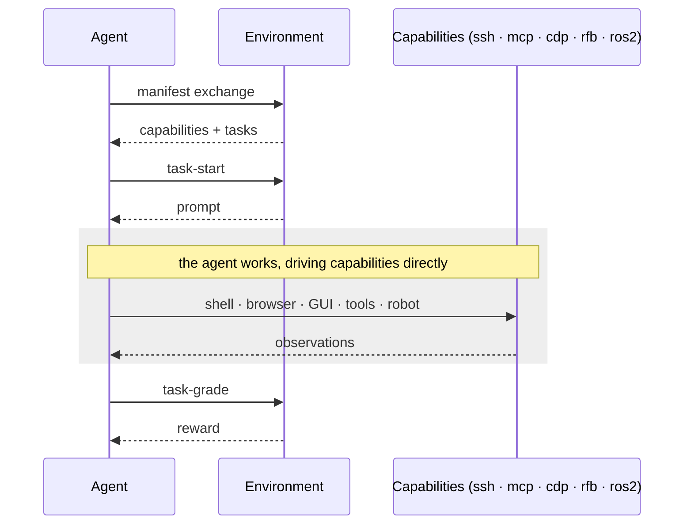

<div align="left">
  <picture>
    <source media="(prefers-color-scheme: dark)" srcset="https://raw.githubusercontent.com/hud-evals/hud-python/main/docs/logo/hud_logo_dark.svg">
    <source media="(prefers-color-scheme: light)" srcset="https://raw.githubusercontent.com/hud-evals/hud-python/main/docs/logo/hud_logo.svg">
    
  </picture>
</div>

HUD is a platform for building RL environments for AI agents. Define an environment, write tasks, and run them as evals and training across any model, at any scale.

To learn more, check out our [Documentation](https://docs.hud.ai) and [API Reference](https://docs.hud.ai/reference).

[](https://pypi.org/project/hud-python/)
[](LICENSE)
[](https://cursor.com/en/install-mcp?name=docs-hud-python&config=eyJ1cmwiOiJodHRwczovL2RvY3MuaHVkLmFpL21jcCJ9)
[](https://discord.gg/wkjtmHYYjm)
[](https://x.com/intent/user?screen_name=hud_evals)
[](https://scarf.sh)
[](https://docs.hud.ai)

## Install

```bash
# Install the CLI (recommended)
uv tool install hud-python --python 3.12

# …or as a library
pip install hud-python
```

Get your API key at [hud.ai/project/api-keys](https://hud.ai/project/api-keys) and set it:

```bash
export HUD_API_KEY=your-key-here
```

Then scaffold your first environment:

```bash
hud init my-env
```


## The HUD protocol

HUD is **protocol-first**. An agent and an environment exchange just three things: a **manifest** (the environment's capabilities and tasks), a **task-start** that returns the prompt, and a **task-grade** that returns the reward. In between, the agent just *works*, driving the capabilities itself. HUD owns only that thin envelope, so any model or harness plugs into any environment.



## Package once, run anywhere

A built image is the **end product for your tasks**: one build packs **many task variants** from a single definition. Because the protocol only exposes **capabilities** (never a fixed agent), an environment outlives any single harness: new harnesses and models keep running against the same old environments, benchmarks, and tasks. It runs on any infra, from your laptop and CI to a Kubernetes fleet or managed cloud-sandbox providers for horizontal scaling:

```bash
hud build .

docker run -d --name run1 my-env
docker exec run1 hud task-start fix_bug
docker exec run1 hud task-grade fix_bug --answer "…"
docker rm -f run1
```

## Environments & tasks

A task is an async generator: yield a **prompt**, receive the agent's **answer**, yield a **score**. Vary its arguments and one function becomes a whole dataset of **variants**, no duplication. The simplest needs no tools, just a prompt and a grader:

```python
from hud import Environment

env = Environment(name="letter-count")

@env.task()
async def count_letter(word: str = "strawberry", letter: str = "r"):
    answer = yield f"How many '{letter}'s are in '{word}'? Reply with just the number."
    yield 1.0 if answer and str(word.count(letter)) in answer else 0.0

tasks = [count_letter(word=w) for w in ("strawberry", "raspberry", "blueberry")]
```

Run it immediately against any model:

```bash
hud eval tasks.py claude
```

Every rollout is traced on the [hud.ai](https://hud.ai) platform when your `HUD_API_KEY` is set. A task that needs tools or an interactive environment declares **capabilities** (below); everything else (variants, grading, batching) stays identical.

## Capabilities & harnesses

A **capability** is a connection the environment exposes; a **harness** opens the ones it needs and defines its own **tool spec**: the actions it gives the model. The same environment serves a one-shot Q&A or a full computer-use rollout, depending on which capabilities the harness opens.

| Capability | What it exposes |
|------------|-----------------|
| **`ssh`**  | Shell + files (bash, SFTP) in a sandboxed workspace |
| **`mcp`**  | Tools over the Model Context Protocol: HUD's native tools or your own MCP server |
| **`cdp`**  | Browser control over the Chrome DevTools Protocol |
| **`rfb`**  | Full computer-use over VNC: screen + keyboard/mouse |
| **`ros2`** | Robot control + sensor topics over ROS 2 |

**Ships natively:** Claude, OpenAI (Responses), OpenAI-compatible (any vLLM/OpenAI endpoint), Gemini, and Claude Code (the `claude` CLI over SSH). `create_agent("claude-sonnet-4-5")` (or `gpt-…`, `gemini-…`, `grok-…`) routes any model through the HUD gateway and wires the matching capability-backed tools.

**Bring your own:** a harness is just *attach to a capability + define a tool spec*, so wrapping another agent (`browser-use` on `cdp`, your own policy on `ssh` / `mcp` / `ros2`) is a thin adapter, no protocol work. → [Capabilities](https://docs.hud.ai/concepts) · [Models](https://hud.ai/models)

## Deploy & scale on the platform

`hud build` is for fully-local workflows. **The easier, recommended path is to skip it and just run `hud deploy`**, which builds and publishes your environment in one step. Then register your tasks and run them on hosted infra:

```bash
hud deploy
hud sync tasks my-taskset
hud eval my-taskset --remote
```

From the [platform UI](https://hud.ai) you can run batches, compare models, and inspect every rollout. → [Deploy](https://docs.hud.ai/quick-links/deploy) · [Leaderboards](https://hud.ai/leaderboards)

## Train on your tasks

Every rollout returns a `Run` carrying a `trace_id` and a `reward`, so the tasks you evaluate are already training data. Run a group per task and turn the rewards into GRPO advantages:

```python
from hud.eval import HudTrainingClient, Taskset, TrainingConfig

trainer = HudTrainingClient(TrainingConfig(learning_rate=1e-5))
runs = await Taskset(count_letter(word=w) for w in words).run(agent, group=16)
await trainer.reward(runs)
```

**Plug into any trainer:** the signal is just `Rewarded` (`trace_id` + `reward`) plus the `group_relative()` helper, so HUD is purely the environment-and-reward source for your own GRPO/PPO loop. The same environment trains any model, text or multimodal, unchanged.

## Import existing tasks

Already have tasks in another format? `hud convert ./tasks` brings existing Harbor tasks into a HUD environment.

## Links

- 📖 [Documentation](https://docs.hud.ai)
- ⌨️ [CLI Reference](https://docs.hud.ai/reference/cli/overview)
- 🏆 [Leaderboards](https://hud.ai/leaderboards)
- 🌐 [Environment Templates](https://hud.ai/environments)
- 🤖 [Supported Models](https://hud.ai/models)
- 💬 [Discord](https://discord.gg/wkjtmHYYjm)

## Enterprise

Building agents at scale? We work with teams on custom environments, benchmarks, and training.

[📅 Book a call](https://cal.com/jay-hud) · [📧 founders@hud.ai](mailto:founders@hud.ai)

## Contributing

We welcome contributions! See [CONTRIBUTING.md](CONTRIBUTING.md).

Key areas: [Agents](hud/agents/) · [Environments](hud/environment/) · [Native Tools](hud/native/tools/)

<a href="https://github.com/hud-evals/hud-python/graphs/contributors">
  
</a>

## Citation

```bibtex
@software{hud2025agentevalplatform,
  author = {HUD and Jay Ram and Lorenss Martinsons and Parth Patel and Govind Pimpale and Dylan Bowman and Jaideep and Nguyen Nhat Minh},
  title  = {HUD: An Evaluation and RL Envrionments Platform for Agents},
  date   = {2025-04},
  url    = {https://github.com/hud-evals/hud-python},
  langid = {en}
}
```

MIT License · [LICENSE](LICENSE)
