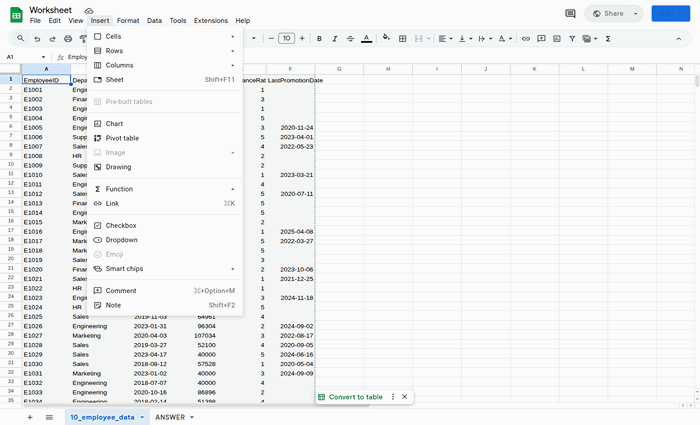
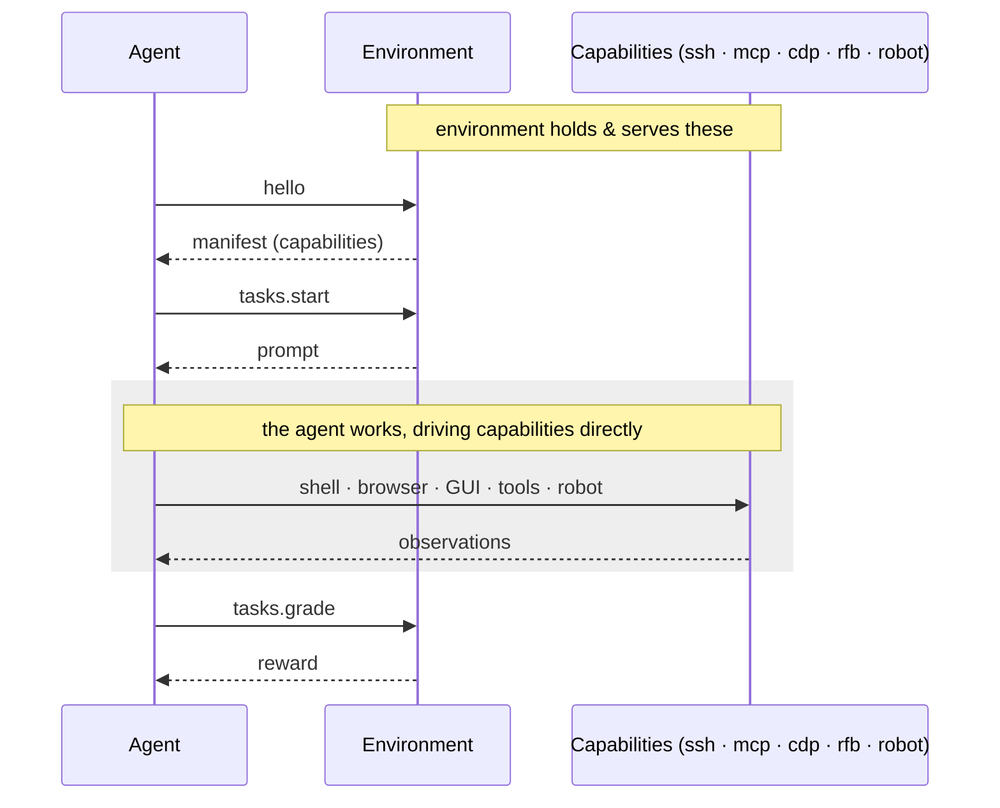

<div align="left">
  <picture>
    <source media="(prefers-color-scheme: dark)" srcset="https://raw.githubusercontent.com/hud-evals/hud-python/main/docs/logo/hud_logo_dark.svg">
    <source media="(prefers-color-scheme: light)" srcset="https://raw.githubusercontent.com/hud-evals/hud-python/main/docs/logo/hud_logo.svg">
    
  </picture>
</div>

HUD is a platform for building RL environments for AI agents, across coding, browser, computer-use, and robotics. Define an environment, write tasks, and run them as evals and training across any model, at any scale.

To learn more, see the [documentation](https://docs.hud.ai) and [environment reference](https://docs.hud.ai/v6/reference/environment).

[](https://pypi.org/project/hud/)
[](LICENSE)
[](https://cursor.com/en/install-mcp?name=docs-hud-python&config=eyJ1cmwiOiJodHRwczovL2RvY3MuaHVkLmFpL21jcCJ9)
[](https://discord.gg/wkjtmHYYjm)
[](https://x.com/intent/user?screen_name=hud_evals)
[](https://scarf.sh)
[](https://docs.hud.ai)

## Install

```bash
# Install the CLI (recommended)
uv tool install hud --python 3.12

# …or as a library
pip install hud
```

> Previously published as [`hud-python`](https://pypi.org/project/hud-python/), which now just installs `hud`. The import and CLI names are unchanged.

Get your API key at [hud.ai/project/api-keys](https://hud.ai/project/api-keys) and set it:

```bash
hud set HUD_API_KEY=your-key-here
# or: export HUD_API_KEY=your-key-here
```

Then scaffold your first environment:

```bash
hud init my-env
```



## The protocol

HUD is **protocol-first**. An agent and an environment exchange just three things: a **manifest** (the environment's capabilities and tasks), **`tasks.start`** that returns the prompt, and **`tasks.grade`** that returns the reward. In between, the agent just *works*, driving the capabilities itself. HUD owns only that thin envelope, so any model or harness plugs into any environment.



Because the protocol only exposes **capabilities** (never a fixed agent), an environment outlives any single harness: new harnesses and models keep running against the same environments, benchmarks, and tasks.

## Package & run anywhere

A built image is the **end product for your tasks**: one build packs every task from a single definition. The recommended path is **`hud deploy`**, which builds and registers your environment on HUD in one step; then sync a taskset and run remotely:

```bash
hud deploy
hud sync tasks my-taskset
hud eval my-taskset --remote
```

For local iteration, the same protocol works against a container on your laptop:

```bash
docker build -f Dockerfile.hud -t my-env .
docker run -d --name run1 -p 8765:8765 my-env
hud task start fix_bug --url tcp://127.0.0.1:8765
hud task grade fix_bug --url tcp://127.0.0.1:8765 --answer "..."
docker rm -f run1
```

→ [Run & deploy](https://docs.hud.ai/v6/reference/runtime)

## Environments & templates

A **template** is an async generator registered with `@env.template()`: `yield` a prompt, receive the agent's answer, `yield` a reward. Calling the template mints a runnable **Task**; one function spans a whole dataset of variants. The simplest needs no capabilities — just a prompt and a grader:

```python
from hud import Environment

env = Environment(name="letter-count")

@env.template()
async def count_letter(word: str = "strawberry", letter: str = "r"):
    answer = yield f"How many '{letter}'s are in '{word}'? Reply with just the number."
    yield 1.0 if answer and str(word.count(letter)) in answer else 0.0

tasks = [count_letter(word=w) for w in ("strawberry", "raspberry", "blueberry")]
```

Run it immediately against any model:

```bash
hud eval tasks.py claude --group 3
```

Each graded evaluation is a **trace** (the SDK's live handle is a `Run`). With `HUD_API_KEY` set, every rollout is recorded on [hud.ai](https://hud.ai). Tasks that need a shell, browser, GUI, or robot declare **capabilities** (below); everything else — variants, grading, batching — stays identical.

→ [Quickstart](https://docs.hud.ai/v6/start/quickstart) · [Tasks & tasksets](https://docs.hud.ai/v6/reference/tasks)

## Capabilities & harnesses

A **capability** is a connection the environment exposes; a **harness** attaches its own tools to it. The same environment serves a one-shot Q&A or a full computer-use rollout, depending on which capabilities the harness opens.

| Protocol | What it exposes |
|----------|-----------------|
| **`ssh`** | Shell + files in a sandboxed workspace (`env.workspace(root)`) |
| **`mcp`** | Tools over the Model Context Protocol |
| **`cdp`** | Browser control over the Chrome DevTools Protocol |
| **`rfb`** | Full computer-use over VNC: screen + keyboard/mouse |
| **`robot`** *(beta)* | Schema-driven robot observation/action loop over WebSocket |

**Ships natively:** Claude, OpenAI (Responses), OpenAI-compatible endpoints, and Gemini via `create_agent("claude-sonnet-4-5")` (or `gpt-…`, `gemini-…`). The harness wires capability-backed tools for the model you choose at run time.

**Bring your own:** a harness attaches to a capability and defines a tool spec — wrap `browser-use` on `cdp`, a VLA policy on `robot`, or your own agent on `ssh` / `mcp`. No protocol work required.

→ [Capabilities](https://docs.hud.ai/v6/reference/capabilities) · [Models](https://docs.hud.ai/v6/reference/agents) · [Robots](https://docs.hud.ai/v6/advanced/robots)

## Deploy on the platform

From the [platform UI](https://hud.ai) you can run batches, compare models on the same taskset, and inspect every trace.

→ [Run & deploy](https://docs.hud.ai/v6/reference/runtime)

## Train on rewards

Every rollout returns a `Run` carrying a `trace_id` and a `reward`, so the tasks you evaluate are already training data. Run a **group** per task and pass the graded runs to `TrainingClient.step()`:

```python
from hud import TrainingClient
from hud.agents import create_agent
from hud.eval import Job

agent = create_agent("arith-rl", completion_kwargs={"extra_body": {"return_token_ids": True}})
trainer = TrainingClient("arith-rl")
taskset, runtime = ...  # your Taskset and where rollouts run

session = await Job.start("arith-rl", group=8)
start = len(session.runs)
await taskset.run(agent, runtime=runtime, group=8, job=session)
await trainer.step(session.runs[start:], learning_rate=1e-5, group_size=8)
```

HUD is the environment-and-reward source for your own GRPO/PPO loop — the same environment trains any model, text or multimodal, unchanged.

→ [Training](https://docs.hud.ai/v6/reference/training) · [Designing tasks for signal](https://docs.hud.ai/v6/reference/advice)

## Links

- [Documentation](https://docs.hud.ai)
- [Quickstart](https://docs.hud.ai/v6/start/quickstart)
- [CLI reference](https://docs.hud.ai/v6/reference/cli)
- [Environment templates](https://hud.ai/environments)
- [Supported models](https://hud.ai/models)
- [Discord](https://discord.gg/wkjtmHYYjm)

## Enterprise

Building agents at scale? We work with teams on custom environments, benchmarks, and training.

[📅 Book a call](https://cal.com/jay-hud) · [📧 founders@hud.ai](mailto:founders@hud.ai)

## Contributing

We welcome contributions! See [CONTRIBUTING.md](CONTRIBUTING.md).

Key areas: [Agents](hud/agents/) · [Environments](hud/environment/) · [Capabilities](hud/capabilities/) · [Eval](hud/eval/)

<a href="https://github.com/hud-evals/hud-python/graphs/contributors">
  
</a>

## Citation

```bibtex
@software{hud2025agentevalplatform,
  author = {HUD and Jay Ram and Lorenss Martinsons and Parth Patel and Govind Pimpale and Dylan Bowman and Jaideep Chawla and Nguyen Nhat Minh},
  title  = {HUD: An Evaluation and RL Environments Platform for Agents},
  date   = {2025-04},
  url    = {https://github.com/hud-evals/hud-python},
  langid = {en}
}
```

MIT License · [LICENSE](LICENSE)
