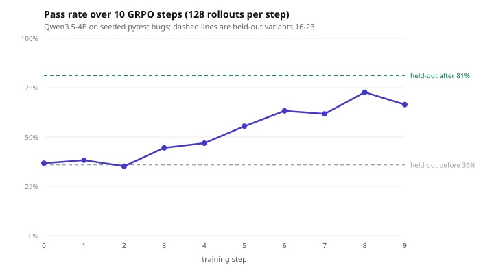

# RL on Daytona sandboxes

Run an agent evaluation where every rollout gets its own fresh
[Daytona](https://daytona.io) sandbox — then train a model on the graded
rollouts that same evaluation produced. One `env.py`, no second pipeline.

The task: a small Python file with seeded bugs, graded by whether `pytest`
passes. Ten GRPO steps at 128 parallel rollouts took a Qwen3.5 4B fork from
**35.9% to 81.2%** pass rate on held-out bug variants it never trained on.



The full measured walkthrough — spin-up ladders to 256 concurrent, warm pools,
and sizing rules — is [the guide on Daytona's docs](https://www.daytona.io/docs/guides/reinforcement-learning/hud-rl-cookbook). The
condensed HUD-side walkthrough is
[on the HUD docs](https://docs.hud.ai/v6/cookbooks/daytona-rl).

| File | Purpose |
|------|---------|
| `env.py` | The environment: a workspace, one task, a pytest grader |
| `bugs.py` | 24 deterministic bug variants (4/5/6 broken functions) |
| `tasks.py` | Task list for `hud eval` |
| `train.py` | The published 10-step GRPO run |
| `pool.py` | Warm-pool helpers (create, wait until really full, drop) |
| `snapshot.py` | Content-addressed snapshot naming |
| `bench/` | Repro receipts behind the guide's numbers |

## Setup

```bash
uv sync
hud set HUD_API_KEY=...        # https://hud.ai/project/api-keys
export DAYTONA_API_KEY=...     # https://app.daytona.io
```

`DAYTONA_API_KEY` has to be a real `export`: the Daytona SDK reads the process
environment, not `~/.hud/.env`.

## Run

```bash
hud eval tasks.py claude                                   # one local rollout, no Daytona
uv run train.py --steps 10 --group 8 --concurrent 128      # the published training run
PYTHONPATH=. uv run bench/reap.py --delete                 # clean up stray sandboxes
```

`train.py` builds the snapshot from `Dockerfile.hud` on first run, keeps a warm
pool the width of the batch, and appends per-step metrics to `train_run.json`.
Variants 0-15 train; 16-23 are held out for the before/after measurement.

The snapshot name is a hash of `env.py`, `bugs.py`, `Dockerfile.hud` and
`pyproject.toml` (`snapshot.py`), so editing the environment mints a new one
instead of silently running the old image.

## `bench/`

Run from this directory with `PYTHONPATH=.`.

| File | Purpose |
|------|---------|
| `baseline.py` | Pass rate with no optimizer — the 35.9% before and 81.2% after |
| `run_daytona.py` | One rollout on Daytona, with the spin-up/agent time split |
| `ladder.py`, `ladder_reps.csv` | Concurrency ladder, N up to 256 |
| `warmpool.py`, `warmpool_repro.py` | Warm-pool A/B |
| `train_run.json`, `train_curve.svg` | The published training curve |
| `reap.py` | Delete stray sandboxes and stale snapshots |

## Two things that will bite you

**A warm pool says it's full before it is.** Its `current_size` reports the target
about 12 seconds early. `pool.py` counts actual sandboxes instead — and that
count needs `include_warm=True`, because unclaimed pool members are excluded from
`list_sandboxes` by default. Count the obvious way and you get 0 forever.

**An interrupted run can strand a pool.** `train.py` drops its pool on exit and
on SIGINT/SIGTERM, but a hard kill leaves one parked. `bench/reap.py` will not
catch it — it calls `AsyncDaytona.list()`, blind to unclaimed pool sandboxes for
the same `include_warm` reason, and it does not delete pools at all. Check after
any interrupted run.
