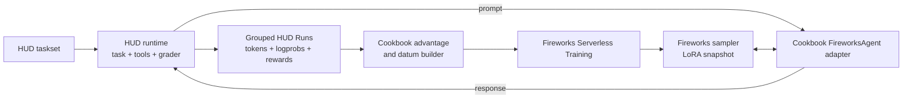

[HUD](https://hud.ai) is an open-source SDK and hosted runtime for building evaluation and
reinforcement-learning environments. A HUD environment packages the task prompt, tools, state, and
grader behind one interface. The same taskset can be used to compare models, collect grouped
training rollouts, and evaluate the resulting checkpoint.

This example trains a Fireworks LoRA adapter on rewards produced by a HUD environment. Fireworks
samples and trains the model. The environment author defines the task and reward, while the HUD
runtime executes the environment and grader. The cookbook connects the two systems and builds the
training datums.

## Why use HUD

RL training requires a model backend and an environment that can determine whether a rollout
succeeded. HUD provides the environment layer:

| HUD capability | Use in training |
| --- | --- |
| Task templates | Define the prompt and task parameters |
| Stateful environments | Run tools, browsers, code sandboxes, games, or APIs during a rollout |
| Graders | Convert the final response or environment state into a reward |
| Tasksets and groups | Repeat the same task to compute group-relative advantages |
| Local and hosted runtimes | Execute a local environment or one already deployed to HUD |
| Traces | Inspect model actions, tool results, grader output, and reward |

The Fireworks training loop only needs the resulting model tokens, sampling logprobs, and reward.
The grader remains part of the HUD environment, so changing the model or training backend does not
change the definition of success.

## Architecture



The guide uses a few HUD terms:

- A **task** is one prompt and its environment parameters.
- A **taskset** is a named collection of tasks.
- A **runtime** chooses where the environment executes, locally or on HUD.
- A **Run** records one task attempt, including its model output, trace, and reward.
- A **group** repeats the same task so the training loop can compare its rewards.
- A HUD **Agent** drives a Run. This cookbook supplies `FireworksAgent`, a one-turn adapter backed
  by the Fireworks sampler.

## Prerequisites

You need:

- [Git](https://git-scm.com/downloads)
- Python 3.11 or 3.12
- [`uv`](https://docs.astral.sh/uv/getting-started/installation/)
- A Fireworks API key with Serverless Training access
- Access to `accounts/fireworks/models/qwen3p5-9b`, the serverless-enabled default model

Clone the HUD SDK, enter the cookbook directory, and install its dependencies:

```bash
git clone https://github.com/hud-evals/hud-python.git
cd hud-python/cookbooks/fireworks-rl-training
uv sync
export FIREWORKS_API_KEY="fw_..."
```

Run all commands below from `hud-python/cookbooks/fireworks-rl-training`.

If you choose another base model, pass a matching Fireworks model, Hugging Face tokenizer, and
renderer together:

```bash
uv run train.py \
  --base-model "<fireworks-model>" \
  --tokenizer-model "<hugging-face-tokenizer>" \
  --renderer "<renderer-name>" \
  --calibrate
```

Prompt rendering happens on the client. A mismatched model, tokenizer, or renderer can train on the
wrong tokenization. The default renderer disables thinking mode so the model reaches the final
answer within the generation limit.

The example runs its HUD environment locally, so a HUD account is not required. A deployed HUD
taskset requires `HUD_API_KEY` as described in [Use a hosted taskset](#use-a-hosted-taskset).

## Calibrate the task

Group-relative training needs reward variation among repeated attempts at the same task. Check the
initial adapter before paying for a longer run:

```bash
uv run train.py \
  --calibrate \
  --tasks-per-step 6 \
  --group-size 6 \
  --max-tokens 512 \
  --debug-samples 4
```

Calibration reports `reward_mean` and `within_group_reward_std` without applying an optimizer
update. A positive within-group value confirms reward variation in at least one group. It does not
prove that the reward is correct. Read the `--debug-samples` output and confirm that higher rewards
match better answers.

If every rollout is correct, make the arithmetic harder with `--min-a`, `--max-a`, `--min-b`, and
`--max-b`. If every rollout is incorrect, reduce the operand range or increase `--max-tokens`.

## Run the example

After calibration shows useful reward spread, run one bounded training step:

```bash
uv run train.py \
  --steps 1 \
  --tasks-per-step 2 \
  --group-size 4 \
  --max-tokens 512 \
  --eval-tasks 4 \
  --require-update
```

`--require-update` makes the command fail if both task groups receive flat rewards. A successful run
therefore verifies Fireworks authentication, sampling, HUD execution and grading, one optimizer
update, checkpoint creation, and held-out evaluation. The step log and `metrics.jsonl` also record
`kept_groups` and `updated`.

Only then consider the full recipe:

```bash
uv run train.py
```

The defaults request 30 steps × 8 task groups × 8 attempts, or 1,920 training rollouts, followed by
16 evaluation rollouts. Each rollout can generate up to 1,024 tokens and incurs Fireworks usage.
Charges include prompt prefill, sampled output, and training tokens at the selected model's
[serverless rates](https://docs.fireworks.ai/fine-tuning/training-api/serverless#pricing). Metrics
are written to `runs/fireworks-serverless/metrics.jsonl`.

## How the integration works

### 1. Define a HUD environment

A HUD task yields the prompt and then grades the model response:

```python
import re

from hud import Environment
from hud.graders import EvaluationResult

env = Environment(name="fireworks-arithmetic")

@env.template()
async def multiply(a: int, b: int):
    answer = yield (
        f"What is {a} * {b}? Work it out, then put the final integer "
        "on its own line at the end of your answer."
    )

    text = answer if isinstance(answer, str) else str(answer)
    integers = re.findall(r"-?\d+", text)
    got = int(integers[-1]) if integers else None
    expected = a * b

    yield EvaluationResult(
        reward=1.0 if got == expected else 0.0,
        content=text.strip(),
        info={"expected": expected, "got": got},
    )
```

The full example keeps the grader in a separate function so it can be tested independently.

### 2. Sample through a HUD agent

The cookbook implements `FireworksAgent`, a small adapter between a Fireworks sampling client and
HUD's `Agent` interface. For each rollout it:

1. Renders the HUD prompt with the model's chat template.
2. Samples from the current LoRA snapshot.
3. Records prompt tokens, output tokens, and output logprobs on the HUD `Run`.
4. Returns the decoded response to the environment for grading.

The base model, tokenizer, and renderer must match because prompt rendering happens on the client.

### 3. Run tasks in groups

HUD executes repeated attempts at each task:

_Conceptual excerpt from `train.py`; this is not standalone code._

```python
job = await taskset.run(
    agent,
    runtime=runtime,
    group=group_size,
)
```

Each run contains the sampled trajectory and the reward returned by the environment. Repeating a
task creates the reward distribution used for group-relative advantages.

### 4. Train on graded runs

The cookbook converts the grouped runs into Fireworks training datums:

_Conceptual excerpt from `train.py`; this is not standalone code._

```python
datums, kept_groups = make_training_batch(job.runs)

training_client.forward_backward(
    datums,
    "importance_sampling",
).result()
training_client.optim_step(adam).result()
```

Groups with identical rewards are omitted because their normalized advantages are zero. The
remaining datums contain target tokens, rollout logprobs, and per-token advantages. The real loop
calls `forward_backward` and `optim_step` only when `datums` is non-empty.

## Select a loss

The example exposes three server-side RL losses:

`--loss-fn` accepts `importance_sampling` (the default), `ppo`, or `cispo`. Add the flag to the
bounded command while comparing objectives. For example, change its final line to:

```bash
  --require-update \
  --loss-fn ppo
```

All three consume the same token-level datums. Fireworks Serverless Training also supports SFT, DPO,
gradient accumulation, and custom client-side losses; see
[Serverless Training](https://docs.fireworks.ai/fine-tuning/training-api/serverless) for the broader
API.

## Checkpoint and resume

The example creates two checkpoint types:

| Checkpoint | Contains | Use |
| --- | --- | --- |
| `policy-*`, `final` | LoRA adapter weights | Create a sampler or promote the adapter |
| `state-*`, `final-state` | Adapter weights and optimizer state | Resume training |

Resume from a fully qualified training checkpoint:

```bash
uv run train.py --resume-from "<account>/<run-id>/state-0005"
```

The script prints `Sampler checkpoint: ...` for the final adapter. Sampler checkpoints are tied to
the active serverless session. Use that path to identify and
[promote the checkpoint to a model](https://docs.fireworks.ai/fine-tuning/training-api/serverless#promote-a-sampler-checkpoint-to-a-model)
before the session is removed.

## Use another one-turn HUD environment

The cookbook accepts local task files and hosted HUD tasksets without editing `train.py`.

For a local environment, pass both the task source and environment source:

```bash
uv run train.py \
  --tasks-file "../my-environment/tasks.py" \
  --env-path "../my-environment/env.py" \
  --calibrate \
  --tasks-per-step 6 \
  --group-size 6
```

Calibration needs at least `--tasks-per-step` tasks. A training run needs
`--tasks-per-step + --eval-tasks`; the cookbook shuffles them deterministically and creates
disjoint training and evaluation subsets. Calibrate first, then replace `--calibrate` with the
bounded-run flags from [Run the example](#run-the-example).

### Use a hosted taskset

First
[deploy the environment](https://docs.hud.ai/v6/guides/creating-an-environment#deploying-to-the-platform)
and sync its tasks to HUD. Then set both API keys and pass the taskset name or id:

```bash
export HUD_API_KEY="sk-hud-..."

uv run train.py \
  --taskset "my-taskset" \
  --calibrate \
  --tasks-per-step 6 \
  --group-size 6
```

This selects `HUDRuntime`: the environment and grader run on a HUD worker, while `FireworksAgent`
stays in the training process and calls the Fireworks sampler. The same task-count requirements
apply.

### Current multi-turn limitation

The included `FireworksAgent` and batch builder support one generated assistant response per Run.
They do not yet train multi-turn or tool-using trajectories. Supporting those environments requires
an agent adapter that executes each tool turn and a batch builder that combines every trainable
assistant turn while masking user and tool-result tokens.

HUD can represent these tasks, including browser, coding, and BFCL function-calling environments,
but they are not drop-in inputs to this Fireworks example. See HUD's
[RL training cookbook](https://github.com/hud-evals/hud-python/tree/main/cookbooks/rl-training)
for a runnable multi-turn training implementation.

## Next steps

- Run the complete example in
  [`hud-python/cookbooks/fireworks-rl-training`](https://github.com/hud-evals/hud-python/tree/main/cookbooks/fireworks-rl-training).
- Learn how to build [HUD environments](https://docs.hud.ai/v6/guides/creating-an-environment).
- Read HUD's guide to [designing tasks for training signal](https://docs.hud.ai/v6/reference/advice).
- Compare [Fireworks Serverless and Dedicated Training](https://docs.fireworks.ai/fine-tuning/training-api/introduction#infrastructure).
