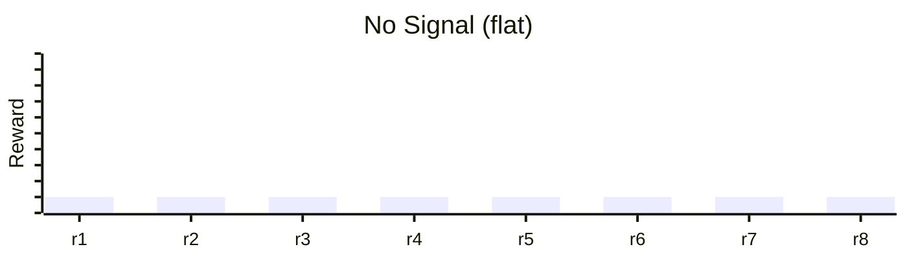
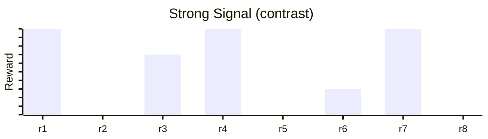

Every evaluation generates data — prompts, tool calls, grades. The quality of that data determines whether training actually improves your model.

In practice, the majority of time building RL environments is spent **curating tasks** — not writing code. You'll run your taskset, look at the reward distribution, and discard tasks that are too easy (every run passes), too hard (every run fails), or flat (no variance across runs). The remaining tasks — the ones where the model sometimes succeeds and sometimes doesn't — are where all the training signal lives.

This page covers how to build environments that produce more of those useful tasks and fewer throwaway ones.

## Why Contrast Matters

Most RL training frameworks — including GRPO (Group Relative Policy Optimization) — use a **group-based approach**: run the same task multiple times, then compare the outcomes relative to each other. The model learns by asking "what did the successful runs do differently from the failed ones?"

Training doesn't optimize absolute reward values. It needs **contrast** — some runs succeed, some fail — on the same task. Typically you run each task **4–16 times** (your `--group-size`).

**No signal** — all runs score roughly the same. Nothing to compare, no learning.



**Strong signal** — mix of outcomes. The model learns from the differences.



If every run scores the same — all 0.0 or all 1.0 — there's no contrast and nothing to learn from. The sweet spot is tasks where the model succeeds *sometimes but not always*. Target **5–75% average success rate** across your taskset for useful training signal.

## What Makes a Good Task

| Principle | Avoid | Better |
|-----------|-------|--------|
| **Observable** — tools return data the agent and grader can act on | Tool returns `"Done"` with no details | Tool returns `{"id": uid, "rows_updated": 3}` |
| **Deterministic** — each run starts from the same known state | Scenario assumes data already exists | Scenario seeds DB with fixtures before the first yield |
| **Isolated** — parallel runs can't interfere with each other | 100 agents write to the same shared database | Each eval gets its own instance or uses transaction rollback |
| **Specific** — only one way to solve it, or grader accounts for all valid approaches | "Fix the data issue" | "Mark order #1234 as shipped" (grader checks status field regardless of method) |
| **Verifiable** — the result produces a checkable state change | "Consider the best approach to optimize" | "Navigate to the checkout page" (grader checks URL), "Add an index on email" (grader runs EXPLAIN) |
| **Varied** — scenario params let you calibrate difficulty without rewriting the scenario | Hardcoded prompt with one difficulty level | Scenario takes a `detail_level` param: `"step-by-step"` vs `"high-level"` |
| **Partial credit** — grader breaks the task into 2–4 sub-checks | Binary 0.0 or 1.0 with no breakdown | Weighted sub-checks: cart added (0.3) + order completed (0.7) |

These principles also reflect how tasks are reviewed during [QA on the platform](/platform/agents/qa) — false negatives often come from non-observable state, false positives from prompts that aren't specific enough.

## Good Environments

Good environments expose observable state, seed deterministic starting conditions, and isolate each evaluation run.

### Observable State

Agents need to see what happened. If they can't observe the data, they can't complete the task — and if *you* can't observe it, you can't grade it. Design tools that return actionable data:

```python
# Bad: Agent can't see what was created, grader can't verify
@env.tool()
def create_user(name: str) -> str:
    db.insert("users", name=name)
    return "Done"

# Good: Structured response — agent can act on it, grader can verify
@env.tool()
def create_user(name: str) -> dict:
    user_id = db.insert("users", name=name)
    return {"id": user_id, "name": name, "created": True}
```

This is the most common source of [false negatives](/platform/agents/qa) in QA — the agent did the right thing but the grader couldn't observe it.

### Deterministic Setup

Each eval should seed the state it needs. HUD handles container isolation — you handle making sure your scenario sets up the right data before the agent runs:

```python
# Bad: Depends on whatever state exists — non-reproducible
@env.scenario("find-user")
async def find_user(name: str):
    answer = yield f"Find the user named {name}"
    yield 1.0 if name in answer else 0.0

# Good: Seeds known state — every run starts the same
@env.scenario("find-user")
async def find_user(name: str):
    await db.clear()
    await db.insert("users", name=name, email=f"{name}@example.com")
    
    answer = yield f"Find the user named {name}"
    yield 1.0 if name in answer else 0.0
```

Non-deterministic setups produce noisy rewards — the same task can score differently depending on leftover state. This destroys training signal because the variance comes from the environment, not the model's behavior.

### Isolated Execution

HUD sandboxes each eval — containers don't share state. But if your environment connects to external services, think about stateful vs stateless.

**Stateless services** are fine. Multiple agents can hit the same read-only API without interference.

**Stateful services** need care. If 100 agents all hit the same database endpoint that modifies data, they'll step on each other. Use per-eval instances, transaction isolation, or target different records. See [Advanced Patterns](/advanced/patterns) for sandboxing techniques.

## Good Evals

An eval combines a prompt (the first `yield`) with grading logic (everything after). The prompt tells agents what to do — write short-to-medium length instructions that ask for an unambiguous change you can verify.

### Be Specific

Ambiguous prompts lead to ambiguous grading — and are the most common source of [false positives](/platform/agents/qa) in QA. Say exactly what you want:

```
Bad:  "Fix the data issue"
Good: "Update order #1234 status from 'pending' to 'shipped' in the orders table"
```

```
Bad:  "Improve the dashboard"
Good: "Add a 'Last 30 Days' filter to the revenue chart on the analytics dashboard"
```

### Only Ask for Verifiable Things

If you can't observe the result, you can't grade it. Don't ask an agent to "think about" something — ask it to do something that produces a checkable state change:

```
Bad:  "Consider the best approach to optimize the query"
Good: "Rewrite the query to use an index on the email column and verify it runs under 100ms"
```

### Create Variations

Create different versions of the same task with more or less explicit instructions — step-by-step guidance vs. high-level goals. This gives you natural difficulty range across the taskset, which directly produces the contrast training needs.

If you've observed agents struggling with specific failure modes, incorporate those into new tasks. [Failure Analysis](/platform/agents/qa) QA agents can help identify common failure categories to target.

## Good Graders

The grading logic after the first `yield` determines the score. Fair grading means useful signal — unfair grading means the model learns the wrong thing.

### Match the Prompt

If the prompt says "create a document with a Japanese car brand", check for any Japanese car brand — not just "Toyota". But don't accept any document either. Grade exactly as strict as the prompt implies:

```python
# Bad: Too strict — only accepts one answer
@env.scenario("add-car")
async def add_car():
    answer = yield "Add a Japanese car brand to the document"
    yield 1.0 if answer == "Toyota" else 0.0

# Good: Accepts any valid answer
@env.scenario("add-car")
async def add_car():
    answer = yield "Add a Japanese car brand to the document"
    japanese_brands = ["toyota", "honda", "nissan", "mazda", "subaru"]
    yield 1.0 if any(brand in answer.lower() for brand in japanese_brands) else 0.0
```

### Use Partial Credit

Partial grades give training finer-grained signal. Did the agent add to cart but not checkout? That's a 0.3, not a 0.0. Break complex grading into weighted sub-checks:

```python
@env.scenario("checkout")
async def checkout(product: str):
    answer = yield f"Add {product} to cart and checkout"
    
    score = 0.0
    if await product_in_cart(product):
        score += 0.3
    if await order_completed(product):
        score += 0.7
    yield score
```

Partial credit also makes QA easier — you can see exactly *where* in the pipeline the agent failed, rather than just "it got 0.0."

<Warning>
Keep partial graders to **2–4 sub-checks**. More than 5 increases the risk surface for grading failures — each sub-check is a potential false negative or false positive. If you need more than 5, the scenario is probably too complex and should be split into separate tasks.
</Warning>

### Sanity Check

At minimum, verify two cases: unchanged state → 0.0, correct completion → 1.0. For grading logic you'll reuse across many evals, write unit tests. Load a known state snapshot, verify the grade matches what you expect.

## What's Next

<CardGroup cols={2}>
<Card title="Platform Models" icon="robot" href="/platform/models">
  Model training and checkpoints
</Card>

<Card title="QA Agents" icon="flask-vial" href="/platform/agents/qa">
  Automated trace and task analysis
</Card>

<Card title="Publishing Leaderboards" icon="trophy" href="/platform/publishing-leaderboards">
  Make your benchmarks public
</Card>

<Card title="Advanced Patterns" icon="puzzle-piece" href="/advanced/patterns">
  Sandboxing, mocking, and complex environment patterns
</Card>
</CardGroup>
