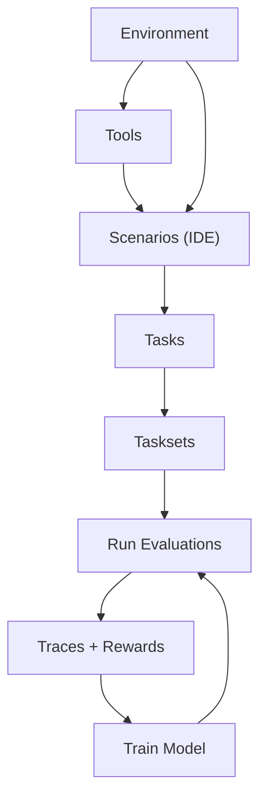

An environment is everything an agent can interact with—your APIs, services, databases, wrapped as tools. It also defines how agents are *evaluated* through **scenarios**. When you deploy an environment, you're creating a sandbox that agents can learn from at scale.

## Why Environments?

Your production API is a single live instance with shared state—you can't run 500 tests against it in parallel without causing chaos. Environments spin up fresh for every evaluation: isolated, deterministic, reproducible. Run thousands in parallel, each starting from the exact state you define, each generating training data.

Under the hood, an environment is an [MCP](https://modelcontextprotocol.io) server. When you deploy, HUD spins up a fresh, isolated instance for every evaluation — no shared state, no interference between parallel runs.

## Create an Environment

Scaffold a new environment with `hud init`. Works on existing codebases too:

```bash
hud init my-env
cd my-env
```

This creates the basic structure:

```python
from hud import Environment

env = Environment("my-env")
```

## Tools

Tools are functions that an agent can call while it's working on a task. Decorate a function with `@env.tool()` and agents can call it:

```python
from hud import Environment

env = Environment("my-env")

@env.tool()
def count_letter(text: str, letter: str) -> int:
    """Count occurrences of a letter in text."""
    return text.lower().count(letter.lower())
```

The docstring becomes the tool's description that the agent sees. The type hints become the tool's parameter schema. That's it — your function is now something any AI model can invoke.

### Tool Hooks

Use `@tool.before` and `@tool.after` to add validation, logging, or access control to any tool without modifying its implementation:

```python
from hud.tools import BashTool
from hud.tools.types import ToolError

bash = BashTool()

@bash.before
async def block_dangerous(command: str | None = None, **kwargs):
    if command and "rm -rf" in command:
        raise ToolError("Blocked dangerous command")

env.add_tool(bash)
```

`@tool.before` can modify arguments, pass through unchanged, or raise to block. `@tool.after` can modify or pass through the result.

### Complex Stateful Tools

For tools that need internal state, connections, or complex initialization, subclass `BaseTool`. See the [Tools SDK Reference](/reference/tools) for architecture details, base classes, native specs, and complete implementation examples.

## Scenarios

Scenarios are the core of HUD. A scenario defines *what you ask the agent to do* and *how you score the result*. This is where you spend your creative energy — writing prompts, designing scoring logic, deciding what success looks like.

A scenario is an async generator function with **two yields** — the first yield sends a prompt to the agent, and the second yield returns a reward:

```python
@env.scenario("count")
async def count(word: str, letter: str):
    answer = yield f"How many '{letter}' in '{word}'?"

    correct = str(word.lower().count(letter.lower()))
    yield 1.0 if answer and correct in answer else 0.0
```

Every scenario follows this structure:

| Section | Where | What it does |
|---------|-------|--------------|
| **Setup** *(optional)* | Before the first yield | Seed a database, navigate to a URL, prepare initial state |
| **Prompt** | The first `yield` | Sends instructions to the agent; receives the agent's answer |
| **Scoring** | After the first yield, ending with the second `yield` | Checks results and returns a reward between 0.0 and 1.0 |

The agent runs between the two yields. It calls tools, reasons, and produces an answer. Your scoring logic then checks the environment state and/or the answer to determine a reward.

Scenarios are **parameterized**. The same scenario with different arguments produces different evaluation tasks:

```python
count.task(word="strawberry", letter="r")  # one task (answer: 3)
count.task(word="banana", letter="a")      # another task (answer: 3)
count.task(word="mississippi", letter="s") # another task (answer: 4)
```

Design scenarios to be **expressive** — the more you can control through parameters, the easier it is to calibrate difficulty later without rewriting the scenario. For example, a scenario that takes `detail_level` as a parameter lets you create both step-by-step and high-level task variants from the same code.

Everything upstream (environments, tools) exists to support scenarios. Everything downstream (tasks, tasksets, traces, training) flows from them. You write scenarios in your IDE — that's where the creative work lives.

## Built-in Capabilities

HUD ships with pre-built tools, connectors, and graders so you can assemble environments without writing everything from scratch.

### Native Tools

Each model provider (Anthropic, OpenAI, Google) has its own tool specification. HUD handles the translation — add a tool once, and it adapts to whatever agent connects:

```python
from hud import Environment
from hud.tools import AnthropicComputerTool, BashTool, EditTool

env = Environment("desktop-agent")
env.add_tool(AnthropicComputerTool())
env.add_tool(BashTool())
env.add_tool(EditTool())
```

Claude gets native `computer_20250124` and `bash_20250124`. OpenAI gets compatible function calls. Same environment, every agent.

Tools declare `native_specs` that map to each provider's format. When an agent connects, HUD checks for a matching spec and registers using the provider's native format — or falls back to standard function calling. Tools with the same `role` (e.g. two shell tools) are mutually exclusive.

**Match tools to your agent:**

| Agent | Computer | Shell | Editor | Memory |
|-------|----------|-------|--------|--------|
| Claude | `AnthropicComputerTool` | `BashTool` | `EditTool` | `ClaudeMemoryTool` |
| OpenAI | `OpenAIComputerTool` | `ShellTool` | `ApplyPatchTool` | `SessionMemoryTool` |
| Gemini | `GeminiComputerTool` | `GeminiShellTool` | `GeminiEditTool` | `GeminiMemoryTool` |

Filesystem tools are agent-agnostic — choose based on output style:

| Style | Read | Search | Glob | List |
|-------|------|--------|------|------|
| OpenCode | `ReadTool` | `GrepTool` | `GlobTool` | `ListTool` |
| Gemini CLI | `GeminiReadTool` | `GeminiSearchTool` | `GeminiGlobTool` | `GeminiListTool` |

**Example — computer use environment:**

```python
from hud import Environment
from hud.tools import AnthropicComputerTool, BashTool, EditTool
from hud.tools.filesystem import ReadTool, GrepTool

env = Environment("desktop-agent")
env.add_tool(AnthropicComputerTool())
env.add_tool(BashTool())
env.add_tool(EditTool())
env.add_tool(ReadTool())
env.add_tool(GrepTool())
```

See the full [Tools Reference](/tools/computer) for all available tools (computer, coding, filesystem, memory, web, grounding).

### Connectors

Connectors let you pull external tools into your HUD environment — from other HUD environments, external MCP servers, or existing APIs:

```python
env.connect_fastapi(app)                                    # FastAPI → tools
env.connect_openapi("https://api.example.com/openapi.json") # OpenAPI spec → tools
env.connect_hub("hud-evals/browser")                        # HUD Hub environments
env.connect_image("my-service:v1")                          # Docker images
```

You don't need connectors to get started. They're useful when you want to compose environments or wrap existing services.

### Native Graders

`hud.native` includes reusable scoring helpers so you don't have to hand-build grading logic for common patterns. Use `Grade.gather` to run multiple graders in parallel and combine them into a single result:

```python
from hud import Environment
from hud.native import BashGrader, Grade, exact_match

env = Environment("coding-env")

@env.scenario("fix-tests")
async def fix_tests():
    yield "Make the checkout tests pass"

    yield await Grade.gather(
        BashGrader.grade(weight=0.7, command="pytest tests/test_checkout.py -q"),
        BashGrader.grade(weight=0.3, command="ruff check ."),
    )
```

| Grader | What it does |
|--------|-------------|
| `BashGrader` | Runs a shell command, scores by exit code (0 → 1.0) |
| `LLMJudgeGrader` | Grades against rubric criteria using an LLM judge |
| `exact_match` | Normalized string comparison |
| `contains` / `contains_any` / `contains_all` | Substring checks |
| `numeric_match` | Extracts first number, checks within tolerance |
| `f1_score` | Token-level F1 between answer and reference |

See the full [Native Graders Reference](/reference/native-graders) for all options and parameters.

## How It All Fits Together



1. You write **Scenarios** in your IDE — the prompt, scoring logic, and arguments
2. **Tools** give agents capabilities; **Environments** package tools + scenarios for deployment
3. A **Scenario** + specific arguments = a **Task**
4. **Tasks** group into **Tasksets** for benchmarking
5. Run a taskset across models → collect **Traces** with rewards
6. Use the traces to compare models, generate training data, or fine-tune your own agent

## What You Have Now

At this point you have an environment with tools and scenarios — the static definition of what agents can do and how they're scored. No running, no iteration yet.

<CardGroup cols={2}>
<Card title="Tasks & Evaluation" icon="flask-vial" href="/building/tasks-and-evaluation">
  Define tasks, test locally, iterate, sync to the platform
</Card>
</CardGroup>

### Tool Categories

<CardGroup cols={2}>
  <Card title="Agent Tools" icon="users" href="/tools/agents">
    Run sub-agents as tools
  </Card>
  <Card title="Computer" icon="desktop" href="/tools/computer">
    Mouse, keyboard, screenshots
  </Card>
  <Card title="Coding" icon="code" href="/tools/coding">
    Shell execution, file editing
  </Card>
  <Card title="Filesystem" icon="folder-open" href="/tools/filesystem">
    Read, search, and list files
  </Card>
  <Card title="Memory" icon="brain" href="/tools/memory">
    Persistent storage
  </Card>
  <Card title="Web" icon="globe" href="/tools/web">
    Browser automation, search
  </Card>
  <Card title="Grounding" icon="crosshairs" href="/tools/grounding">
    Element description → coordinates
  </Card>
</CardGroup>

## Advanced Topics

| Topic | What it is | When you'll need it |
|--------------|-----------|-------------------|
| [Harbor conversion](/advanced/harbor-convert) | Importing external benchmarks | Migrating existing benchmarks |
| [REST API](/platform/rest-api) | Programmatic platform access | Custom integrations |
| [Framework integrations](/guides/integrations) | LangChain, CrewAI, AutoGen, etc. | When using those frameworks |
| [Chat scenarios](/guides/chat) | Multi-turn conversational agents | Building chat products |
| [AgentTool](/tools/agents) | Hierarchical sub-agent delegation | Complex multi-agent workflows |
| [Slack integration](/platform/slack) | Running agents from Slack | Team workflows |
