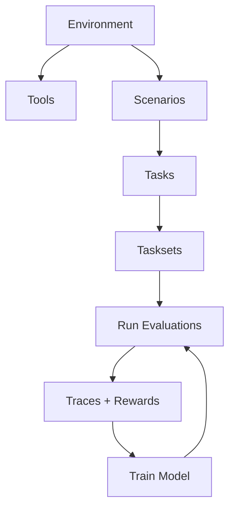

HUD has four core concepts. Everything else in the SDK and platform is built on top of them.

## Environments

An environment is the harness an agent operates in. It packages **tools** (what agents can do) and **scenarios** (how agents are evaluated) into a single deployable unit.

```python
from hud import Environment

env = Environment("my-env")
```

Under the hood, an environment is an [MCP](https://modelcontextprotocol.io) server. When you deploy it, HUD spins up a fresh, isolated instance for every evaluation -- no shared state, no interference between parallel runs.

Why not just point agents at a production API or website? Because a production API is one live instance with shared state. You can't run 500 parallel task runs against it without them stepping on each other. Environments solve this: isolated, deterministic, reproducible.

## Scenarios

A scenario defines how an agent is evaluated. It is an async generator function with **two yields** -- the first yield sends a prompt to the agent, and the second yield returns a reward.

Here's the simplest possible scenario:

```python
@env.scenario("count")
async def count(word: str, letter: str):
    # ---- PROMPT ----
    # The first yield sends a prompt to the agent.
    # The agent receives this prompt, runs its reasoning loop,
    # and returns its final answer as a string.
    answer = yield f"How many '{letter}' in '{word}'?"

    # ---- SCORING ----
    # After the agent responds, we check if the answer is correct.
    # The second yield returns a reward: 1.0 for correct, 0.0 for wrong.
    correct = str(word.lower().count(letter.lower()))
    yield 1.0 if answer and correct in answer else 0.0
```

Every scenario follows this structure:

| Section | Where | What it does |
|---------|-------|--------------|
| **Setup** *(optional)* | Before the first yield | Seed a database, navigate to a URL, prepare initial state |
| **Prompt** | The first `yield` | Sends instructions to the agent; receives the agent's answer |
| **Scoring** | After the first yield, ending with the second `yield` | Checks results and returns a reward between 0.0 and 1.0 |

The agent runs between the two yields. It calls tools, reasons, and produces an answer. Your scoring logic then checks the environment state and/or the answer to determine a reward.

Scenarios are **parameterized**. The same scenario with different arguments produces different evaluation tasks:

```python
env("count", word="strawberry", letter="r")  # one task (answer: 3)
env("count", word="banana", letter="a")      # another task (answer: 3)
env("count", word="mississippi", letter="s") # another task (answer: 4)
```

## Tools

Tools are functions that an agent can call while it's working on a task. You define a tool by decorating a function with `@env.tool()`:

```python
@env.tool()
def count_letter(text: str, letter: str) -> int:
    """Count occurrences of a letter in text."""
    return text.lower().count(letter.lower())
```

The docstring becomes the tool's description that the agent sees. The type hints become the tool's parameter schema. That's it -- your function is now something any AI model can invoke.

### Pre-built Tools

Most real environments don't need custom tools from scratch. HUD ships a library of standard tools you can compose into complex environments.

**Computer use environment** -- give an agent mouse, keyboard, and screenshot control:

```python
from hud import Environment
from hud.tools import AnthropicComputerTool, BashTool, EditTool

env = Environment("desktop-agent")

# Add computer control -- the agent can click, type, scroll, and take screenshots.
# HUD automatically adapts these to each model's native format
# (Claude's computer_20250124, OpenAI's computer_use_preview, etc.)
env.add_tool(AnthropicComputerTool())

# Add a shell -- the agent can run bash commands in a persistent session.
env.add_tool(BashTool())

# Add a file editor -- the agent can view and edit files with str_replace.
env.add_tool(EditTool())
```

**Web research environment** -- give an agent browser and search capabilities:

```python
from hud import Environment
from hud.tools import PlaywrightTool
from hud.tools.hosted import WebSearchTool
from hud.tools.filesystem import ReadTool, GrepTool

env = Environment("web-researcher")

# Add a browser -- the agent can navigate pages, click elements, fill forms.
env.add_tool(PlaywrightTool())

# Add web search -- Claude's native search, executed server-side by Anthropic.
env.add_tool(WebSearchTool())

# Add file reading -- the agent can read files and search their contents.
env.add_tool(ReadTool())
env.add_tool(GrepTool())
```

See the full [Tools Reference](/tools/computer) for all available tools (computer, coding, filesystem, memory, web, grounding).

### Connectors

Connectors let you pull external tools into your HUD environment. If you have tools defined somewhere else -- another HUD environment, an external MCP server, or an existing API -- connectors bring them in so your agent can use them alongside your own tools.

```python
# Connect a FastAPI app -- all its routes become agent-callable tools.
env.connect_fastapi(app)

# Connect an OpenAPI spec -- the spec's endpoints become tools.
env.connect_openapi("https://api.example.com/openapi.json")

# Connect another HUD environment -- its tools become available in yours.
env.connect_hub("hud-evals/browser")
```

You don't need connectors to get started. They're useful when you want to compose environments or wrap existing services.

## Tasks

A task is a scenario instantiated with specific arguments. It's what you actually run an agent against:

```python
task = env("count", word="strawberry", letter="r")
```

Tasks group into **tasksets** -- batches of related tasks used for benchmarking. Create a taskset, add tasks with different arguments, and run the whole set across models to compare performance.

## How They Fit Together



1. An **Environment** contains **Tools** and **Scenarios**
2. A **Scenario** + arguments = a **Task**
3. **Tasks** group into **Tasksets**
4. Run a taskset -> collect **Traces** with rewards
5. Train a model on calibrated Tasksets -> run again -> improve

## Running an Agent Against a Task

The `hud.eval()` context manager is how you run any agent against a task:

```python
import hud
from hud.agents import create_agent

task = env("count", word="strawberry", letter="r")
agent = create_agent("claude-sonnet-4-5")

async with hud.eval(task) as ctx:
    result = await agent.run(ctx)

print(f"Reward: {result.reward}")  # 1.0 if agent answers "3"
```

`create_agent()` is a convenience that picks the right agent class for each model. You can also bring your own agent loop:

```python
async with hud.eval(task) as ctx:
    # ctx.prompt         -- the prompt from the scenario's first yield
    # ctx.call_tool()    -- execute a tool call
    # ctx.submit()       -- submit the agent's final answer, triggers scoring
    # ctx.as_openai_chat_tools()  -- tools in OpenAI format
    # ctx.as_claude_tools()       -- tools in Anthropic format

    response = await client.chat.completions.create(
        model="gpt-4o",
        messages=[{"role": "user", "content": ctx.prompt}],
        tools=ctx.as_openai_chat_tools()
    )
    # ... handle tool calls in your own loop ...
    await ctx.submit(response.choices[0].message.content)

print(ctx.reward)
```

## Advance topics

HUD covers a lot of use cases for building environments at scale and agent development.

| Topic | What it is | When you'll need it |
|--------------|-----------|-------------------|
| [Harbor conversion](/advanced/harbor-convert) | Importing external benchmarks | Migrating existing benchmarks |
| [REST API](/platform/rest-api) | Programmatic platform access | Custom integrations |
| [Framework integrations](/guides/integrations) | LangChain, CrewAI, AutoGen, etc. | When using those frameworks |
| [Chat scenarios](/guides/chat) | Multi-turn conversational agents | Building chat products |
| [AgentTool](/tools/agents) | Hierarchical sub-agent delegation | Complex multi-agent workflows |
| [Slack integration](/platform/slack) | Running agents from Slack | Team workflows |

Start with: one environment, one scenario, a few out of the box tools, run it locally. Everything else builds on that.

## Next Steps

<CardGroup cols={2}>
<Card title="Quick Start" icon="rocket" href="/index">
  Install and run your first environment
</Card>

<Card title="Environments" icon="cube" href="/quick-links/environments">
  Tools, scenarios, and local development
</Card>

<Card title="Best Practices" icon="star" href="/guides/best-practices">
  Patterns for reliable environments and evals
</Card>

<Card title="Tasks & Training" icon="flask-vial" href="/quick-links/training">
  Run evaluations and train models
</Card>
</CardGroup>
