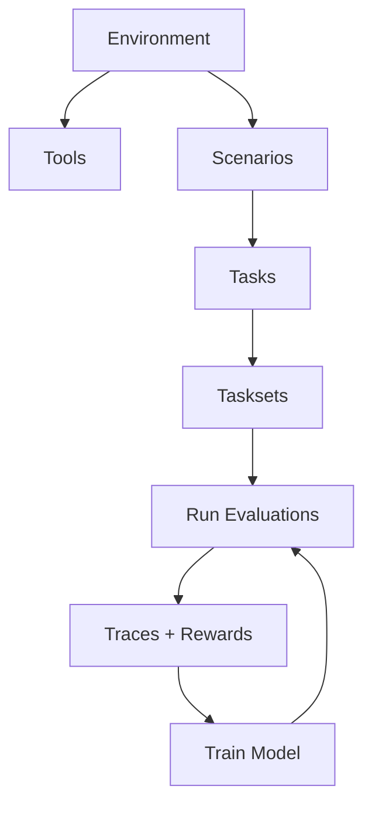

HUD has four core concepts. Everything else in the SDK and platform is built on top of them.

## Environments

An environment is the world an agent lives in. It packages **tools** (what agents can do) and **scenarios** (how agents are evaluated) into a single deployable unit.

```python
from hud import Environment

env = Environment("my-env")
```

Under the hood, an environment is an [MCP](https://modelcontextprotocol.io) server. When you deploy it, HUD spins up a fresh, isolated instance for every evaluation -- no shared state, no interference between parallel runs.

Why not just point agents at a production API or website? Because a production API is one live instance with shared state. You can't run 500 parallel task runs against it without them stepping on each other. Environments solve this: isolated, deterministic, reproducible.

## Tools

A tool is a function an agent can call. Decorate any function with `@env.tool()` and it becomes agent-callable:

```python
@env.tool()
def search(query: str) -> str:
    """Search the knowledge base."""
    return db.search(query)
```

The docstring becomes the tool's description that the agent sees. The type hints become the tool's parameter schema. That's it -- your function is now something any AI model can invoke.

You can also connect existing infrastructure as tools without rewriting anything:

```python
env.connect_fastapi(app)                                    # FastAPI routes → tools
env.connect_openapi("https://api.example.com/openapi.json") # OpenAPI spec → tools
env.connect_hub("hud-evals/browser")                        # HUD Hub environments → tools
```

HUD also ships [pre-built tools](/tools) for common capabilities (shell, file editing, computer use, browser automation, web search), but your own `@env.tool()` functions are the starting point.

## Scenario

A scenario defines how an agent is evaluated. It is an async generator with **two yields**:

```python
@env.scenario("checkout")
async def checkout(product_name: str):
    # --- Setup (runs before the agent) ---
    navigate(url="https://store.example.com")

    # --- First yield: the prompt ---
    # Sends the prompt to the agent. The agent runs. Its answer comes back.
    answer = yield f"Add '{product_name}' to cart and complete checkout"

    # --- Second yield: the reward ---
    # Checks what happened and returns a score (0.0 to 1.0).
    order_exists = check_order_status(product_name)
    yield 1.0 if order_exists else 0.0
```

The three sections are always the same:

| Section | Where | Purpose |
|---------|-------|---------|
| **Setup** | Before first yield | Seed state, navigate to starting point |
| **Prompt** | The first `yield` | Tell the agent what to do |
| **Scoring** | After first yield, ending with second `yield` | Check results, return reward |

The agent runs between the two yields. It calls tools, reasons, and eventually produces an answer. Your scoring logic then checks the environment state and/or the answer to determine a reward.

Scenarios are **parameterized**. The same scenario with different arguments produces different evaluation tasks:

```python
env("checkout", product_name="Laptop")     # one task
env("checkout", product_name="Headphones") # another task, same scenario
```

## Tasks

A task is a scenario instantiated with specific arguments. It's what you actually run an agent against:

```python
task = env("checkout", product_name="Laptop")
```

Tasks group into **tasksets** -- batches of related tasks used for benchmarking. Create a taskset, add tasks with different arguments, and run the whole set across models to compare performance.

## How They Fit Together



1. An **Environment** contains **Tools** and **Scenarios**
2. A **Scenario** + arguments = a **Task**
3. **Tasks** group into **Tasksets**
4. Run a taskset → collect **Traces** with rewards
5. Train a model on successful traces → run again → improve

## Running an Agent Against a Task

The `hud.eval()` context manager is how you run any agent against a task:

```python
import hud
from hud.agents import create_agent

task = env("checkout", product_name="Laptop")
agent = create_agent("claude-sonnet-4-5")

async with hud.eval(task) as ctx:
    result = await agent.run(ctx)

print(f"Reward: {result.reward}")
```

`create_agent()` is a convenience that picks the right agent class for each model. You can also bring your own agent loop:

```python
async with hud.eval(task) as ctx:
    # ctx.prompt         — the prompt from the scenario's first yield
    # ctx.call_tool()    — execute a tool call
    # ctx.submit()       — submit the agent's final answer → triggers scoring
    # ctx.as_openai_chat_tools()  — tools in OpenAI format
    # ctx.as_claude_tools()       — tools in Anthropic format

    response = await client.chat.completions.create(
        model="gpt-4o",
        messages=[{"role": "user", "content": ctx.prompt}],
        tools=ctx.as_openai_chat_tools()
    )
    # ... handle tool calls in your own loop ...
    await ctx.submit(response.choices[0].message.content)

print(ctx.reward)
```

## Advance topics

HUD covers a lot of use cases for post training and agent development.

| Topic | What it is | When you'll need it |
|--------------|-----------|-------------------|
| [Pre-built tools](/tools) | Shell, browser, file editing, etc. | When your tasks need system-level capabilities |
| [Harbor conversion](/advanced/harbor-convert) | Importing external benchmarks | Migrating existing benchmarks |
| [REST API](/platform/rest-api) | Programmatic platform access | Custom integrations |
| [Framework integrations](/guides/integrations) | LangChain, CrewAI, AutoGen, etc. | When using those frameworks |
| [Chat scenarios](/guides/chat) | Multi-turn conversational agents | Building chat products |
| [AgentTool](/tools/agents) | Hierarchical sub-agent delegation | Complex multi-agent workflows |
| [Slack integration](/platform/slack) | Running agents from Slack | Team workflows |

Start with: one environment, a few tools, one scenario, run it locally. Everything else builds on that.

## Next Steps

<CardGroup cols={2}>
<Card title="Quick Start" icon="rocket" href="/index">
  Install and run your first environment
</Card>

<Card title="Environments" icon="cube" href="/quick-links/environments">
  Tools, scenarios, and local development
</Card>

<Card title="Best Practices" icon="star" href="/guides/best-practices">
  Patterns for reliable environments and evals
</Card>

<Card title="Tasks & Training" icon="flask-vial" href="/quick-links/evals">
  Run evaluations and train models
</Card>
</CardGroup>
