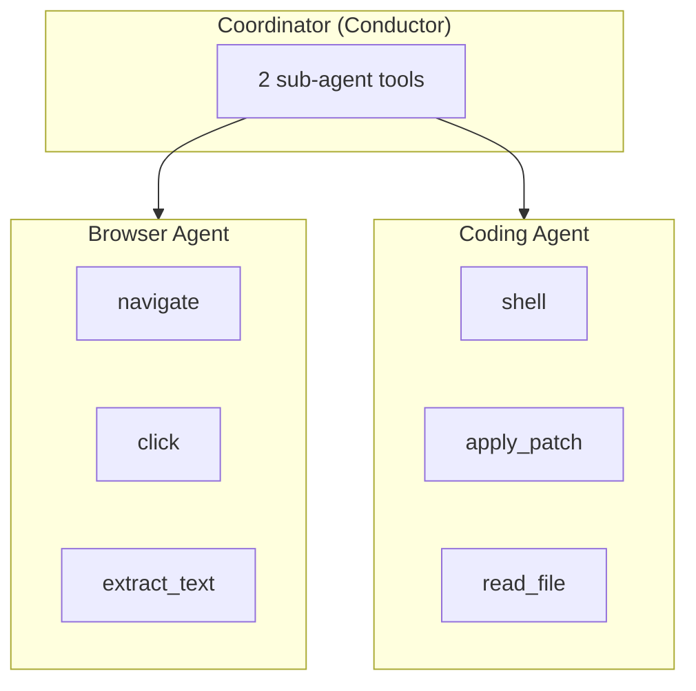

Multi-agent systems let you combine specialized agents—each with their own environment, tools, and model—into a coordinated workflow. A "conductor" agent orchestrates the specialists, dispatching tasks and synthesizing results.

<Card
  title="Example Code"
  icon="github"
  href="https://github.com/hud-evals/hud-python/blob/main/examples/07_multi_agent.py"
>
  Follow along with the full working example on GitHub.
</Card>

## Overview

The multi-agent pattern solves a common problem: as agent capabilities grow, a single agent with 50+ tools becomes unwieldy. By splitting responsibilities across specialized agents, each one stays focused and effective.



The conductor sees only 2 tools—one per specialist. Each specialist has a focused toolset for its domain.

## Key Concepts

| Concept | Description |
|---------|-------------|
| **Coordinator** | An Environment with sub-agents registered as tools |
| **AgentTool** | Wraps an environment + scenario as a callable tool |
| **Conductor** | The agent that runs the coordinator (makes decisions) |
| **Sub-agent** | A specialized agent wrapped as a tool |
| **Eval-only params** | Parameters hidden from conductor but available for evaluation |

## Quick Start

### Prerequisites

```bash
export HUD_API_KEY="sk-hud-..."
```

Get your API key at [hud.ai/project/api-keys](https://hud.ai/project/api-keys).

<Note>
  **Prerequisites**: You must deploy two hub environments before running this example:
  
  1. **Remote Browser**: Go to [hud-evals/hud-remote-browser](https://github.com/hud-evals/hud-remote-browser) → Fork to your GitHub → [hud.ai](https://hud.ai) → **New** → **Environment** → Import from your repo. Set required browser provider API keys (e.g., `ANCHOR_API_KEY`).
  
  2. **Codex Sandbox**: Go to [hud.ai](https://hud.ai) → **New** → **Environment** → Import from [hud-evals/codex_environment_sandbox](https://github.com/hud-evals/codex_environment_sandbox).
  
  Once deployed, update the `connect_hub()` calls to use your environment slugs (e.g., `my-org/remote-browser`).
</Note>

### Running the Example

```bash
# Default task: research and save to markdown
uv run python examples/07_multi_agent.py

# Custom research task
uv run python examples/07_multi_agent.py \
  --task "Find current prices of Bitcoin and Ethereum and save to crypto.md"

# Verbose mode
uv run python examples/07_multi_agent.py --verbose
```

## Building a Multi-Agent System

The pattern is simple:
1. Create `AgentTool`s that wrap environments + models
2. Register them on a coordinator `Environment`
3. Run a "conductor" agent that dispatches work to sub-agents

### Step 1: Create Sub-Agent Environments

Each sub-agent is an `Environment` with its own tools and scenario. Connect to HUD Hub environments or define local tools:

```python
from hud import Environment
from hud.tools.agent import AgentTool


def create_browser_agent() -> AgentTool:
    """Create a browser sub-agent for web research."""
    env = Environment("browser")
    env.connect_hub("hud-remote-browser-2")

    @env.scenario()
    async def web_research(
        task: str,
        start_url: str | None = None,
        expected_outcome: str | None = None,  # Eval-only (hidden from conductor)
    ):
        """Research information on the web."""
        prompt = f"""You are a web research agent with browser access.

Research Task: {task}
"""
        if start_url:
            prompt += f"\nStart URL: {start_url}"

        prompt += """

Find relevant information, extract key data, and return structured findings."""

        yield prompt
        yield 1.0

    return AgentTool(
        env("web_research"),
        model="claude-sonnet-4-5",  # Good at browser navigation
        name="web_research",
        description="Research information on the web. Use for finding articles, "
        "scraping data, comparing prices, and extracting structured information.",
    )
```

### Step 2: Define the Coding Agent

```python
def create_coding_agent() -> AgentTool:
    """Create a coding sub-agent for file operations."""
    env = Environment("coding")
    env.connect_hub("codex_environment_sandbox")

    @env.scenario()
    async def create_markdown(
        filename: str,
        content: str,
        expected_result: str | None = None,  # Eval-only
    ):
        """Create a markdown file with the given content."""
        prompt = f"""You are a file creation assistant.

Task: Create a markdown file named '{filename}' with the following content:

{content}

IMPORTANT: Use the `apply_patch` tool to create the file.

Steps:
1. Use apply_patch to create '{filename}' with the content above
2. Confirm it was created successfully

Return a confirmation message."""

        yield prompt
        yield 1.0

    return AgentTool(
        env("create_markdown"),
        model="gpt-5.1",  # Codex-capable for native shell/apply_patch
        name="create_markdown",
        description="Create a markdown file with specified content. Use for "
        "saving research findings, creating reports, and documenting results.",
    )
```

### Step 3: Create the Coordinator

Create an `Environment` with sub-agents as tools, then run a conductor agent:

```python
import hud
from hud import Environment
from hud.agents import create_agent


async def run_research(task: str):
    # Create sub-agents as tools
    browser_agent = create_browser_agent()
    coding_agent = create_coding_agent()

    # Create coordinator environment with sub-agents as tools
    coordinator = Environment("coordinator")
    coordinator.add_tool(browser_agent)
    coordinator.add_tool(coding_agent)

    # Define the coordination scenario
    @coordinator.scenario()
    async def coordinate(prompt: str):
        yield prompt
        yield 1.0

    # System prompt for the conductor
    system_prompt = """You are a research assistant coordinating specialized agents.

Available sub-agents (call as tools):
- web_research: Find information on the web
- create_markdown: Create markdown files

CRITICAL: Sub-agents don't share context. When calling create_markdown, 
you MUST pass the content you want to save.

Workflow:
1. web_research: Gather data
2. Format the data into markdown content
3. create_markdown: Save the formatted content
"""

    # Run with eval context
    async with hud.eval(
        coordinator("coordinate", prompt=task),
        name="multi-agent-research",
    ) as ctx:
        conductor = create_agent("gpt-4o", system_prompt=system_prompt)
        result = await conductor.run(ctx, max_steps=10)

    print(f"Reward: {ctx.reward}")
    print(f"Result: {result.content}")
```

## AgentTool API

`AgentTool` wraps an environment's scenario as a callable tool:

```python
from hud.tools.agent import AgentTool

tool = AgentTool(
    env("scenario_name"),      # Task from environment
    model="claude-sonnet-4-5", # Model for this sub-agent
    name="tool_name",          # Name shown to conductor
    description="...",         # Description for conductor
    agent=None,                # Or provide custom agent class
    agent_params={},           # Params passed to agent
    trace=False,               # Enable separate tracing
)
```

### Eval-Only Parameters

Parameters with `| None = None` are automatically hidden from the conductor's tool schema:

```python
@env.scenario()
async def investigate(
    query: str,                           # Visible to conductor
    expected_finding: str | None = None,  # Hidden (eval-only)
):
    response = yield f"Investigate: {query}"
    
    # Use expected_finding for scoring
    if expected_finding and response:
        yield 1.0 if expected_finding.lower() in response.lower() else 0.0
    else:
        yield 1.0
```

This lets you include ground truth for evaluations without exposing it to the conductor.

## Context Isolation

<Warning>
**Sub-agents don't share context.** Each sub-agent runs in its own isolated environment. The conductor must explicitly pass all necessary data when calling a sub-agent.
</Warning>

```python
# ❌ Wrong: Assuming sub-agent knows about previous results
result = await ctx.call_tool(name="web_research", arguments={"task": "Find stock prices"})
# The create_markdown agent won't know what web_research found!
await ctx.call_tool(name="create_markdown", arguments={"filename": "report.md"})

# ✅ Correct: Pass data explicitly
result = await ctx.call_tool(name="web_research", arguments={"task": "Find stock prices"})
await ctx.call_tool(name="create_markdown", arguments={
    "filename": "report.md",
    "content": result.content  # Pass the data!
})
```

Your system prompt should remind the conductor about this:

```python
system_prompt="""...
CRITICAL: Sub-agents don't share context. When calling create_markdown, 
you MUST pass the content you want to save.
..."""
```

## Trace Continuity

All sub-agent activity appears in a single trace on the HUD platform. When the conductor calls a sub-agent tool, the inference and tool calls are recorded under the parent trace—no separate URLs to track.

```
🎭 Coordinator Trace
├── 🤖 Conductor: "I'll research GOOGL prices first..."
│   └── 🔧 web_research(task="Find GOOGL price")
│       ├── 🤖 Browser Agent: "Navigating to finance site..."
│       │   └── 🔧 navigate(url="https://finance.google.com")
│       │   └── 🔧 extract_text(selector=".price")
│       └── ✅ "GOOGL: $185.42"
├── 🤖 Conductor: "Now I'll save to markdown..."
│   └── 🔧 create_markdown(filename="googl.md", content="# GOOGL Price\n...")
│       ├── 🤖 Coding Agent: "Creating file..."
│       │   └── 🔧 apply_patch(type="create_file", path="googl.md", ...)
│       └── ✅ "Created googl.md"
└── ✅ "Research complete!"
```

## Advanced Patterns

### Custom Conductor Agent

Use a custom agent class for the conductor:

```python
from hud.agents.claude import ClaudeAgent

# Create and run with a custom agent
async with hud.eval(coordinator("coordinate", prompt=task)) as ctx:
    conductor = ClaudeAgent.create(
        checkpoint_name="claude-sonnet-4-5",
        system_prompt=system_prompt,
        max_tokens=8192,
    )
    result = await conductor.run(ctx, max_steps=10)
```

### Multiple Scenarios

Define multiple scenarios on the coordinator:

```python
@coordinator.scenario()
async def research(prompt: str):
    yield prompt
    yield 1.0

@coordinator.scenario()
async def summarize(topic: str, length: str = "short"):
    yield f"Summarize {topic} in a {length} format"
    yield 1.0

# Use different scenarios
async with hud.eval(coordinator("research", prompt="Find Python frameworks")) as ctx:
    ...

async with hud.eval(coordinator("summarize", topic="ML", length="detailed")) as ctx:
    ...
```

### Mixing AgentTools with Regular Tools

You can add both AgentTools (sub-agents) and regular tools:

```python
from hud.tools.base import BaseTool

class CalculatorTool(BaseTool):
    def __init__(self):
        super().__init__(name="calculator", description="Add two numbers")
    
    async def __call__(self, a: float, b: float) -> str:
        return str(a + b)

coordinator = Environment("hybrid")
coordinator.add_tool(browser_agent)      # AgentTool (spawns sub-agent)
coordinator.add_tool(CalculatorTool())   # Regular tool (runs directly)
```

## CLI Options

| Flag | Default | Description |
|------|---------|-------------|
| `--task` | Stock research | The task for the coordinator |
| `--conductor` | `gpt-4o` | Model for the conductor agent |
| `--max-steps` | `10` | Maximum conductor steps |
| `--verbose` | Off | Enable verbose output |

## See Also

- [Ops Diagnostics](/cookbooks/ops-diagnostics) - A more complex multi-agent example
- [AgentTool Reference](/reference/tools#agenttool) - Detailed AgentTool API
- [Building Environments](/build-environments) - Creating custom environments
- [Scenarios](/reference/environments#scenarios) - Scenario patterns and best practices
