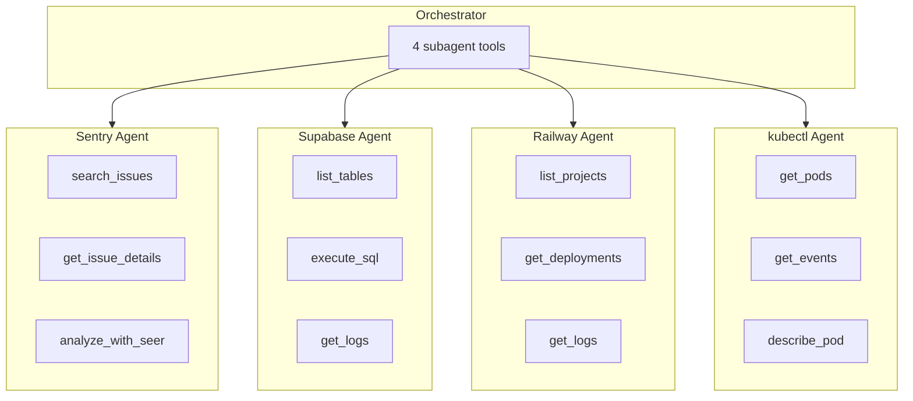

At HUD, we run a complex stack: Sentry for errors, Supabase for data, Railway for deployments, and Kubernetes for orchestration. When something breaks, we wanted an agent that could investigate across all services and provide a unified diagnosis.

This cookbook walks through how we built it—focusing on **environment design**, **hierarchical delegation**, and **practical patterns** for production agent systems.

## Why Hierarchical?

When you connect multiple MCP servers to a single environment, the agent sees all tools at once. For diagnostics across four services, this meant 60+ tools in a flat list. The cognitive load made it harder for the model to select the right tool for the job.

We restructured into a hierarchy: an orchestrator that delegates to specialized subagents.



The orchestrator sees only 4 tools—one per specialist. Each specialist has a focused toolset for its domain.

## Environment Design

Good environment design is the foundation. Each subagent is an `Environment` with:
- A **focused toolset** (only what's needed for this domain)
- A **single scenario** that defines the interface
- **Read-only constraints** for safety

### Connecting to MCP Servers

For services with official MCP servers (Sentry, Supabase), connect via `connect_mcp_config`:

```python
# environments/sentry.py
from hud import Environment
import os
import platform

sentry_env = Environment(name="sentry-agent")

IS_WINDOWS = platform.system() == "Windows"
token = os.getenv("SENTRY_AUTH_TOKEN")

if token:
    config = {
        "command": "cmd" if IS_WINDOWS else "npx",
        "args": ["/c", "npx", "-y", "@sentry/mcp-server@latest"] if IS_WINDOWS 
                else ["-y", "@sentry/mcp-server@latest"],
        "env": {"SENTRY_ACCESS_TOKEN": token}
    }
    sentry_env.connect_mcp_config({"sentry": config})
```

### Custom Tools When Needed

Railway's MCP server requires browser OAuth—not ideal for headless agents. We built custom tools using their GraphQL API:

```python
# environments/tools/railway.py
from hud.server import MCPRouter
import httpx
import os

router = MCPRouter()
RAILWAY_API = "https://backboard.railway.com/graphql/v2"


async def _graphql(query: str, variables: dict | None = None) -> dict:
    token = os.getenv("RAILWAY_API_TOKEN")
    async with httpx.AsyncClient() as client:
        resp = await client.post(
            RAILWAY_API,
            headers={"Authorization": f"Bearer {token}"},
            json={"query": query, "variables": variables}
        )
        return resp.json()


@router.tool()
async def railway_list_projects() -> dict:
    """List all projects with their services."""
    return await _graphql("""
        query {
            projects {
                edges { node { id name } }
            }
        }
    """)


@router.tool()
async def railway_get_deployment_logs(deployment_id: str) -> dict:
    """Get logs for a deployment."""
    return await _graphql("""
        query($id: String!) {
            deploymentLogs(deploymentId: $id) {
                ... on Log { message timestamp severity }
            }
        }
    """, {"id": deployment_id})
```

Then include the router in your environment:

```python
# environments/railway.py
from hud import Environment
from .tools.railway import router

railway_env = Environment(name="railway-agent")
railway_env.include_router(router)
```

### Defining the Scenario

The scenario is the contract between orchestrator and subagent:

```python
@sentry_env.scenario("investigate")
async def investigate_issue(
    query: str,                          # Orchestrator provides this
    expected_finding: str | None = None, # Hidden from orchestrator (eval-only)
):
    """Investigate errors in Sentry."""
    
    prompt = f"""You are a Sentry specialist. Investigate:

**Query:** {query}

**IMPORTANT: This is a READ-ONLY investigation.**

Provide findings, root cause analysis, and recommended fixes."""

    response = yield prompt
    
    # Scoring for evals
    if expected_finding and response:
        yield 1.0 if expected_finding.lower() in response.lower() else 0.5
    else:
        yield 1.0 if response else 0.0
```

<Note>
**Eval-only parameters**: Parameters with `| None = None` are automatically hidden from the orchestrator's tool schema but available for evaluation scoring.
</Note>

## Building the Orchestrator

The orchestrator wraps each subagent's scenario as an `AgentTool`:

```python
# orchestrator.py
from hud import Environment
from hud.tools import AgentTool
from hud.agents import create_agent
import hud

from environments import sentry_env, supabase_env, railway_env, kubectl_env


async def diagnose(query: str, model: str = "claude-sonnet-4-5"):
    orchestrator = Environment(name="ops-orchestrator")
    
    # Wrap each subagent as a tool
    for name, env, desc in [
        ("investigate_sentry", sentry_env, "Check error monitoring"),
        ("investigate_supabase", supabase_env, "Check database/auth"),
        ("investigate_railway", railway_env, "Check deployments"),
        ("investigate_kubernetes", kubectl_env, "Check cluster health"),
    ]:
        tool = AgentTool(
            env("investigate"),
            model=model,
            name=name,
            description=desc,
        )
        orchestrator.add_tool(tool.mcp)
    
    @orchestrator.scenario("diagnose")
    async def run_diagnosis(issue: str):
        yield f"""You are an ops diagnostics orchestrator.

**Issue:** {issue}

You have READ-ONLY subagents for Sentry, Supabase, Railway, and Kubernetes.
Investigate systematically and correlate findings across services."""
    
    task = orchestrator("diagnose", issue=query)
    
    async with hud.eval(task) as ctx:
        agent = create_agent(model)
        return await agent.run(ctx, max_steps=20)
```

### Trace Continuity

All subagent activity appears in a single trace on the HUD platform. When the orchestrator calls a subagent tool, the inference and tool calls are recorded under the parent trace—no separate URLs to track.

## The READ-ONLY Constraint

<Warning>
We tested and operated this environment directly on our production systems, so all scenarios enforce read-only constraints. We removed mutation tools like `kubectl_exec`, `railway_redeploy`, and Supabase DDL operations.

Every prompt includes: **"This is a READ-ONLY investigation."**
</Warning>

## Sample Output

Running against a real production issue:

```bash
python orchestrator.py --model claude-sonnet-4-5 \
  "Failed to delete pod: 429 Too Many Requests. 7451 events, escalating."
```

The orchestrator delegates to `investigate_sentry`, `investigate_railway`, and `investigate_supabase`, then correlates findings across services. After about 5 minutes:

```text Diagnosis
COMPREHENSIVE DIAGNOSIS REPORT

Issue Summary
  - Error: Failed to delete pod ████████████████████████████████████: 429 Too Many Requests
  - Impact: 7,451 events over 5 days, 16 users affected, escalating state
  - Project: Orchestrator / mcp-server
  - Alert ID: ORCHESTRATOR-AC

ROOT CAUSE ANALYSIS

  Primary Root Cause: Kubernetes API Rate Limiting

  The orchestrator service is hitting Kubernetes API server rate limits when
  attempting to delete pods at scale. This is occurring in the
  ████████.hud_gym.utils.kubernetes module.

  Key Contributing Factors:

    1. Excessive Deletion Frequency: ~1,491 errors/day (~62/hour) indicates
       aggressive pod deletion attempts
    2. No Retry/Backoff Logic: Code lacks exponential backoff when encountering
       429 responses
    3. High Concurrency: Service runs with 50 uvicorn workers + 32 Railway
       replicas, amplifying concurrent API calls
    4. Burst Traffic Pattern: Correlated with API usage spikes (313 inference
       calls/minute at peak)
    5. No Client-Side Rate Limiting: Kubernetes client not configured with QPS
       limits

CORRELATED FINDINGS ACROSS SERVICES

  Sentry (Error Tracking)
    - 7,455 occurrences of the 429 error between ██████████████
    - Last occurrence: ████████████████████
    - Error originates from: ████████.hud_gym.utils.kubernetes logger
    - Associated with HTTP PATCH to Supabase /rest/v1/environments endpoint
    - Part of environment update/cleanup workflow

  Railway (Deployment Platform)
    - Production service: 32 replicas in us-west2
    - Latest successful deployment: ████████████████████ (30 min AFTER last
      Sentry error)
    - Historical failures (██████): AWS EKS credential issues (now resolved)
    - No current rate limiting errors in deployment logs
    - Pod deletions working normally post-fix

  Supabase (Database/API)
    - API burst traffic spike: 313 calls/minute at ████████████████████
    - ████ Team (22 members, free tier): 15,933 inference calls/24h - prime
      candidate for "16 users"
    - Connection pool saturation: 49 waiting connections out of 52
    - Security vulnerabilities: 38 tables with RLS enabled but NO policies
    - Performance issues: 52 unindexed foreign keys, inefficient RLS policies
    - 429 errors occur at API gateway layer (not visible in Postgres logs)

  Kubernetes
    - Investigation unavailable due to response size (cluster likely healthy
      but under load)

CORRELATION & TIMELINE

  ██████████████: 7,455 pod deletion failures (continuous)
    - ████████████████████: Last 429 error recorded in Sentry
    - ████████████████████: New production deployment (likely contained fix)
    - ████████████████████: API traffic spike (313 req/min)

  Pattern Identified:

    1. Orchestrator creates ephemeral pods for task execution (inference
       workloads)
    2. High inference API traffic (15,933 calls/day from ████ team) triggers
       frequent pod creation
    3. Cleanup attempts to delete pods rapidly after task completion
    4. Kubernetes API rate limits exceeded due to:
       - 50 uvicorn workers x 32 Railway replicas = 1,600 concurrent processes
       - No client-side rate limiting or request coordination
       - No exponential backoff on 429 responses
    5. Failed deletions likely retry aggressively, compounding the problem

RECOMMENDED ACTIONS FOR HUMANS

  CRITICAL - Immediate Actions

    1. Implement Exponential Backoff
       Location: ████████.hud_gym.utils.kubernetes

         def delete_pod_with_retry(api_client, pod_name, namespace, max_retries=5):
             for attempt in range(max_retries):
                 try:
                     api_client.delete_namespaced_pod(pod_name, namespace)
                     return True
                 except ApiException as e:
                     if e.status == 429 and attempt < max_retries - 1:
                         wait_time = (2 ** attempt) + random.uniform(0, 1)
                         logger.warning(f"Rate limited, retrying in {wait_time:.1f}s")
                         time.sleep(wait_time)
                         continue
                     raise
             return False

    2. Configure Kubernetes Client Rate Limiting

         configuration = client.Configuration()
         configuration.qps = 5.0      # Max 5 queries per second per client
         configuration.burst = 10     # Allow bursts up to 10

    3. Add Concurrency Control

         k8s_api_semaphore = Semaphore(10)  # Max 10 concurrent API calls

         async def delete_pod_rate_limited(pod_name, namespace):
             async with k8s_api_semaphore:
                 return await delete_pod_with_retry(pod_name, namespace)

  HIGH PRIORITY - Within 48 Hours

    4. Optimize Worker Configuration
       - Current: 50 uvicorn workers x 32 Railway replicas = 1,600 processes
       - Recommendation: Reduce uvicorn workers to 10-20 per replica
       - Why: Excessive concurrency amplifies K8s API load

    5. Implement Pod Deletion Queue
       - Use background queue (Redis, Celery) for pod deletions
       - Process deletions with controlled rate (e.g., 100/minute globally)
       - Provides visibility into deletion backlog

    6. Fix Supabase Security Issues
       - URGENT: Add RLS policies to 38 tables currently without policies
       - Enable leaked password protection
       - Reduce OTP expiry to < 1 hour
       - Index 52 foreign keys for query performance
       - Remove 5 duplicate indexes

    7. Upgrade ████ Team or Implement Graduated Rate Limits
       - ████ team (22 members, free tier) using 15,933 API calls/day
         (enterprise-level)
       - Either upgrade to paid tier or implement request throttling
       - Add monitoring for teams exceeding tier limits

  MEDIUM PRIORITY - Within 1 Week

    8. Add Monitoring & Alerting
       - Track pod deletion success/failure rates
       - Monitor K8s API rate limit headers (X-RateLimit-Remaining)
       - Alert when deletion failure rate > 5%
       - Add dashboards for pod lifecycle metrics

    9. Implement Circuit Breaker Pattern

         k8s_breaker = CircuitBreaker(fail_max=5, timeout_duration=60)

         @k8s_breaker
         def delete_pod_protected(pod_name, namespace):
             return delete_pod_with_retry(pod_name, namespace)

    10. Optimize Pod Lifecycle
        - Review if pods can be longer-lived (reduce churn)
        - Consider pod pooling/reuse for similar tasks
        - Use K8s native garbage collection where possible
        - Set propagationPolicy=Background for async cleanup

    11. Fix Supabase Connection Pool
        - Switch auth server to percentage-based connection allocation
        - Current: 49 waiting connections out of 52 (saturation)
        - Monitor connection wait times and adjust pool size

  LOW PRIORITY - Technical Debt

    12. Update Deprecated Dependencies
        - Replace close() with aclose() for Redis connections
        - Update Supabase client for new parameter configuration
        - Address deprecation warnings in logs

    13. Add Request Coalescing
        - Batch multiple pod deletions into single API calls where possible
        - Implement request deduplication for identical operations

VALIDATION STEPS

  After implementing fixes, validate with:

    1. Sentry: Monitor ORCHESTRATOR-AC for decreased error frequency (target: 0
       errors)
    2. Kubernetes: Check API server metrics for reduced throttling events
    3. Railway: Verify pod deletion logs show successful operations
    4. Supabase: Confirm API traffic patterns stay within rate limits
    5. Metrics: Track pod deletion latency and success rate

COMMIT MESSAGE TEMPLATE

    fix: implement exponential backoff for K8s pod deletions

    - Add retry logic with exponential backoff for 429 errors
    - Configure client-side rate limiting (5 QPS, 10 burst)
    - Add concurrency control with semaphore (max 10 concurrent)
    - Reduce uvicorn workers from 50 to 20 per replica

    Fixes ORCHESTRATOR-AC
    Resolves rate limiting issues affecting 16 users over 5 days

SUCCESS CRITERIA

    - Zero 429 errors in Sentry for 7 consecutive days
    - Pod deletion success rate > 99.9%
    - Average deletion latency < 2 seconds
    - No user-facing impact from pod lifecycle operations
    - Supabase API calls stay within tier limits

Investigation Status: Complete
Next Review: After fix deployment (monitor for 48 hours)
```

The entire investigation—from initial query to actionable recommendations—took about 5 minutes across the specialized subagents.

## What We Learned

1. **Environment design matters.** A focused toolset per domain outperforms a flat list of everything.

2. **Scenarios are contracts.** They define what the orchestrator can ask and what the subagent returns.

3. **Custom tools fill gaps.** When MCP servers don't fit your auth model, build direct API integrations.

## See Also

- [AgentTool Reference](/reference/tools#agenttool)
- [Building Environments](/build-environments)
- [Scenarios](/reference/environments#scenarios)
