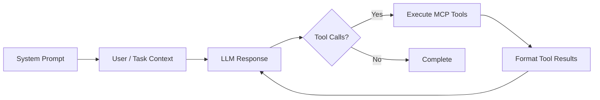

Build custom agents that use MCP tools to complete tasks. An agent is a loop that:

1. Sends messages to your LLM
2. Receives a response (possibly with tool calls)
3. Executes those tools via MCP
4. Feeds results back and repeats until done

## How agents run



The base class (`MCPAgent`) manages this loop, MCP connections, tool discovery/filtering, optional setup/evaluation tools, and tracing. You only bridge your LLM’s message format to MCP.

## The 4 methods you implement

Every agent subclass implements these four:

```python
from typing import Any
from hud.agents import MCPAgent
from hud.types import AgentResponse, MCPToolCall, MCPToolResult

class MyAgent(MCPAgent):
    async def get_system_messages(self) -> list[Any]:
        """Return provider-specific 'system' messages. Called once at start."""
        ...

    async def format_blocks(self, blocks: list[Any]) -> list[Any]:
        """Convert MCP content blocks (text/images) into your LLM's input format."""
        ...

    async def get_response(self, messages: list[Any]) -> AgentResponse:
        """Call your LLM with the full conversation and return:
           - content: assistant text
           - tool_calls: list[MCPToolCall] when the LLM wants to use tools
           - done: True when you want the loop to stop
        """
        ...

    async def format_tool_results(
        self, tool_calls: list[MCPToolCall], tool_results: list[MCPToolResult]
    ) -> list[Any]:
        """Convert MCP tool outputs back into your LLM's input format (e.g., a tool or user message)."""
        ...
```

Call order during a run:

1. `get_system_messages()` (once)
2. `format_blocks()` (initial prompt/context → provider format)
3. Loop: `get_response()` → (if tools) execute → `format_tool_results()` → back to `get_response()`
4. Stop when `get_response().done` is `True` or no further tool calls

---

## Quickstart: extend a built-in (recommended)

Pick a base class that already speaks your provider’s API:

| Base class                | When to use                                                                                        | Notes                                                                                  |
| ------------------------- | -------------------------------------------------------------------------------------------------- | -------------------------------------------------------------------------------------- |
| `GenericOpenAIChatAgent`  | Any OpenAI-compatible **chat.completions** endpoint (OpenAI, Together, local oai-compatible, etc.) | Stateless; converts MCP tool schemas to OpenAI function tools (with a sanitizer).      |
| `OperatorAgent`           | OpenAI **Responses + Computer Use** API                                                            | Stateful (uses `previous_response_id`); expects an MCP tool named `openai_computer`.   |
| `ClaudeAgent`             | Anthropic Messages (beta tools + optional computer-use beta)                                       | Maps Claude `computer_20250124` to your MCP computer tool; handles Claude tool blocks. |
| `GroundedOpenAIChatAgent` | OpenAI chat, but you want vision grounding (separate model)                                        | Intercepts a synthetic `computer` tool and calls a `Grounder` to locate elements.      |
| `LiteAgent`               | Any provider supported by LiteLLM                                                                  | Same OpenAI chat shape; optionally uses LiteLLM’s MCP→OpenAI tool transformer.         |
| `LangChainAgent`          | You already use LangChain LLMs/tools                                                               | Wraps MCP tools as LangChain tools via an adapter (optional dependency).               |

### Example: point an OpenAI-compatible client at MCP

```python
from openai import AsyncOpenAI
from hud.agents import GenericOpenAIChatAgent
from hud.datasets import Task

oai = AsyncOpenAI(base_url="https://my-gateway/v1", api_key="...")

agent = GenericOpenAIChatAgent(
    openai_client=oai,
    model_name="gpt-4o-mini",
    allowed_tools=["computer"],        # optional filtering
    disallowed_tools=["dangerous_op"], # optional filtering
    verbose=True
)

task = Task(
  prompt="Open example.com and tell me the page title",
  mcp_config={"hud": {"url": "https://mcp.hud.so/v3/mcp"}},  # your MCP servers
  setup_tool={"name": "setup", "arguments": {"name": "navigate", "arguments": {"url": "https://example.com"}}},
  evaluate_tool={"name": "evaluate", "arguments": {"name": "text_match", "arguments": {"pattern": "Example Domain"}}},
)

result = await agent.run(task)
print(result.reward, result.content)
```

That’s all—you didn’t have to write the 4 bridge methods because the base class already did.

---

## Writing a custom agent from `MCPAgent` (from scratch)

Use this when you’re integrating a brand-new LLM API. Here’s a minimal, real template:

```python
from typing import Any, cast
from hud.agents import MCPAgent
from hud.types import AgentResponse, MCPToolCall, MCPToolResult
import mcp.types as types

class MyRawProviderAgent(MCPAgent):
    async def get_system_messages(self) -> list[Any]:
        return [{"role": "system", "content": self.system_prompt}]

    async def format_blocks(self, blocks: list[types.ContentBlock]) -> list[Any]:
        content = []
        for b in blocks:
            if isinstance(b, types.TextContent):
                content.append({"type": "text", "text": b.text})
            elif isinstance(b, types.ImageContent):
                content.append({"type": "image_url",
                                "image_url": {"url": f"data:{b.mimeType};base64,{b.data}"}})
        return [{"role": "user", "content": content}]

    async def get_response(self, messages: list[Any]) -> AgentResponse:
        # 1) Call your provider here with `messages`
        # 2) Convert its tool-calls to MCPToolCall(name, arguments, id)
        # 3) Return AgentResponse(...)
        provider = ...  # your SDK
        resp = await provider.create(messages=messages, tools=self.get_tool_schemas())
        tool_calls = []
        for tc in getattr(resp, "tool_calls", []):
            args = tc.get("arguments", {}) or {}
            tool_calls.append(MCPToolCall(id=tc.get("id"), name=tc["name"], arguments=args))
        done = not tool_calls and getattr(resp, "finish_reason", "stop") in ("stop", "length")
        return AgentResponse(content=getattr(resp, "text", "") or "", tool_calls=tool_calls, done=done)

    async def format_tool_results(
        self, tool_calls: list[MCPToolCall], tool_results: list[MCPToolResult]
    ) -> list[Any]:
        # Many providers accept only strings for tool outputs; concatenate text.
        text_parts = []
        images = []
        for call, res in zip(tool_calls, tool_results, strict=False):
            if res.isError:
                text_parts.append(f"[{call.name}] ERROR: " + _first_text(res) or "error")
            else:
                t = _first_text(res)
                if t: text_parts.append(f"[{call.name}] {t}")
                img = _last_image(res)
                if img: images.append({"type":"image_url","image_url":{"url":f"data:{img.mimeType};base64,{img.data}"}})
        content = []
        if text_parts: content.append({"type":"text","text":"\n".join(text_parts)})
        content.extend(images[-1:])  # keep it compact: latest screenshot
        return [{"role": "user", "content": content or [{"type":"text","text":"Tools returned no output"}]}]

def _first_text(res: MCPToolResult) -> str | None:
    for c in res.content:
        if isinstance(c, types.TextContent):
            return c.text
    return None

def _last_image(res: MCPToolResult):
    last = None
    for c in res.content:
        if isinstance(c, types.ImageContent):
            last = c
    return last
```

> Tip: If your provider has its own tool-call shape, your job is just mapping that shape to `MCPToolCall` and mapping `MCPToolResult` back into your provider’s message format.

---

## What `MCPAgent` already does for you

- **Client lifecycle**: If you don’t pass a client, `agent.run(Task)` auto-creates one from `task.mcp_config` and cleans it up afterwards.
- **Tool discovery & filtering**:

  - `allowed_tools`, `disallowed_tools`, plus **lifecycle** tools (`setup`, `evaluate`, and an auto-detected `response` tool) are handled for you.
  - `get_available_tools()` returns tools your LLM is allowed to see (lifecycle tools are hidden).
- **Setup & Evaluate** (optional): If your `Task` supplies them, setup tool output can be appended to the first turn (`append_setup_output=True`), and evaluation computes a reward (looks for `reward`/`grade`/`score` keys).
- **Tracing & logs**: Consistent logs via HUDConsole and optional auto tracing (`auto_trace=True`).

Minimal usage surface:

```python
result = await agent.run("Just a prompt", max_steps=5)
# or
result = await agent.run(task_obj, max_steps=10)
```

The return is a `Trace` with `.reward`, `.done`, `.content`, `.isError`, and the full step history.

---

## Common options you’ll actually use

- **Tool filtering**

  ```python
  agent = ClaudeAgent(
      allowed_tools=["anthropic_computer", "search"],
      disallowed_tools=["danger_delete"]
  )
  ```
- **Screenshots / setup output**

  ```python
  agent = GenericOpenAIChatAgent(
      initial_screenshot=True,      # include a first screenshot when supported
      append_setup_output=False     # don’t push setup output into the first LLM turn
  )
  ```
- **Auto stop/continue helper**

  ```python
  from hud.agents.misc import ResponseAgent
  agent = GenericOpenAIChatAgent(response_agent=ResponseAgent())
  ```

---

## Provider-specific notes (quick)

- **OpenAI chat (`GenericOpenAIChatAgent`)**

  - Converts MCP JSON Schemas to OpenAI function tools (handles `anyOf`, `prefixItems` via a sanitizer).
  - Returns OpenAI-style tool messages and injects the latest image as a separate user message when needed.

- **OpenAI Responses + Computer Use (`OperatorAgent`)**

  - Stateful; tracks `previous_response_id` and `pending_call_id`.
  - Expects an MCP tool named **`openai_computer`** (required tool).
  - Formats tool results to send the latest screenshot back as an `input_image`.

- **Anthropic (`ClaudeAgent`)**

  - Builds a mapping from Claude tool names to MCP tool names; prefers the `computer_20250124` beta if available and enables the corresponding beta.
  - Accepts/returns Anthropic beta content blocks; includes “thinking” summary when present.

- **Grounded OpenAI (`GroundedOpenAIChatAgent`)**

  - The LLM sees only a synthetic `computer` function with natural-language element descriptions.
  - The agent calls a separate **Grounder** to resolve `"blue button in top-right"` → `(x, y)` clicks and forwards to the real MCP computer tool.

- **LiteLLM (`LiteAgent`)**

  - Uses LiteLLM for transport; if available, uses LiteLLM’s MCP→OpenAI tool transformer for stricter compatibility.

- **LangChain (`LangChainAgent`)**

  - Wraps MCP tools as LangChain tools via `LangChainAdapter` (optional dependency).
  - Uses `create_tool_calling_agent` + `AgentExecutor` under the hood.

---

## Running and testing quickly

A tiny async smoke test:

```python
import asyncio, os
from hud.agents import GenericOpenAIChatAgent
from openai import AsyncOpenAI

async def main():
    agent = GenericOpenAIChatAgent(
        openai_client=AsyncOpenAI(api_key=os.getenv("OPENAI_API_KEY")),
        model_name="gpt-4o-mini",
    )
    result = await agent.run("What is 2 + 2?")
    print(result.content)

asyncio.run(main())
```

For more thorough tests, look at `hud/agents/tests/` for examples of:

- mocking provider SDKs
- verifying `format_blocks`/`format_tool_results`
- simulating tool calls and checking the loop behavior

---

## Troubleshooting (fast)

- **“Required tools not available: ['openai_computer']”**
  Your MCP servers must expose those tool names. Check `agent.get_available_tools()`; verify your `mcp_config`.

- **Provider says “prompt too long”**
  Trim message history or mimic what `ClaudeAgent` does (truncate earlier turns on 413).

- **Model keeps asking “Should I continue?”**
  Add `ResponseAgent()` to auto-resolve CONTINUE/STOP decisions, or refine your `system_prompt`.

- **No screenshot in the next step**
  Ensure your MCP computer tool returns an `ImageContent`. `OperatorAgent` and `GroundedOpenAIChatAgent` forward the latest screenshot automatically.

---

## See also

- [`hud eval`](/reference/cli/eval) – run agents/datasets from the CLI
- [`hud rl`](/reference/cli/rl) – train agents with GRPO
- [Agents (SDK Reference)](/reference/agents) – API details & built-ins
