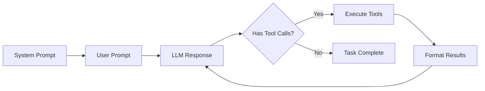

Build custom agents that interact with MCP tools to complete tasks. An agent is essentially a loop that calls your LLM, executes tools based on its decisions, and continues until the task is complete.

## How Agents Work

An agent follows this lifecycle:



The agent keeps calling your LLM and executing tools until the LLM stops requesting tools, indicating the task is complete.

## Building a Custom Agent

To create your own agent, subclass `MCPAgent` and implement four methods that bridge your LLM with MCP tools:

```python
from typing import Any
import mcp.types as types
from hud.agents import MCPAgent
from hud.types import AgentResponse, MCPToolCall, MCPToolResult

class MyAgent(MCPAgent):
    """Custom agent using any LLM provider."""
    
    def __init__(self, **kwargs):
        super().__init__(**kwargs)
        self.client = MyLLMClient()  # Your LLM client
    
    async def get_system_messages(self) -> list[Any]:
        """Return system prompt in your LLM's format. Called once at start."""
        return [{"role": "system", "content": self.system_prompt or "You are a helpful assistant."}]
    
    async def get_response(self, messages: list[Any]) -> AgentResponse:
        """Call your LLM and return its response. Called each turn."""
        response = await self.client.chat(
            messages=messages,
            tools=self.get_tool_schemas(),  # MCP tools formatted for your LLM
        )
        
        # Convert to AgentResponse
        tool_calls = [
            MCPToolCall(name=tc.name, arguments=tc.arguments)
            for tc in response.tool_calls
        ] if response.tool_calls else []
        
        return AgentResponse(
            content=response.content,
            tool_calls=tool_calls,
            done=len(tool_calls) == 0,  # Done when no more tool calls
        )
    
    async def format_blocks(self, blocks: list[types.ContentBlock]) -> list[Any]:
        """Convert MCP content blocks to your LLM's message format."""
        content = []
        for block in blocks:
            if isinstance(block, types.TextContent):
                content.append({"type": "text", "text": block.text})
            elif isinstance(block, types.ImageContent):
                content.append({"type": "image", "data": block.data})
        return [{"role": "user", "content": content}]
    
    async def format_tool_results(
        self, tool_calls: list[MCPToolCall], tool_results: list[MCPToolResult]
    ) -> list[Any]:
        """Convert MCP tool results to your LLM's format."""
        return [
            {"role": "tool", "tool_call_id": call.id, "content": str(result.content)}
            for call, result in zip(tool_calls, tool_results)
        ]
```

### Method Call Sequence

1. **`get_system_messages()`** - Once at start
2. **`format_blocks()`** - Converts initial task prompt to your format
3. **`get_response()`** - Your LLM decides what to do
4. **`format_tool_results()`** - After each tool execution
5. Back to step 3 until `done=True`

## What MCPAgent Does For You

The base `MCPAgent` class handles:

- **Client lifecycle** - Auto-creates MCP client from `task.mcp_config`, cleans up after execution
- **Tool discovery** - Discovers tools from servers, applies `allowed_tools`/`disallowed_tools` filtering
- **Lifecycle tools** - Automatically runs `setup_tool` and `evaluate_tool`, hides them from your LLM
- **The execution loop** - Calls your methods in sequence, handles errors gracefully
- **Telemetry** - Automatic tracing and logging when `auto_trace=True` or `verbose=True`

The main loop:

```python
while not done and step < max_steps:
    response = await agent.get_response(messages)  # Your method
    
    if response.tool_calls:
        results = await agent.call_tools(response.tool_calls)
        messages.extend(await agent.format_tool_results(tool_calls, results))  # Your method
    else:
        done = True
```

See the [Agents Reference](/reference/agents) for configuration options like `auto_respond`, `allowed_tools`, etc.

## Testing Your Agent

Test your agent on a simple task:

```python
import asyncio
import hud
import os
from hud.datasets import Task

async def test_agent():
    async with hud.async_trace("test-custom-agent"):
        task = Task(
            prompt="Navigate to example.com",
            mcp_config={
                "hud": {
                    "url": "https://mcp.hud.ai/v3/mcp",
                    "headers": {
                        "Authorization": f"Bearer {os.getenv('HUD_API_KEY')}",
                        "Mcp-Image": "hudpython/hud-remote-browser:latest"
                    }
                }
            },
            setup_tool={
                "name": "setup",
                "arguments": {
                    "name": "navigate",
                    "arguments": {"url": "https://example.com"}
                }
            },
            evaluate_tool={
                "name": "evaluate",
                "arguments": {
                    "name": "url_match",
                    "arguments": {"pattern": "example.com"}
                }
            }
        )
        
        # Use your custom agent
        agent = MyAgent()
        result = await agent.run(task)
        print(f"Reward: {result.reward}")

asyncio.run(test_agent())
```

## Built-in Agents

HUD provides built-in agents for common LLM providers:

```python
from hud.agents import ClaudeAgent, OperatorAgent

# Claude (Anthropic)
claude_agent = ClaudeAgent.create(
    checkpoint_name="claude-sonnet-4-5",
)

# Operator (OpenAI computer-use)
operator_agent = OperatorAgent.create()
```

## Next Steps

<CardGroup cols={2}>
<Card title="Benchmarks" icon="flask" href="/evaluate-agents/benchmarks">
  Create, run, and publish evaluations
</Card>

<Card title="Agents Reference" icon="book" href="/reference/agents">
  API details and configuration options
</Card>
</CardGroup>
