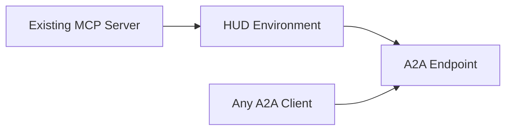

You already have an MCP server with useful tools. This guide shows how to wrap it with a chat scenario and serve it as an [A2A](https://google.github.io/A2A/) endpoint — turning any MCP toolset into a conversational agent that other services can talk to.

## The Pattern



1. **Connect** your MCP server to a HUD Environment
2. **Define** a `chat=True` scenario (the agent gets your MCP tools automatically)
3. **Serve** with `ChatService` — it speaks A2A out of the box

## Step 1: Connect Your MCP Server

Use `connect_mcp()` with the same config format you'd use in Claude Desktop or Cursor:

```python
# env.py
from hud import Environment

env = Environment("my-assistant")

# Stdio-based MCP server
env.connect_mcp({
    "filesystem": {
        "command": "npx",
        "args": ["-y", "@modelcontextprotocol/server-filesystem", "/tmp"],
    }
})

# Or a remote MCP server
env.connect_mcp({
    "my-service": {
        "url": "https://my-mcp-server.example.com/mcp",
    }
})
```

Any connect method works — `connect_mcp()`, `connect_mcp_config()`, `connect_url()`, `connect_hub()`, etc. The tools from all connected servers are merged and made available to the agent.

## Step 2: Add a Chat Scenario

A chat scenario is a regular scenario with `chat=True`. The environment already has all your MCP tools — the scenario just defines the system prompt and grading.

```python
from typing import Any

@env.scenario("assist", chat=True)
async def assist(messages: list[dict[str, Any]] | None = None):
    yield "You are a helpful assistant. Use the available tools to help the user."
    yield 1.0
```

The agent sees every tool from your connected MCP servers. When a user sends a message, the agent decides which tools to call. No routing logic needed.

<Tip>
The first `yield` is the system prompt. You can customize it to scope the agent's behavior — e.g., *"You are a filesystem assistant. Help users read, search, and organize files."*
</Tip>

## Step 3: Serve Over A2A

### Quick: Environment Variables

The built-in example script serves any environment + scenario combination:

```bash
HUD_ENV=my-assistant HUD_SCENARIO=assist HUD_MODEL=claude-haiku-4-5 \
    uv run python examples/03_a2a_chat_server.py
```

### Programmatic

```python
from hud.services import ChatService

service = ChatService(
    env("assist"),
    model="claude-haiku-4-5",
)
service.serve(host="0.0.0.0", port=9999)
```

The service publishes an agent card at `/.well-known/agent-card.json` and accepts A2A messages at the root endpoint.

## Step 4: Talk to It

### Simple Python Client

A minimal A2A client that sends messages and prints responses:

```python
import asyncio
import uuid

import httpx
from a2a.client import A2ACardResolver, ClientConfig, ClientFactory
from a2a.types import (
    Message, Part, Role, TextPart,
    TaskArtifactUpdateEvent, TaskState, TaskStatusUpdateEvent,
)

A2A_URL = "http://localhost:9999"

async def main():
    async with httpx.AsyncClient(timeout=httpx.Timeout(180.0)) as http:
        # Discover the agent card and create a client
        resolver = A2ACardResolver(httpx_client=http, base_url=A2A_URL)
        card = await resolver.get_agent_card()
        client = ClientFactory(
            config=ClientConfig(streaming=True, httpx_client=http)
        ).create(card)

        context_id = None

        while True:
            user_text = input("You: ").strip()
            if not user_text:
                continue

            message = Message(
                message_id=uuid.uuid4().hex,
                role=Role.user,
                parts=[Part(root=TextPart(text=user_text))],
                context_id=context_id,
            )

            async for item in client.send_message(message):
                # Track context for multi-turn
                ctx = getattr(item, "context_id", None)
                if ctx:
                    context_id = ctx

                if isinstance(item, tuple):
                    task, event = item
                    context_id = getattr(task, "context_id", context_id)

                    if isinstance(event, TaskStatusUpdateEvent):
                        if event.status.message and event.status.message.parts:
                            for part in event.status.message.parts:
                                text = getattr(getattr(part, "root", part), "text", None)
                                if text:
                                    print(f"Agent: {text}")

                    elif isinstance(event, TaskArtifactUpdateEvent):
                        for part in (event.artifact.parts or []):
                            text = getattr(getattr(part, "root", part), "text", None)
                            if text:
                                print(f"Agent: {text}")

asyncio.run(main())
```

### curl

```bash
# Discover the agent
curl http://localhost:9999/.well-known/agent-card.json | jq .

# Send a message (non-streaming)
curl -X POST http://localhost:9999/ \
  -H "Content-Type: application/json" \
  -d '{
    "jsonrpc": "2.0",
    "method": "message/send",
    "id": "1",
    "params": {
      "message": {
        "messageId": "msg-001",
        "role": "user",
        "parts": [{"kind": "text", "text": "List files in /tmp"}]
      }
    }
  }'
```

## Full Example

Here's a complete `env.py` that wraps the GitHub MCP server:

```python
from typing import Any
from hud import Environment

env = Environment("github-assistant")

env.connect_mcp({
    "github": {
        "command": "npx",
        "args": ["-y", "@modelcontextprotocol/server-github"],
        "env": {"GITHUB_TOKEN": "ghp_..."},
    }
})

@env.scenario("chat", chat=True)
async def chat(messages: list[dict[str, Any]] | None = None):
    yield (
        "You are a GitHub assistant. Help users search repositories, "
        "read files, manage issues, and explore code."
    )
    yield 1.0
```

```bash
# Serve it
HUD_ENV=github-assistant HUD_SCENARIO=chat \
    uv run python examples/03_a2a_chat_server.py

# Talk to it
uv run python examples/05_a2a_simple_client.py
```

## What Next

- [Chat with Environments](/guides/chat) — full Chat and ChatService reference
- [Ops Diagnostics](/cookbooks/ops-diagnostics) — hierarchical agents with multiple MCP servers
- [Best Practices](/guides/best-practices) — environment design patterns
