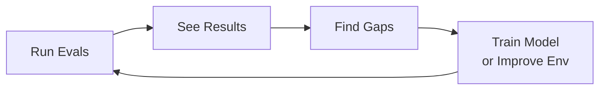

HUD is infrastructure for the agent improvement loop. We give you the infrastructure to measure what works, find what doesn't, and improve both your model and your environment.



## Install

```bash
# Install CLI
uv tool install hud-python --python 3.12

# Set your API key
hud set HUD_API_KEY=your-key-here
```

Get your API key at [hud.ai/project/api-keys](https://hud.ai/project/api-keys).

## 1. Your Agent is Just a For-Loop

An agent is a loop that calls tools until it's done:

```python
import os
import hud
from openai import AsyncOpenAI

client = AsyncOpenAI(base_url="https://inference.hud.ai", api_key=os.environ["HUD_API_KEY"])

async with hud.eval(task) as ctx:
    messages = [{"role": "user", "content": ctx.prompt}]
    
    while True:
        response = await client.chat.completions.create(
            model="claude-sonnet-4-5",
            messages=messages,
            tools=ctx.as_openai_chat_tools()
        )
        msg = response.choices[0].message
        messages.append(msg)
        
        if not msg.tool_calls:
            break
        
        for tc in msg.tool_calls:
            result = await ctx.call_tool(tc)
            messages.append(result)
    
    await ctx.submit(msg.content)

print(ctx.reward)  # Scored by the scenario
```

The work is in the model and the environment. HUD gives you the infrastructure to measure and improve both.

## 2. Environments: Action Spaces, Not Abstractions

Environments define what agents can do (tools) and how to score them (scenarios). Give models maximum capability, then restrict based on what you learn from evals:

```python
from hud import Environment

env = Environment("my-env")

@env.tool()
def search(query: str) -> str:
    """Search the knowledge base."""
    return db.search(query)

@env.scenario("find-answer")
async def find_answer(question: str, expected: str):
    answer = yield f"Find the answer to: {question}"
    yield 1.0 if expected.lower() in answer.lower() else 0.0
```

**Scenarios are the atomic skills your agent must get right.** If your agent can't reliably pass a scenario, that's a gap to close.

→ [More on Environments](/quick-links/environments)

## 3. Evals: Find What Works

Run scenarios with different models. Repeat runs to see the distribution:

```python
async with hud.eval(
    env("find-answer", question="What is 2+2?", expected="4"),
    variants={"model": ["gpt-4o", "claude-sonnet-4-5"]},
    group=10
) as ctx:
    # Your agent loop here
    ...
```

**Variants** test configurations. **Groups** repeat for statistical confidence. Results stream to [hud.ai](https://hud.ai/home).

→ [More on A/B Evals](/quick-links/ab-testing)

## 4. The Loop: Evals → Improve Model or Environment

Every eval generates training data. Use it to improve:

```bash
hud init                              # Scaffold environment
git push                              # Push to GitHub
hud eval my-eval --model gpt-4o -n 100  # Run 100 evals

# On hud.ai: select traces → Train → Launch RFT job
# Or: improve your environment's tools and scenarios based on what you learned
```

This is the loop: run evals, find gaps, improve the model or the environment, repeat.

→ [More on Deploy](/quick-links/deploy)

## 5. Gateway: Any Model, One API

Stop juggling API keys. Every call is traced:

```python
from openai import AsyncOpenAI

client = AsyncOpenAI(base_url="https://inference.hud.ai", api_key=os.environ["HUD_API_KEY"])
response = await client.chat.completions.create(
    model="claude-sonnet-4-5", messages=[{"role": "user", "content": "Hello!"}]
)
```

→ [More on Gateway](/quick-links/gateway)

## Next Steps

<CardGroup cols={2}>
<Card title="Gateway" icon="server" href="/quick-links/gateway">
  One endpoint for every model. Full observability.
</Card>

<Card title="Environments" icon="cube" href="/quick-links/environments">
  Tools, Scenarios, and local testing.
</Card>

<Card title="A/B Evals" icon="flask-vial" href="/quick-links/ab-testing">
  Variants, groups, and finding what works.
</Card>

<Card title="Deploy" icon="rocket" href="/quick-links/deploy">
  Run at scale. Generate training data.
</Card>
</CardGroup>

## Community

<CardGroup cols={2}>
<Card title="GitHub" icon="github" href="https://github.com/hud-evals/hud-python">
  Star the repo and contribute
</Card>

<Card title="Discord" icon="discord" href="https://discord.gg/wkjtmHYYjm">
  Join the community
</Card>
</CardGroup>

## Enterprise

Building agents at scale? We work with teams on custom environments, benchmarks, and training pipelines.

[📅 Book a call](https://cal.com/jay-hud) · [📧 founders@hud.ai](mailto:founders@hud.ai)
