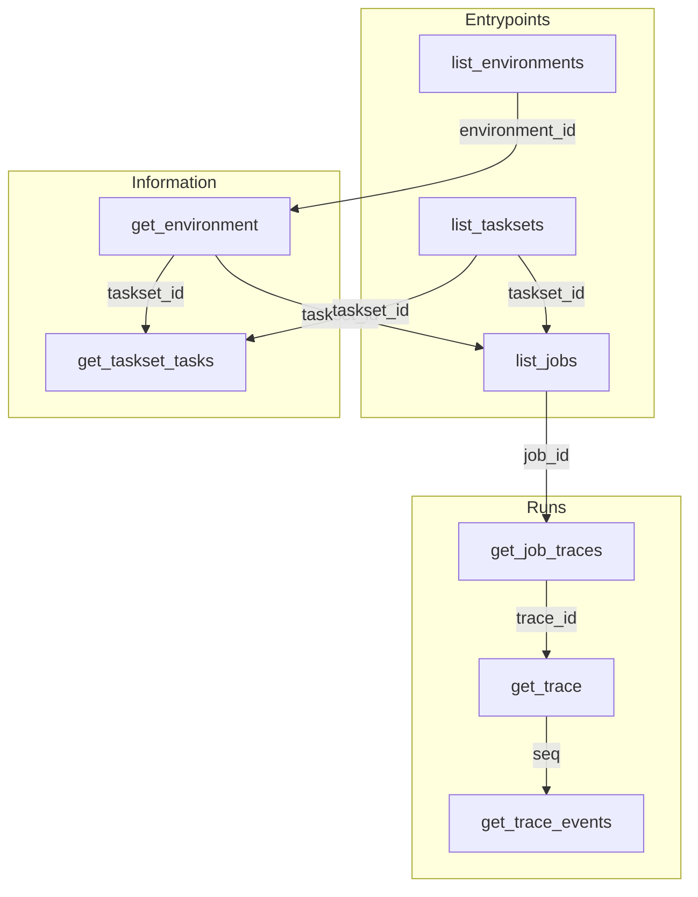

The **Platform MCP** is a read-only [Model Context Protocol](https://modelcontextprotocol.io/)
server on the HUD API. Coding agents call it to find environments, tasksets, jobs, and traces
without you pasting IDs by hand. Same project API key as the [REST API](/platform/rest-api); a
different transport (streamable HTTP JSON-RPC at `/v2/mcp/`).

This is not the `mcp` [capability](/v6/reference/capabilities) you declare inside an
environment. Platform MCP queries platform data. An env capability exposes tools inside a live
sandbox.

<div className="page-nav">

**Orientation** [Setup](#setup) · [Authentication](#authentication) · [How tools chain](#how-tools-chain)

**Tool reference** [Entrypoints](#entrypoints) · [Information](#information) · [Runs](#runs)

</div>

## Setup

Create a key in [Settings → API Keys](https://hud.ai/project/api-keys). Point your MCP client at
`https://api.beta.hud.ai/v2/mcp/` with that key on every request.

<CodeGroup>

```json Cursor (~/.cursor/mcp.json)
{
  "mcpServers": {
    "hud-platform": {
      "url": "https://api.beta.hud.ai/v2/mcp/",
      "headers": {
        "Authorization": "Bearer YOUR_HUD_API_KEY"
      }
    }
  }
}
```

```bash Claude Code
claude mcp add --transport http hud-platform \
  https://api.beta.hud.ai/v2/mcp/ \
  --header "Authorization: Bearer $HUD_API_KEY"
```

```json Generic MCP client
{
  "hud-platform": {
    "url": "https://api.beta.hud.ai/v2/mcp/",
    "headers": {
      "Authorization": "Bearer YOUR_HUD_API_KEY"
    }
  }
}
```

</CodeGroup>

<div className="agent-note">

<span className="agent-signal">IF YOU ARE AN AGENT SETTING THIS UP:</span> add an MCP server named
`hud-platform` with URL `https://api.beta.hud.ai/v2/mcp/` and header
`Authorization: Bearer <HUD_API_KEY>` (or `X-API-Key: <HUD_API_KEY>`). Then call
`list_environments` to verify. Do not invent tool names; use the catalog the server returns.

</div>

## Authentication

Same project `HUD_API_KEY` as REST. Send it as `Authorization: Bearer sk-hud-…` or as
`X-API-Key`. Missing or invalid credentials fail the tool call as unauthorized.

The server is **read-only**: it can list and fetch, not create jobs, deploy environments, or
mutate tasks. Visibility matches your team's key (same authz as the REST surface).

## How tools chain

Tools fall into three groups. **Entrypoints** discover IDs. **Information** is the task catalog.
**Runs** is execution: jobs and what each attempt did. Responses carry chainable IDs
(`environment_id`, `taskset_id`, `job_id`, `trace_id`), so you can jump between catalog and runs.

| Concept | What it is |
| --- | --- |
| **Environment** | A hosted sandbox image your team can run agents in. |
| **Taskset** | A named bundle of concrete tasks. |
| **Job** | One batch run of a suite (metadata plus rollup stats). |
| **Trace** | One attempt inside a job, from first action to reward. |



Typical paths from zero IDs:

- `list_environments` → `get_environment` → `get_taskset_tasks` or `list_jobs`
- `list_tasksets` → `get_taskset_tasks` or `list_jobs`
- `list_jobs` → `get_job_traces` → `get_trace` → `get_trace_events`

List tools page with `limit` (default `20`, max `100`) and `offset`. When more rows remain, the
response includes `next_offset`. Event paging uses `since_seq` instead (see `get_trace_events`).

<div className="section-eyebrow">Tool reference</div>

## Entrypoints

Discovery when you do not have IDs, or when you want to re-enter from a list.

<div className="api-endpoints">
<AccordionGroup>

<Accordion title="list_environments - List your team's environments (newest first).">

Start here when you have no IDs. Optional `search` is a case-insensitive substring match on
environment name.

| Parameter | Type | Default | Description |
| --- | --- | --- | --- |
| `search` | `string \| null` | `null` | Substring match on name; omit to list all visible envs. |
| `limit` | `integer` | `20` | Page size (max `100`). |
| `offset` | `integer` | `0` | Row offset. |

**Returns** paged `{ items, total, next_offset? }` with `id`, `name`, `build_status`, `public`.
**Next:** `get_environment`.

</Accordion>

<Accordion title="list_tasksets - List your team's tasksets (newest first).">

Optional `search` matches taskset name. For tasksets on one environment, prefer
`get_environment` (it embeds them).

| Parameter | Type | Default | Description |
| --- | --- | --- | --- |
| `search` | `string \| null` | `null` | Substring match on name. |
| `limit` | `integer` | `20` | Page size (max `100`). |
| `offset` | `integer` | `0` | Row offset. |

**Returns** paged rows with `id`, `name`, `task_count`, `environment_id`.
**Next:** `get_taskset_tasks` or `list_jobs`.

</Accordion>

<Accordion title="list_jobs - List recent jobs with rollup trace stats.">

Scan runs across the team, or filter to one taskset. Each row includes a compact traces rollup
(`total_traces`, `avg_reward`, non-zero status counts).

| Parameter | Type | Default | Description |
| --- | --- | --- | --- |
| `taskset_id` | `uuid \| null` | `null` | Restrict to that taskset's jobs. |
| `limit` | `integer` | `20` | Page size (max `100`). |
| `offset` | `integer` | `0` | Row offset. |

**Returns** paged rows with `id`, `name`, `status`, `taskset_id`, `taskset_name`, `created_at`,
`traces` rollup.
**Next:** `get_job_traces`; `get_taskset_tasks` when a row has `taskset_id`.

</Accordion>

</AccordionGroup>
</div>

## Information

What can run and what each task is.

<div className="api-endpoints">
<AccordionGroup>

<Accordion title="get_environment - One environment: build, templates, and tasksets.">

**Templates** are parameterized definitions on the latest build. **Tasksets** are bundles of
concrete tasks.

| Parameter | Type | Required | Description |
| --- | --- | --- | --- |
| `environment_id` | `uuid` | yes | From `list_environments`. |

**Returns** `id`, `name`, `description`, `github_url`, `templates`, `latest_build`, `tasksets`.
**Next:** `get_taskset_tasks` or `list_jobs` with a `taskset_id`.

</Accordion>

<Accordion title="get_taskset_tasks - Tasks in a taskset (filled-in template instances).">

Each row includes which template it uses and the args that fill it.

| Parameter | Type | Default | Description |
| --- | --- | --- | --- |
| `taskset_id` | `uuid` | required | From entrypoints or `get_environment`. |
| `limit` | `integer` | `20` | Page size (max `100`). |
| `offset` | `integer` | `0` | Row offset. |

**Returns** paged tasks with `id`, `name`, `description`, `template`, `args`.
**Next:** `list_jobs` for runs on this bundle.

</Accordion>

</AccordionGroup>
</div>

## Runs

How tasks ran: open a job, then a trace, then zoom into events.

<div className="api-endpoints">
<AccordionGroup>

<Accordion title="get_job_traces - One job: header, stats, and a page of traces.">

`limit` / `offset` page that job's attempts, not the job list.

| Parameter | Type | Default | Description |
| --- | --- | --- | --- |
| `job_id` | `uuid` | required | From `list_jobs`. |
| `limit` | `integer` | `20` | Trace page size (max `100`). |
| `offset` | `integer` | `0` | Trace offset. |

**Returns** job header plus `traces: { stats, items, total, next_offset? }`. Each item has `id`,
`status`, `reward`, clipped `error`, `created_at`.
**Next:** `get_trace` on a row from `traces.items`.

</Accordion>

<Accordion title="get_trace - Verdict, task context, and a lean trajectory outline.">

Pair with `get_trace_events`. The outline and `points_of_interest` use **seq** (the event index)
as the cursor: zoom into seq `K` with `get_trace_events(trace_id, since_seq=K-1)` (`since_seq` is
exclusive). Outline lines tagged `[screenshot]` point at frames; open `screenshot_url` from the
events tool (never inlined).

| Parameter | Type | Required | Description |
| --- | --- | --- | --- |
| `trace_id` | `uuid` | yes | From `get_job_traces`. |

**Returns** status, reward, error, task prompt, `trajectory_outline`, `points_of_interest`, and a
short response `guide`.
**Next:** `get_trace_events`.

</Accordion>

<Accordion title="get_trace_events - Full events for a trace, ordered by seq.">

Pick `seq` values from `get_trace`'s outline or `points_of_interest`. Screenshots are HTTPS links
on `tool_call` events (`screenshot_url`), not inline bytes.

| Parameter | Type | Default | Description |
| --- | --- | --- | --- |
| `trace_id` | `uuid` | required | Trace to open. |
| `since_seq` | `integer` | `-1` | Exclusive cursor; pass `K-1` to start at seq `K`. |
| `limit` | `integer` | `50` | Events per page (max `100`). |
| `kinds` | `string[] \| null` | `null` | Optional filter, e.g. `["agent_message"]`. |

**Returns** `events`, a `showing` summary, and `next_since_seq` / `remaining` when more match.
**Next:** continue paging, or return to `get_trace` for the outline.

</Accordion>

</AccordionGroup>
</div>

For the full HTTP surface these tools sit beside, see the [REST API](/platform/rest-api). For how
platform objects fit together, see the [platform introduction](/platform/introduction).
