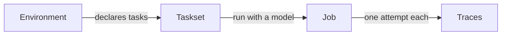

import { Endpoint } from "/snippets/endpoint.jsx";

The **REST API** is the HTTP interface to the HUD platform: the hosted service that stores the
environments agents work in, runs agents inside them, and keeps a graded record of every run. The
CLI, the SDK, and the platform UI are all clients of this one surface, so anything they can do, a
client of yours can do too.

Base URL `https://api.beta.hud.ai`, every public route under `/v2`, authenticated with a project
API key. A first call, returning what an agent actually did on a single attempt:

```bash
curl https://api.beta.hud.ai/v2/trace/<trace_id>/events \
  -H "Authorization: Bearer $HUD_API_KEY"
```

<div className="page-nav">

**Orientation** [Authentication](#authentication) · [Conventions](#conventions) · [Platform model](#platform-model)

**Endpoint reference** [Core](#core) · [Runs and evals](#runs-and-evals) · [Secondary](#secondary) · [Utilities](#utilities) · [Secrets](#secrets) · [Account](#account) · [Errors](#errors)

</div>

## Authentication

Create a key in [Settings → API Keys](https://hud.ai/project/api-keys) and send it as a bearer
token on every request (see above).

Missing or invalid credentials return `401`. A valid key that may not touch the resource returns
`403`.

Three kinds of access appear across the surface. An API key is the default; the groups below call
out where an endpoint differs.

| Access | What it means |
| --- | --- |
| **API key** | A `HUD_API_KEY` bearer token. Used by scripts, CI, and the SDK. |
| **Session** | A signed-in browser session. A few endpoints accept only this and return `401` for API keys. |
| **Optional** | No credentials required for published jobs and traces. A key widens what you can see. |

## Conventions

| Convention | Detail |
| --- | --- |
| **Prefix** | Every public route lives under `/v2`. |
| **Format** | JSON in, JSON out, except file uploads, which are multipart. |
| **IDs** | Resources are addressed by UUID in the path. |
| **Pagination** | List endpoints take `limit` and `offset` and return `{ items, total, limit, offset }`. |
| **Time** | Timestamps are UTC, ISO 8601. |
| **Mutations** | Creates return `201`, deletes return `204`, everything else returns `200`. |

Every example on this page is generated from the
[OpenAPI document](https://api.beta.hud.ai/openapi.json), so field names match what the server
sends and receives. The values are placeholders. For a console that sends real requests, use the
[interactive reference](https://api.beta.hud.ai/docs).

## Platform model

Nothing runs until three things exist: a place for an agent to act, something to ask it to do, and
a model to do it. The API is organized around those objects.

| Concept | What it is |
| --- | --- |
| **Environment** | The sandboxed application an agent works in, such as a browser or a spreadsheet, packaged as a container image the platform hosts. |
| **Task** | One graded request inside an environment, together with the check that decides whether the agent succeeded. |
| **Taskset** | A named bundle of tasks: the suite you evaluate against. |
| **Job** | One batch run: this suite, these models, this many attempts. |
| **Trace** | The record of a single attempt, from the first message to the reward. |
| **Rollout** | A request to place and run one attempt on hosted infrastructure. |
| **Model** | An entry in the model catalog: a base model, or your team's own fine-tune. |
| **Instance** | A sandbox that is live right now, running one attempt. |



Environments and builds are the stage, tasksets and tasks are the script, jobs and rollouts are the
action, and traces are the recording. The remaining groups cover credentials, models, live
capacity, and cost.

<div className="section-eyebrow">Endpoint reference</div>

## Core

The objects you set up before anything runs: the environment an agent will act in, the suite you
grade it on, and the individual tasks inside that suite.

### Environments

An **environment** is the sandboxed application an agent works in, packaged as a container image
that HUD hosts. The API calls the catalog of those images the **registry**, and one entry is one
environment: its name, its owner, and the work it knows how to run. Reading the registry is how a
client discovers what it can run against; creating an entry is what [builds](#builds) do.

Each environment declares **scenarios**, the parameterized task definitions baked into its image.
Tasks point at a scenario, which is how a taskset ends up tied to a specific environment.

<div className="api-endpoints">
<AccordionGroup>

<Accordion title={<Endpoint method="GET" path="/v2/registry" note="List the environments your team can see." />}>

{/* api:GET /v2/registry */}

| Parameter | In | Type | Required | Description |
| --- | --- | --- | --- | --- |
| `limit` | query | `integer` |  | Defaults to `50`. |
| `offset` | query | `integer` |  | Defaults to `0`. |
| `search` | query | `string?` |  | ILIKE-match on name |
| `public_only` | query | `boolean` |  | Only public registries (Explore tab) Defaults to `False`. |
| `owner_only` | query | `boolean` |  | Only registries owned by the caller's membership; ignored when public_only=True Defaults to `False`. |
| `sort_by` | query | `starred \| date \| name \| stars` |  | Sort order: starred (caller's starred first), date (updated_at DESC), name (A-Z), stars (star_count DESC) Defaults to `starred`. |

```bash Request
curl https://api.beta.hud.ai/v2/registry \
  -H "Authorization: Bearer $HUD_API_KEY"
```

```json Response 200
{
  "items": [
    {
      "id": "3fa85f64-5717-4562-b3fc-2c963f66afa6",
      "name": "string",
      "registry_type": "string",
      "public": false,
      "created_at": "2026-07-26T17:04:11Z",
      "updated_at": "2026-07-26T17:04:11Z",
      "description": "string",
      "latest_build_id": "3fa85f64-5717-4562-b3fc-2c963f66afa6",
      "github_url": "string",
      "branch": "string",
      "entry_folder": "string",
      "build_args": {}
    }
  ],
  "total": 0,
  "limit": 0,
  "offset": 0
}
```

{/* /api */}

</Accordion>

<Accordion title={<Endpoint method="GET" path="/v2/registry/{registry_id}" note="Fetch one environment." />}>

{/* api:GET /v2/registry/{registry_id} */}

| Parameter | In | Type | Required | Description |
| --- | --- | --- | --- | --- |
| `registry_id` | path | `uuid` | yes |  |

```bash Request
curl https://api.beta.hud.ai/v2/registry/<registry_id> \
  -H "Authorization: Bearer $HUD_API_KEY"
```

```json Response 200
{
  "id": "3fa85f64-5717-4562-b3fc-2c963f66afa6",
  "name": "string",
  "registry_type": "string",
  "public": false,
  "created_at": "2026-07-26T17:04:11Z",
  "updated_at": "2026-07-26T17:04:11Z",
  "description": "string",
  "latest_build_id": "3fa85f64-5717-4562-b3fc-2c963f66afa6",
  "github_url": "string",
  "branch": "string",
  "entry_folder": "string",
  "build_args": {}
}
```

{/* /api */}

</Accordion>

<Accordion title={<Endpoint method="GET" path="/v2/registry/{registry_id}/scenarios" note="List the task definitions the environment's image declares." />}>

{/* api:GET /v2/registry/{registry_id}/scenarios */}

| Parameter | In | Type | Required | Description |
| --- | --- | --- | --- | --- |
| `registry_id` | path | `uuid` | yes |  |
| `build_id` | query | `uuid?` |  | Filter scenarios to a specific build of this registry. Defaults to the registry's latest build when omitted. |

```bash Request
curl https://api.beta.hud.ai/v2/registry/<registry_id>/scenarios \
  -H "Authorization: Bearer $HUD_API_KEY"
```

```json Response 200
[
  {
    "id": "3fa85f64-5717-4562-b3fc-2c963f66afa6",
    "registry_id": "3fa85f64-5717-4562-b3fc-2c963f66afa6",
    "build_id": "3fa85f64-5717-4562-b3fc-2c963f66afa6",
    "name": "string",
    "created_at": "2026-07-26T17:04:11Z",
    "slug": "string",
    "description": "string",
    "args_schema": {},
    "arguments": [],
    "metadata": {},
    "trace_name_template": "string"
  }
]
```

{/* /api */}

</Accordion>

<Accordion title={<Endpoint method="GET" path="/v2/registry/{registry_id}/source-url" note="Get a temporary download link for the environment's source archive." />}>

{/* api:GET /v2/registry/{registry_id}/source-url */}

| Parameter | In | Type | Required | Description |
| --- | --- | --- | --- | --- |
| `registry_id` | path | `uuid` | yes |  |
| `build_id` | query | `uuid?` |  | Download a specific build's source archive. Defaults to the registry's latest build when omitted. |

```bash Request
curl https://api.beta.hud.ai/v2/registry/<registry_id>/source-url \
  -H "Authorization: Bearer $HUD_API_KEY"
```

```json Response 200
{
  "registry_id": "3fa85f64-5717-4562-b3fc-2c963f66afa6",
  "build_id": "3fa85f64-5717-4562-b3fc-2c963f66afa6",
  "download_url": "string",
  "github_url": "string"
}
```

{/* /api */}

</Accordion>

</AccordionGroup>
</div>

### Tasksets

A **taskset** is a named bundle of tasks and the unit an evaluation is defined against: a public
benchmark, your team's regression suite, a customer's acceptance set. Two jobs are comparable
because they ran the same taskset.

Two reads answer different questions. Fetching a taskset returns the card: name, task count,
ownership. Exporting returns the tasks themselves, in the same portable shape that
`POST /v2/tasks/upload` accepts, which makes export and upload a round trip you can use to clone a
suite, back it up, or sync it into CI.

<Note>
Export requires an API key; a browser session alone returns `401`. No public endpoint lists
tasksets today, so resolve them by name or by ID.
</Note>

<div className="api-endpoints">
<AccordionGroup>

<Accordion title={<Endpoint method="GET" path="/v2/tasksets/{taskset_id}" note="Fetch a taskset's name, counts, and ownership." />}>

{/* api:GET /v2/tasksets/{taskset_id} */}

| Parameter | In | Type | Required | Description |
| --- | --- | --- | --- | --- |
| `taskset_id` | path | `uuid` | yes |  |

```bash Request
curl https://api.beta.hud.ai/v2/tasksets/<taskset_id> \
  -H "Authorization: Bearer $HUD_API_KEY"
```

```json Response 200
{
  "id": "3fa85f64-5717-4562-b3fc-2c963f66afa6",
  "name": "string",
  "public": false,
  "created_at": "2026-07-26T17:04:11Z",
  "updated_at": "2026-07-26T17:04:11Z",
  "description": "string",
  "registry_id": "3fa85f64-5717-4562-b3fc-2c963f66afa6",
  "purpose": "EVAL",
  "star_count": 0,
  "task_count": 0,
  "sample_unit_count": 0,
  "system_prompt": "string"
}
```

{/* /api */}

</Accordion>

<Accordion title={<Endpoint method="GET" path="/v2/tasksets/{taskset_id}/export" note="Download every task in the suite, in upload format." />}>

{/* api:GET /v2/tasksets/{taskset_id}/export */}

| Parameter | In | Type | Required | Description |
| --- | --- | --- | --- | --- |
| `taskset_id` | path | `uuid` | yes |  |

```bash Request
curl https://api.beta.hud.ai/v2/tasksets/<taskset_id>/export \
  -H "Authorization: Bearer $HUD_API_KEY"
```

```json Response 200
{
  "taskset_id": "3fa85f64-5717-4562-b3fc-2c963f66afa6",
  "name": "string",
  "tasks": [
    {
      "name": "string",
      "env": "string",
      "scenario": "string",
      "args": {},
      "validation": [
        {}
      ],
      "agent_config": {},
      "runtime_config": {}
    }
  ]
}
```

{/* /api */}

</Accordion>

<Accordion title={<Endpoint method="GET" path="/v2/tasksets/by-name/{name}" note="The same export, looked up by name within your team." />}>

{/* api:GET /v2/tasksets/by-name/{name} */}

| Parameter | In | Type | Required | Description |
| --- | --- | --- | --- | --- |
| `name` | path | `string` | yes |  |

```bash Request
curl https://api.beta.hud.ai/v2/tasksets/by-name/<name> \
  -H "Authorization: Bearer $HUD_API_KEY"
```

```json Response 200
{
  "taskset_id": "3fa85f64-5717-4562-b3fc-2c963f66afa6",
  "name": "string",
  "tasks": [
    {
      "name": "string",
      "env": "string",
      "scenario": "string",
      "args": {},
      "validation": [
        {}
      ],
      "agent_config": {},
      "runtime_config": {}
    }
  ]
}
```

{/* /api */}

</Accordion>

</AccordionGroup>
</div>

### Tasks

A **task** is one graded request inside an environment plus the check that decides whether the
agent succeeded. Tasks are what a job actually runs. Most of this group exists because tasks are
written and reviewed by people before anyone trusts them to grade a model.

A task begins as a **brief**: a prompt and any attachments describing the idea, before it is backed
by a runnable scenario. Once it is real, it carries a **status**, the review state everyone reads.

| Status | Meaning |
| --- | --- |
| `draft` | An idea captured as a brief. Not runnable. |
| `pending` | Being built. |
| `ready` | The author considers it finished. |
| `verified`, `revision`, `rejected` | The reviewer's decision. |

While a task is `pending`, its taskset can define **stages**: an optional checklist inside that one
status, such as write, then QA, then polish. A task advances one stage at a time, or jumps back
when someone returns it for more work, and it must reach the last stage before it can become
`ready`. Tasksets with no stages configured ignore this machinery entirely.

A **ready-check** evaluates the taskset's submission requirements against a task: enough graded
traces, accuracy thresholds, particular models, QA checks. It reports each requirement as passed or
failed along with what is missing. It reports; it does not change the status.

**Comments** and **activity** are the review trail: human discussion on one side, and an audit
timeline of version and status changes on the other.

#### Authoring and review state

<div className="api-endpoints">
<AccordionGroup>

<Accordion title={<Endpoint method="POST" path="/v2/tasks/upload" note="Create or update tasks in a taskset in bulk." />}>

{/* api:POST /v2/tasks/upload */}

```bash Request
curl https://api.beta.hud.ai/v2/tasks/upload \
  -H "Authorization: Bearer $HUD_API_KEY" \
  -X POST \
  -H "Content-Type: application/json" \
  -d '{
    "taskset_name": "string",
    "tasks": [
      {
        "name": "string",
        "description": "string",
        "external_id": "string",
        "env": {},
        "task_id": "string",
        "scenario": "string",
        "args": {},
        "validation": [
          {}
        ],
        "system_prompt": "string",
        "agent_config": {},
        "runtime_config": {
          "image": "string",
          "resources": {},
          "limits": {}
        },
        "scenario_id": "3fa85f64-5717-4562-b3fc-2c963f66afa6"
      }
    ],
    "taskset_id": "3fa85f64-5717-4562-b3fc-2c963f66afa6",
    "description": "string",
    "registry_id": "3fa85f64-5717-4562-b3fc-2c963f66afa6"
  }'
```

```json Response 201
{
  "taskset_id": "3fa85f64-5717-4562-b3fc-2c963f66afa6",
  "taskset_name": "string",
  "task_count": 0,
  "task_version_ids": [
    "3fa85f64-5717-4562-b3fc-2c963f66afa6"
  ],
  "tasks_created": 0,
  "tasks_updated": 0
}
```

{/* /api */}

</Accordion>

<Accordion title={<Endpoint method="PATCH" path="/v2/tasks/status" note="Move a set of tasks to a new review status." />}>

{/* api:PATCH /v2/tasks/status */}

```bash Request
curl https://api.beta.hud.ai/v2/tasks/status \
  -H "Authorization: Bearer $HUD_API_KEY" \
  -X PATCH \
  -H "Content-Type: application/json" \
  -d '{
    "ids": [
      "3fa85f64-5717-4562-b3fc-2c963f66afa6"
    ],
    "slugs": [
      "string"
    ],
    "taskset_id": "3fa85f64-5717-4562-b3fc-2c963f66afa6",
    "status": "pending",
    "clear": false,
    "reviewed": false
  }'
```

```json Response 200
{
  "succeeded": [
    "3fa85f64-5717-4562-b3fc-2c963f66afa6"
  ],
  "unchanged": [
    "3fa85f64-5717-4562-b3fc-2c963f66afa6"
  ],
  "failures": [
    {
      "input": "string",
      "reason": "string",
      "code": "not_found",
      "resolved_id": "3fa85f64-5717-4562-b3fc-2c963f66afa6"
    }
  ]
}
```

{/* /api */}

</Accordion>

<Accordion title={<Endpoint method="PATCH" path="/v2/tasks/stage" note="Move pending tasks forward, or send them back a stage." />}>

{/* api:PATCH /v2/tasks/stage */}

```bash Request
curl https://api.beta.hud.ai/v2/tasks/stage \
  -H "Authorization: Bearer $HUD_API_KEY" \
  -X PATCH \
  -H "Content-Type: application/json" \
  -d '{
    "ids": [
      "3fa85f64-5717-4562-b3fc-2c963f66afa6"
    ],
    "stage": "string"
  }'
```

```json Response 200
{
  "succeeded": [
    "3fa85f64-5717-4562-b3fc-2c963f66afa6"
  ],
  "unchanged": [
    "3fa85f64-5717-4562-b3fc-2c963f66afa6"
  ],
  "failures": [
    {
      "input": "string",
      "reason": "string",
      "code": "not_found",
      "resolved_id": "3fa85f64-5717-4562-b3fc-2c963f66afa6"
    }
  ]
}
```

{/* /api */}

</Accordion>

<Accordion title={<Endpoint method="GET" path="/v2/tasks/{task_id}/ready-check" note="Check one task against the taskset's submission requirements." />}>

{/* api:GET /v2/tasks/{task_id}/ready-check */}

| Parameter | In | Type | Required | Description |
| --- | --- | --- | --- | --- |
| `task_id` | path | `uuid` | yes |  |

```bash Request
curl https://api.beta.hud.ai/v2/tasks/<task_id>/ready-check \
  -H "Authorization: Bearer $HUD_API_KEY"
```

```json Response 200
{
  "passed": false,
  "k": 0,
  "candidate_count": 0,
  "evaluated_at": "2026-07-26T17:04:11Z",
  "evaluated_trace_ids": [
    "string"
  ],
  "requirements_version": 1,
  "checks": [
    {
      "key": "string",
      "label": "string",
      "passed": false,
      "required": "string",
      "current": "string",
      "how_to_fix": "string",
      "severity": "error",
      "offending_trace_ids": [
        "string"
      ]
    }
  ],
  "can_override": true,
  "has_requirements": true
}
```

{/* /api */}

</Accordion>

</AccordionGroup>
</div>

#### Briefs

Briefs belong to draft tasks only. These three routes are written for the platform UI and accept a
browser session, so an API key returns `401`.

<div className="api-endpoints">
<AccordionGroup>

<Accordion title={<Endpoint method="GET" path="/v2/tasks/{task_id}/brief" note="Read a draft task's prompt and attachments." />}>

{/* api:GET /v2/tasks/{task_id}/brief */}

| Parameter | In | Type | Required | Description |
| --- | --- | --- | --- | --- |
| `task_id` | path | `uuid` | yes |  |

```bash Request
curl https://api.beta.hud.ai/v2/tasks/<task_id>/brief \
  -H "Authorization: Bearer $HUD_API_KEY"
```

```json Response 200
{
  "prompt": "string",
  "attachments": [
    {
      "name": "string",
      "url": "string",
      "storage_url": "string",
      "size": 0,
      "content_type": "string",
      "status": "staged",
      "error": "string",
      "archived_at": "2026-07-26T17:04:11Z"
    }
  ]
}
```

{/* /api */}

</Accordion>

<Accordion title={<Endpoint method="PATCH" path="/v2/tasks/{task_id}/brief" note="Replace a draft task's brief." />}>

{/* api:PATCH /v2/tasks/{task_id}/brief */}

| Parameter | In | Type | Required | Description |
| --- | --- | --- | --- | --- |
| `task_id` | path | `uuid` | yes |  |

```bash Request
curl https://api.beta.hud.ai/v2/tasks/<task_id>/brief \
  -H "Authorization: Bearer $HUD_API_KEY" \
  -X PATCH \
  -H "Content-Type: application/json" \
  -d '{
    "prompt": "string",
    "attachments": [
      {
        "name": "string",
        "url": "string",
        "size": 0,
        "content_type": "string"
      }
    ]
  }'
```

```json Response 200
{
  "prompt": "string",
  "attachments": [
    {
      "name": "string",
      "url": "string",
      "storage_url": "string",
      "size": 0,
      "content_type": "string",
      "status": "staged",
      "error": "string",
      "archived_at": "2026-07-26T17:04:11Z"
    }
  ]
}
```

{/* /api */}

</Accordion>

<Accordion title={<Endpoint method="GET" path="/v2/tasks/{task_id}/brief/download" note="Download the brief and its attachments as an archive." />}>

{/* api:GET /v2/tasks/{task_id}/brief/download */}

| Parameter | In | Type | Required | Description |
| --- | --- | --- | --- | --- |
| `task_id` | path | `uuid` | yes |  |

```bash Request
curl https://api.beta.hud.ai/v2/tasks/<task_id>/brief/download \
  -H "Authorization: Bearer $HUD_API_KEY"
```

Returns `200` with a file body.

{/* /api */}

</Accordion>

</AccordionGroup>
</div>

#### Comments and activity

<div className="api-endpoints">
<AccordionGroup>

<Accordion title={<Endpoint method="GET" path="/v2/tasks/{task_id}/comments" note="List the discussion on a task." />}>

{/* api:GET /v2/tasks/{task_id}/comments */}

| Parameter | In | Type | Required | Description |
| --- | --- | --- | --- | --- |
| `task_id` | path | `uuid` | yes |  |

```bash Request
curl https://api.beta.hud.ai/v2/tasks/<task_id>/comments \
  -H "Authorization: Bearer $HUD_API_KEY"
```

```json Response 200
{
  "comments": [
    {
      "id": "3fa85f64-5717-4562-b3fc-2c963f66afa6",
      "task_id": "3fa85f64-5717-4562-b3fc-2c963f66afa6",
      "user_id": "3fa85f64-5717-4562-b3fc-2c963f66afa6",
      "message": "string",
      "created_at": "2026-07-26T17:04:11Z",
      "updated_at": "2026-07-26T17:04:11Z",
      "user_name": "string",
      "avatar_url": "string"
    }
  ],
  "can_comment": false,
  "reason": "string"
}
```

{/* /api */}

</Accordion>

<Accordion title={<Endpoint method="POST" path="/v2/tasks/{task_id}/comments" note="Add a comment." />}>

{/* api:POST /v2/tasks/{task_id}/comments */}

| Parameter | In | Type | Required | Description |
| --- | --- | --- | --- | --- |
| `task_id` | path | `uuid` | yes |  |

```bash Request
curl https://api.beta.hud.ai/v2/tasks/<task_id>/comments \
  -H "Authorization: Bearer $HUD_API_KEY" \
  -X POST \
  -H "Content-Type: application/json" \
  -d '{
    "body": "string"
  }'
```

```json Response 200
{
  "id": "3fa85f64-5717-4562-b3fc-2c963f66afa6",
  "task_id": "3fa85f64-5717-4562-b3fc-2c963f66afa6",
  "user_id": "3fa85f64-5717-4562-b3fc-2c963f66afa6",
  "message": "string",
  "created_at": "2026-07-26T17:04:11Z",
  "updated_at": "2026-07-26T17:04:11Z",
  "user_name": "string",
  "avatar_url": "string"
}
```

{/* /api */}

</Accordion>

<Accordion title={<Endpoint method="PATCH" path="/v2/tasks/{task_id}/comments/{comment_id}" note="Edit a comment." />}>

{/* api:PATCH /v2/tasks/{task_id}/comments/{comment_id} */}

| Parameter | In | Type | Required | Description |
| --- | --- | --- | --- | --- |
| `task_id` | path | `uuid` | yes |  |
| `comment_id` | path | `uuid` | yes |  |

```bash Request
curl https://api.beta.hud.ai/v2/tasks/<task_id>/comments/<comment_id> \
  -H "Authorization: Bearer $HUD_API_KEY" \
  -X PATCH \
  -H "Content-Type: application/json" \
  -d '{
    "body": "string"
  }'
```

```json Response 200
{
  "id": "3fa85f64-5717-4562-b3fc-2c963f66afa6",
  "task_id": "3fa85f64-5717-4562-b3fc-2c963f66afa6",
  "user_id": "3fa85f64-5717-4562-b3fc-2c963f66afa6",
  "message": "string",
  "created_at": "2026-07-26T17:04:11Z",
  "updated_at": "2026-07-26T17:04:11Z",
  "user_name": "string",
  "avatar_url": "string"
}
```

{/* /api */}

</Accordion>

<Accordion title={<Endpoint method="DELETE" path="/v2/tasks/{task_id}/comments/{comment_id}" note="Delete a comment." />}>

{/* api:DELETE /v2/tasks/{task_id}/comments/{comment_id} */}

| Parameter | In | Type | Required | Description |
| --- | --- | --- | --- | --- |
| `task_id` | path | `uuid` | yes |  |
| `comment_id` | path | `uuid` | yes |  |

```bash Request
curl https://api.beta.hud.ai/v2/tasks/<task_id>/comments/<comment_id> \
  -H "Authorization: Bearer $HUD_API_KEY" \
  -X DELETE
```

Returns `204` with an empty body.

{/* /api */}

</Accordion>

<Accordion title={<Endpoint method="GET" path="/v2/tasks/{task_id}/activity" note="Read the task's version and status timeline." />}>

{/* api:GET /v2/tasks/{task_id}/activity */}

| Parameter | In | Type | Required | Description |
| --- | --- | --- | --- | --- |
| `task_id` | path | `uuid` | yes |  |
| `limit` | query | `integer` |  | Defaults to `50`. |

```bash Request
curl https://api.beta.hud.ai/v2/tasks/<task_id>/activity \
  -H "Authorization: Bearer $HUD_API_KEY"
```

```json Response 200
{
  "events": [
    {
      "event": "string",
      "at": "string",
      "by": "3fa85f64-5717-4562-b3fc-2c963f66afa6",
      "by_name": "string",
      "by_role": "string",
      "key": "string",
      "done": false,
      "summary": "string",
      "version": 0
    }
  ]
}
```

{/* /api */}

</Accordion>

</AccordionGroup>
</div>

## Runs and evals

What happens once you actually run something. Rollouts start the work, a job groups it, a trace
records each attempt, and an instance is the sandbox an attempt is running in right now.

### Jobs

A **job** is one batch of work: this taskset, these models, this many attempts, grouped so the
results can be read as a single score. Every graded attempt belongs to a job.

There is no `POST /v2/jobs`. Jobs come into existence when work is launched, either through
[rollouts](#rollouts) or when the SDK enters a job as it starts running, and they are cancelled
through rollouts as well. What lives here is everything you do with a job once it exists: read it,
summarize it, page through its attempts, and decide whether its results count.

Single-job reads use optional authentication, so a published job is readable without a key.

#### Core resource

<div className="api-endpoints">
<AccordionGroup>

<Accordion title={<Endpoint method="GET" path="/v2/jobs" note="List jobs, newest first, optionally for one taskset." />}>

{/* api:GET /v2/jobs */}

| Parameter | In | Type | Required | Description |
| --- | --- | --- | --- | --- |
| `limit` | query | `integer` |  | Defaults to `50`. |
| `offset` | query | `integer` |  | Defaults to `0`. |
| `taskset_id` | query | `uuid?` |  |  |

```bash Request
curl https://api.beta.hud.ai/v2/jobs \
  -H "Authorization: Bearer $HUD_API_KEY"
```

```json Response 200
{
  "items": [
    {
      "id": "3fa85f64-5717-4562-b3fc-2c963f66afa6",
      "status": "string",
      "max_steps": 0,
      "group_size": 0,
      "is_remote": false,
      "created_at": "2026-07-26T17:04:11Z",
      "name": "string",
      "description": "string",
      "taskset_id": "3fa85f64-5717-4562-b3fc-2c963f66afa6",
      "taskset_name": "string",
      "max_concurrent": 0,
      "metadata": {
        "resolved_agents": [],
        "sdk_agent_params": {},
        "parent_job_id": "3fa85f64-5717-4562-b3fc-2c963f66afa6"
      }
    }
  ],
  "total": 0,
  "limit": 0,
  "offset": 0
}
```

{/* /api */}

</Accordion>

<Accordion title={<Endpoint method="GET" path="/v2/jobs/{job_id}" note="Fetch one job." />}>

{/* api:GET /v2/jobs/{job_id} */}

| Parameter | In | Type | Required | Description |
| --- | --- | --- | --- | --- |
| `job_id` | path | `uuid` | yes |  |

```bash Request
curl https://api.beta.hud.ai/v2/jobs/<job_id> \
  -H "Authorization: Bearer $HUD_API_KEY"
```

```json Response 200
{
  "id": "3fa85f64-5717-4562-b3fc-2c963f66afa6",
  "status": "string",
  "max_steps": 0,
  "group_size": 0,
  "is_remote": false,
  "created_at": "2026-07-26T17:04:11Z",
  "name": "string",
  "description": "string",
  "taskset_id": "3fa85f64-5717-4562-b3fc-2c963f66afa6",
  "taskset_name": "string",
  "max_concurrent": 0,
  "metadata": {
    "resolved_agents": [],
    "sdk_agent_params": {},
    "parent_job_id": "3fa85f64-5717-4562-b3fc-2c963f66afa6"
  }
}
```

{/* /api */}

</Accordion>

<Accordion title={<Endpoint method="PATCH" path="/v2/jobs/{job_id}" note="Rename a job or edit its description." />}>

{/* api:PATCH /v2/jobs/{job_id} */}

| Parameter | In | Type | Required | Description |
| --- | --- | --- | --- | --- |
| `job_id` | path | `uuid` | yes |  |

```bash Request
curl https://api.beta.hud.ai/v2/jobs/<job_id> \
  -H "Authorization: Bearer $HUD_API_KEY" \
  -X PATCH \
  -H "Content-Type: application/json" \
  -d '{
    "name": "string",
    "description": "string"
  }'
```

```json Response 200
{
  "id": "3fa85f64-5717-4562-b3fc-2c963f66afa6",
  "status": "string",
  "max_steps": 0,
  "group_size": 0,
  "is_remote": false,
  "created_at": "2026-07-26T17:04:11Z",
  "name": "string",
  "description": "string",
  "taskset_id": "3fa85f64-5717-4562-b3fc-2c963f66afa6",
  "taskset_name": "string",
  "max_concurrent": 0,
  "metadata": {
    "resolved_agents": [],
    "sdk_agent_params": {},
    "parent_job_id": "3fa85f64-5717-4562-b3fc-2c963f66afa6"
  }
}
```

{/* /api */}

</Accordion>

</AccordionGroup>
</div>

#### Aggregates

Rollups over the job's attempts, so a client does not have to fetch every trace and add the numbers
up itself.

<div className="api-endpoints">
<AccordionGroup>

<Accordion title={<Endpoint method="GET" path="/v2/jobs/{job_id}/summary" note="Attempt counts by status, plus average reward." />}>

{/* api:GET /v2/jobs/{job_id}/summary */}

| Parameter | In | Type | Required | Description |
| --- | --- | --- | --- | --- |
| `job_id` | path | `uuid` | yes |  |

```bash Request
curl https://api.beta.hud.ai/v2/jobs/<job_id>/summary \
  -H "Authorization: Bearer $HUD_API_KEY"
```

```json Response 200
{
  "job_id": "3fa85f64-5717-4562-b3fc-2c963f66afa6",
  "total_traces": 0,
  "total_tasks": 0,
  "completed": 0,
  "running": 0,
  "pending": 0,
  "initializing": 0,
  "cancelling": 0,
  "error": 0,
  "cancelled": 0,
  "avg_reward": 0.0
}
```

{/* /api */}

</Accordion>

<Accordion title={<Endpoint method="GET" path="/v2/jobs/{job_id}/usage" note="What the job cost, split by environment and inference." />}>

{/* api:GET /v2/jobs/{job_id}/usage */}

| Parameter | In | Type | Required | Description |
| --- | --- | --- | --- | --- |
| `job_id` | path | `uuid` | yes |  |

```bash Request
curl https://api.beta.hud.ai/v2/jobs/<job_id>/usage \
  -H "Authorization: Bearer $HUD_API_KEY"
```

```json Response 200
{
  "job_id": "3fa85f64-5717-4562-b3fc-2c963f66afa6",
  "calculated_at": "2026-07-26T17:04:11Z",
  "job_name": "string",
  "trace_count": 0,
  "environment_cost": {
    "cost": 0.0,
    "count": 0,
    "details": {}
  },
  "inference_cost": {
    "cost": 0.0,
    "count": 0,
    "details": {}
  },
  "inference_cost_incomplete": false,
  "total_cost": 0.0,
  "training_cost": {
    "total_cost": 0.0,
    "hourly_rate": 0.0,
    "runtime_seconds": 0.0
  },
  "traces": [
    {
      "trace_id": "3fa85f64-5717-4562-b3fc-2c963f66afa6",
      "created_at": "2026-07-26T17:04:11Z",
      "end_time": "2026-07-26T17:04:11Z",
      "status": "string",
      "environment_id": "3fa85f64-5717-4562-b3fc-2c963f66afa6",
      "environment_cost": 0.0,
      "environment_transactions": 0,
      "environment_hourly_rate": 0.0,
      "environment_still_running": false,
      "environment_baseline_cost": 0.0,
      "environment_additional_cost": 0.0,
      "environment_baseline_minutes": 5
    }
  ],
  "environments_still_running": 0,
  "note": "string"
}
```

{/* /api */}

</Accordion>

<Accordion title={<Endpoint method="GET" path="/v2/jobs/{job_id}/taskset-coverage" note="Which tasks in the suite the job attempted, and which it missed." />}>

{/* api:GET /v2/jobs/{job_id}/taskset-coverage */}

| Parameter | In | Type | Required | Description |
| --- | --- | --- | --- | --- |
| `job_id` | path | `uuid` | yes |  |

```bash Request
curl https://api.beta.hud.ai/v2/jobs/<job_id>/taskset-coverage \
  -H "Authorization: Bearer $HUD_API_KEY"
```

```json Response 200
{
  "taskset_id": "3fa85f64-5717-4562-b3fc-2c963f66afa6",
  "taskset_name": "string",
  "tasks": [
    {
      "task_id": "3fa85f64-5717-4562-b3fc-2c963f66afa6",
      "task_name": "string",
      "task_version_id": "3fa85f64-5717-4562-b3fc-2c963f66afa6",
      "trace_count": 0,
      "avg_reward": 0.0,
      "statuses": [
        "string"
      ],
      "invalidated_count": 0
    }
  ],
  "total_tasks": 0,
  "tasks_with_traces": 0
}
```

{/* /api */}

</Accordion>

<Accordion title={<Endpoint method="GET" path="/v2/jobs/{job_id}/chart-data" note="Per-attempt points for the job overview chart." />}>

{/* api:GET /v2/jobs/{job_id}/chart-data */}

| Parameter | In | Type | Required | Description |
| --- | --- | --- | --- | --- |
| `job_id` | path | `uuid` | yes |  |
| `limit` | query | `integer` |  | Defaults to `5000`. |

```bash Request
curl https://api.beta.hud.ai/v2/jobs/<job_id>/chart-data \
  -H "Authorization: Bearer $HUD_API_KEY"
```

```json Response 200
{
  "data_points": [
    {
      "id": "3fa85f64-5717-4562-b3fc-2c963f66afa6",
      "status": "string",
      "reward": 0.0,
      "is_valid": true,
      "created_at": "2026-07-26T17:04:11Z",
      "end_time": "2026-07-26T17:04:11Z",
      "task_version_id": "3fa85f64-5717-4562-b3fc-2c963f66afa6"
    }
  ],
  "total": 0
}
```

{/* /api */}

</Accordion>

</AccordionGroup>
</div>

#### Attempts in the job

Two views of the same attempts. Traces are the full records, suited to scripts. Thumbnails are the
compact tiles the platform's grid renders, with counts per outcome attached.

<div className="api-endpoints">
<AccordionGroup>

<Accordion title={<Endpoint method="GET" path="/v2/jobs/{job_id}/traces" note="Page through the job's attempts." />}>

{/* api:GET /v2/jobs/{job_id}/traces */}

| Parameter | In | Type | Required | Description |
| --- | --- | --- | --- | --- |
| `job_id` | path | `uuid` | yes |  |
| `limit` | query | `integer` |  | Defaults to `50`. |
| `offset` | query | `integer` |  | Defaults to `0`. |

```bash Request
curl https://api.beta.hud.ai/v2/jobs/<job_id>/traces \
  -H "Authorization: Bearer $HUD_API_KEY"
```

```json Response 200
{
  "items": [
    {
      "id": "3fa85f64-5717-4562-b3fc-2c963f66afa6",
      "job_id": "3fa85f64-5717-4562-b3fc-2c963f66afa6",
      "status": "string",
      "created_at": "2026-07-26T17:04:11Z",
      "task_version_id": "3fa85f64-5717-4562-b3fc-2c963f66afa6",
      "task_slug": "string",
      "instance_id": "3fa85f64-5717-4562-b3fc-2c963f66afa6",
      "inference_llm_model_id": "3fa85f64-5717-4562-b3fc-2c963f66afa6",
      "reward": 0.0,
      "stop_reason": "done",
      "views": 0,
      "error": "string"
    }
  ],
  "total": 0,
  "limit": 0,
  "offset": 0
}
```

{/* /api */}

</Accordion>

<Accordion title={<Endpoint method="GET" path="/v2/jobs/{job_id}/thumbnails" note="Compact attempt tiles plus counts per outcome." />}>

{/* api:GET /v2/jobs/{job_id}/thumbnails */}

| Parameter | In | Type | Required | Description |
| --- | --- | --- | --- | --- |
| `job_id` | path | `uuid` | yes |  |
| `limit` | query | `integer` |  | Defaults to `100`. |
| `offset` | query | `integer` |  | Defaults to `0`. |

```bash Request
curl https://api.beta.hud.ai/v2/jobs/<job_id>/thumbnails \
  -H "Authorization: Bearer $HUD_API_KEY"
```

```json Response 200
{
  "thumbnails": [
    {
      "id": "3fa85f64-5717-4562-b3fc-2c963f66afa6",
      "job_id": "3fa85f64-5717-4562-b3fc-2c963f66afa6",
      "status": "string",
      "created_at": "2026-07-26T17:04:11Z",
      "job_name": "string",
      "reward": 0.0,
      "is_valid": true,
      "error": "string",
      "start_time": "2026-07-26T17:04:11Z",
      "end_time": "2026-07-26T17:04:11Z",
      "views": 0,
      "task_version_id": "3fa85f64-5717-4562-b3fc-2c963f66afa6"
    }
  ],
  "next_offset": 0,
  "has_more": false,
  "category_counts": {
    "all": 0,
    "live": 0,
    "successful": 0,
    "failed": 0,
    "no_score": 0
  }
}
```

{/* /api */}

</Accordion>

<Accordion title={<Endpoint method="GET" path="/v2/jobs/{job_id}/entity-links" note="The taskset, environment, and models this job touched." />}>

{/* api:GET /v2/jobs/{job_id}/entity-links */}

| Parameter | In | Type | Required | Description |
| --- | --- | --- | --- | --- |
| `job_id` | path | `uuid` | yes |  |

```bash Request
curl https://api.beta.hud.ai/v2/jobs/<job_id>/entity-links \
  -H "Authorization: Bearer $HUD_API_KEY"
```

```json Response 200
{
  "links": [
    {
      "registry": {
        "id": "3fa85f64-5717-4562-b3fc-2c963f66afa6",
        "name": "string"
      },
      "taskset": {
        "id": "3fa85f64-5717-4562-b3fc-2c963f66afa6",
        "name": "string"
      },
      "model": {
        "id": "3fa85f64-5717-4562-b3fc-2c963f66afa6",
        "name": "string"
      }
    }
  ]
}
```

{/* /api */}

</Accordion>

</AccordionGroup>
</div>

#### List projections

Shapes built for dashboards: the jobs still running, and job cards with their scores already rolled
up so a list of jobs renders in one round trip.

<div className="api-endpoints">
<AccordionGroup>

<Accordion title={<Endpoint method="GET" path="/v2/jobs/active" note="Your jobs that are still pending or running." />}>

{/* api:GET /v2/jobs/active */}

```bash Request
curl https://api.beta.hud.ai/v2/jobs/active \
  -H "Authorization: Bearer $HUD_API_KEY"
```

```json Response 200
[
  {
    "id": "3fa85f64-5717-4562-b3fc-2c963f66afa6",
    "status": "string",
    "max_steps": 0,
    "group_size": 0,
    "is_remote": false,
    "created_at": "2026-07-26T17:04:11Z",
    "name": "string",
    "description": "string",
    "taskset_id": "3fa85f64-5717-4562-b3fc-2c963f66afa6",
    "taskset_name": "string",
    "max_concurrent": 0,
    "metadata": {
      "resolved_agents": [],
      "sdk_agent_params": {},
      "parent_job_id": "3fa85f64-5717-4562-b3fc-2c963f66afa6"
    }
  }
]
```

{/* /api */}

</Accordion>

<Accordion title={<Endpoint method="GET" path="/v2/jobs/enriched" note="Job cards for one taskset, with scores rolled up." />}>

{/* api:GET /v2/jobs/enriched */}

| Parameter | In | Type | Required | Description |
| --- | --- | --- | --- | --- |
| `taskset_id` | query | `uuid` | yes |  |
| `limit` | query | `integer` |  | Defaults to `50`. |
| `offset` | query | `integer` |  | Defaults to `0`. |

```bash Request
curl "https://api.beta.hud.ai/v2/jobs/enriched?taskset_id=<taskset_id>" \
  -H "Authorization: Bearer $HUD_API_KEY"
```

```json Response 200
{
  "jobs": [
    {
      "id": "3fa85f64-5717-4562-b3fc-2c963f66afa6",
      "name": "string",
      "status": "string",
      "created_at": "2026-07-26T17:04:11Z",
      "average_accuracy": 0.0,
      "total_tasks": 0,
      "completed_tasks": 0,
      "failed_count": 0,
      "invalidated_count": 0,
      "user_name": "string",
      "user_avatar_url": "string",
      "taskset_id": "3fa85f64-5717-4562-b3fc-2c963f66afa6"
    }
  ],
  "total_count": 0,
  "taskset_tasks": [
    {
      "id": "3fa85f64-5717-4562-b3fc-2c963f66afa6",
      "name": "string"
    }
  ]
}
```

{/* /api */}

</Accordion>

<Accordion title={<Endpoint method="POST" path="/v2/jobs/enrich" note="Roll up scores for a list of job IDs in one call." />}>

{/* api:POST /v2/jobs/enrich */}

```bash Request
curl https://api.beta.hud.ai/v2/jobs/enrich \
  -H "Authorization: Bearer $HUD_API_KEY" \
  -X POST \
  -H "Content-Type: application/json" \
  -d '[
    "3fa85f64-5717-4562-b3fc-2c963f66afa6"
  ]'
```

```json Response 200
{
  "enrichments": {}
}
```

{/* /api */}

</Accordion>

</AccordionGroup>
</div>

#### State

Publishing makes a job readable without a key. Invalidating marks every attempt in it as not
counting toward scores, which is how a run spoiled by a broken environment or a bad prompt is taken
out of the record without deleting it.

<div className="api-endpoints">
<AccordionGroup>

<Accordion title={<Endpoint method="POST" path="/v2/jobs/{job_id}/publish" note="Make the job readable without a key." />}>

{/* api:POST /v2/jobs/{job_id}/publish */}

| Parameter | In | Type | Required | Description |
| --- | --- | --- | --- | --- |
| `job_id` | path | `uuid` | yes |  |

```bash Request
curl https://api.beta.hud.ai/v2/jobs/<job_id>/publish \
  -H "Authorization: Bearer $HUD_API_KEY" \
  -X POST
```

```json Response 200
{
  "message": "string",
  "public_url": "string",
  "job_id": "3fa85f64-5717-4562-b3fc-2c963f66afa6",
  "success": true
}
```

{/* /api */}

</Accordion>

<Accordion title={<Endpoint method="POST" path="/v2/jobs/{job_id}/invalidate" note="Exclude every attempt in the job from scoring." />}>

{/* api:POST /v2/jobs/{job_id}/invalidate */}

| Parameter | In | Type | Required | Description |
| --- | --- | --- | --- | --- |
| `job_id` | path | `uuid` | yes |  |

```bash Request
curl https://api.beta.hud.ai/v2/jobs/<job_id>/invalidate \
  -H "Authorization: Bearer $HUD_API_KEY" \
  -X POST
```

```json Response 200
{
  "updated_count": 0
}
```

{/* /api */}

</Accordion>

<Accordion title={<Endpoint method="POST" path="/v2/jobs/{job_id}/revalidate" note="Count them again." />}>

{/* api:POST /v2/jobs/{job_id}/revalidate */}

| Parameter | In | Type | Required | Description |
| --- | --- | --- | --- | --- |
| `job_id` | path | `uuid` | yes |  |

```bash Request
curl https://api.beta.hud.ai/v2/jobs/<job_id>/revalidate \
  -H "Authorization: Bearer $HUD_API_KEY" \
  -X POST
```

```json Response 200
{
  "updated_count": 0
}
```

{/* /api */}

</Accordion>

</AccordionGroup>
</div>

### Rollouts

A **rollout** is one attempt placed on hosted infrastructure: pick up a task, start a sandbox, run
the agent, record the result. This group is the go and stop switch for that work, and nothing else.
Reading results happens under [jobs](#jobs) and [traces](#traces).

Launching returns immediately with a `job_id` and a `trace_id`. The work itself is queued, so a
client polls the trace, or the job, until it finishes.

The three launch endpoints differ in what they are given. Running one task needs a task version and
a model. A batch takes lists of both and groups the result into a single job. Submitting is the
path the SDK uses when it has already minted its own identifiers and describes the work by
environment and task name instead.

#### Launch

<div className="api-endpoints">
<AccordionGroup>

<Accordion title={<Endpoint method="POST" path="/v2/rollouts/run" note="Run one task with one model." />}>

{/* api:POST /v2/rollouts/run */}

```bash Request
curl https://api.beta.hud.ai/v2/rollouts/run \
  -H "Authorization: Bearer $HUD_API_KEY" \
  -X POST \
  -H "Content-Type: application/json" \
  -d '{
    "task_version_id": "3fa85f64-5717-4562-b3fc-2c963f66afa6",
    "model_id": "3fa85f64-5717-4562-b3fc-2c963f66afa6",
    "trace_id": "3fa85f64-5717-4562-b3fc-2c963f66afa6",
    "max_steps": 100,
    "trace_name": "string",
    "runtime_config": {
      "image": "string",
      "resources": {
        "cpu": 0.0,
        "memory_mb": 0,
        "gpu": {
          "type": "string",
          "count": 1
        }
      },
      "limits": {
        "startup_timeout_s": 0,
        "run_timeout_s": 0
      }
    }
  }'
```

```json Response 201
{
  "job_id": "3fa85f64-5717-4562-b3fc-2c963f66afa6",
  "trace_id": "3fa85f64-5717-4562-b3fc-2c963f66afa6",
  "status": "queued"
}
```

{/* /api */}

</Accordion>

<Accordion title={<Endpoint method="POST" path="/v2/rollouts/run_list" note="Launch a batch of attempts as one job." />}>

{/* api:POST /v2/rollouts/run_list */}

```bash Request
curl https://api.beta.hud.ai/v2/rollouts/run_list \
  -H "Authorization: Bearer $HUD_API_KEY" \
  -X POST
```

```json Response 201
{
  "total": 0,
  "accepted": 0,
  "rejected": 0,
  "results": [
    {}
  ]
}
```

{/* /api */}

</Accordion>

<Accordion title={<Endpoint method="POST" path="/v2/rollouts/submit" note="Submit a rollout the SDK has already identified." />}>

{/* api:POST /v2/rollouts/submit */}

```bash Request
curl https://api.beta.hud.ai/v2/rollouts/submit \
  -H "Authorization: Bearer $HUD_API_KEY" \
  -X POST \
  -H "Content-Type: application/json" \
  -d '{
    "trace_id": "3fa85f64-5717-4562-b3fc-2c963f66afa6",
    "job_id": "3fa85f64-5717-4562-b3fc-2c963f66afa6",
    "env": "string",
    "task": "string",
    "agent": {
      "type": "claude",
      "config": {}
    },
    "group_id": "string",
    "slug": "string",
    "args": {},
    "runtime_config": {
      "image": "string",
      "resources": {
        "cpu": 0.0,
        "memory_mb": 0,
        "gpu": {
          "type": "string",
          "count": 1
        }
      },
      "limits": {
        "startup_timeout_s": 0,
        "run_timeout_s": 0
      }
    }
  }'
```

```json Response 201
{
  "job_id": "3fa85f64-5717-4562-b3fc-2c963f66afa6",
  "trace_id": "3fa85f64-5717-4562-b3fc-2c963f66afa6",
  "status": "queued"
}
```

{/* /api */}

</Accordion>

</AccordionGroup>
</div>

#### Cancel

Cancelling is scoped: one attempt, one job, or everything you have running.

<div className="api-endpoints">
<AccordionGroup>

<Accordion title={<Endpoint method="POST" path="/v2/rollouts/cancel" note="Stop one attempt." />}>

{/* api:POST /v2/rollouts/cancel */}

```bash Request
curl https://api.beta.hud.ai/v2/rollouts/cancel \
  -H "Authorization: Bearer $HUD_API_KEY" \
  -X POST \
  -H "Content-Type: application/json" \
  -d '{
    "trace_id": "3fa85f64-5717-4562-b3fc-2c963f66afa6"
  }'
```

```json Response 200
{
  "status": "accepted"
}
```

{/* /api */}

</Accordion>

<Accordion title={<Endpoint method="POST" path="/v2/rollouts/cancel_job" note="Stop every attempt in a job." />}>

{/* api:POST /v2/rollouts/cancel_job */}

```bash Request
curl https://api.beta.hud.ai/v2/rollouts/cancel_job \
  -H "Authorization: Bearer $HUD_API_KEY" \
  -X POST \
  -H "Content-Type: application/json" \
  -d '{
    "job_id": "3fa85f64-5717-4562-b3fc-2c963f66afa6"
  }'
```

```json Response 200
{
  "cancelled": 0,
  "status": "accepted"
}
```

{/* /api */}

</Accordion>

<Accordion title={<Endpoint method="POST" path="/v2/rollouts/cancel_user_jobs" note="Stop everything you have running." />}>

{/* api:POST /v2/rollouts/cancel_user_jobs */}

```bash Request
curl https://api.beta.hud.ai/v2/rollouts/cancel_user_jobs \
  -H "Authorization: Bearer $HUD_API_KEY" \
  -X POST
```

```json Response 200
{
  "jobs_cancelled": 0,
  "total_tasks_cancelled": 0,
  "job_details": [
    {
      "job_id": "3fa85f64-5717-4562-b3fc-2c963f66afa6",
      "cancelled": 0
    }
  ],
  "status": "accepted"
}
```

{/* /api */}

</Accordion>

</AccordionGroup>
</div>

### Traces

A **trace** is one attempt at one task: what the agent saw, every tool call it made, what the
environment said back, how long it took, what it cost, and the reward it ended with. Traces are the
evidence behind every score on the platform.

The record itself is small. The interesting read is **events**, a flat and typed projection of the
attempt's telemetry into messages, tool calls, and results, ordered by a sequence number. Passing
the last `latest_seq` you saw as `since_seq` returns only what is new, which is how a viewer
follows a run that is still going.

Most reads use optional authentication, so a trace inside a published job is readable without a
key. Writes and the analysis bundle require a key or a session.

#### Core resource

<div className="api-endpoints">
<AccordionGroup>

<Accordion title={<Endpoint method="GET" path="/v2/trace/{trace_id}" note="Status, reward, timing, and identity for one attempt." />}>

{/* api:GET /v2/trace/{trace_id} */}

| Parameter | In | Type | Required | Description |
| --- | --- | --- | --- | --- |
| `trace_id` | path | `uuid` | yes |  |

```bash Request
curl https://api.beta.hud.ai/v2/trace/<trace_id> \
  -H "Authorization: Bearer $HUD_API_KEY"
```

```json Response 200
{
  "id": "3fa85f64-5717-4562-b3fc-2c963f66afa6",
  "job_id": "3fa85f64-5717-4562-b3fc-2c963f66afa6",
  "status": "string",
  "created_at": "2026-07-26T17:04:11Z",
  "task_version_id": "3fa85f64-5717-4562-b3fc-2c963f66afa6",
  "task_slug": "string",
  "instance_id": "3fa85f64-5717-4562-b3fc-2c963f66afa6",
  "inference_llm_model_id": "3fa85f64-5717-4562-b3fc-2c963f66afa6",
  "reward": 0.0,
  "stop_reason": "done",
  "views": 0,
  "error": "string"
}
```

{/* /api */}

</Accordion>

<Accordion title={<Endpoint method="GET" path="/v2/trace/{trace_id}/info" note="Compact metadata for the trace side panel." />}>

{/* api:GET /v2/trace/{trace_id}/info */}

| Parameter | In | Type | Required | Description |
| --- | --- | --- | --- | --- |
| `trace_id` | path | `uuid` | yes |  |

```bash Request
curl https://api.beta.hud.ai/v2/trace/<trace_id>/info \
  -H "Authorization: Bearer $HUD_API_KEY"
```

```json Response 200
{
  "id": "3fa85f64-5717-4562-b3fc-2c963f66afa6",
  "job_id": "3fa85f64-5717-4562-b3fc-2c963f66afa6",
  "status": "string",
  "created_at": "2026-07-26T17:04:11Z",
  "execution_mode": "external",
  "task_version_id": "3fa85f64-5717-4562-b3fc-2c963f66afa6",
  "task_slug": "string",
  "task_id": "3fa85f64-5717-4562-b3fc-2c963f66afa6",
  "instance_id": "3fa85f64-5717-4562-b3fc-2c963f66afa6",
  "inference_llm_model_id": "3fa85f64-5717-4562-b3fc-2c963f66afa6",
  "reward": 0.0,
  "stop_reason": "done"
}
```

{/* /api */}

</Accordion>

<Accordion title={<Endpoint method="PATCH" path="/v2/trace/{trace_id}" note="Edit a trace's description or metadata." />}>

{/* api:PATCH /v2/trace/{trace_id} */}

| Parameter | In | Type | Required | Description |
| --- | --- | --- | --- | --- |
| `trace_id` | path | `uuid` | yes |  |

```bash Request
curl https://api.beta.hud.ai/v2/trace/<trace_id> \
  -H "Authorization: Bearer $HUD_API_KEY" \
  -X PATCH \
  -H "Content-Type: application/json" \
  -d '{
    "name": "string",
    "description": "string"
  }'
```

```json Response 200
{
  "id": "3fa85f64-5717-4562-b3fc-2c963f66afa6",
  "job_id": "3fa85f64-5717-4562-b3fc-2c963f66afa6",
  "status": "string",
  "created_at": "2026-07-26T17:04:11Z",
  "execution_mode": "external",
  "task_version_id": "3fa85f64-5717-4562-b3fc-2c963f66afa6",
  "task_slug": "string",
  "task_id": "3fa85f64-5717-4562-b3fc-2c963f66afa6",
  "instance_id": "3fa85f64-5717-4562-b3fc-2c963f66afa6",
  "inference_llm_model_id": "3fa85f64-5717-4562-b3fc-2c963f66afa6",
  "reward": 0.0,
  "stop_reason": "done"
}
```

{/* /api */}

</Accordion>

</AccordionGroup>
</div>

#### Telemetry and logs

Three levels of detail: the projected trajectory, the runner's own logs, and the raw output of the
environment container. The analysis bundle packages all of it for an agent that has been asked why
a run failed.

<div className="api-endpoints">
<AccordionGroup>

<Accordion title={<Endpoint method="GET" path="/v2/trace/{trace_id}/events" note="The trajectory: messages, tool calls, and results." />}>

{/* api:GET /v2/trace/{trace_id}/events */}

| Parameter | In | Type | Required | Description |
| --- | --- | --- | --- | --- |
| `trace_id` | path | `uuid` | yes |  |
| `since_seq` | query | `integer` |  | Return only events derived from spans with sequence > since_seq. Use -1 (default) for the full trajectory; set to the previously received `latest_seq` for incremental polling. |

```bash Request
curl https://api.beta.hud.ai/v2/trace/<trace_id>/events \
  -H "Authorization: Bearer $HUD_API_KEY"
```

```json Response 200
{
  "events": [
    {
      "id": "string",
      "text": "string",
      "parent_id": "string",
      "started_at": "2026-07-26T17:04:11Z",
      "ended_at": "2026-07-26T17:04:11Z",
      "seq": 0,
      "kind": "user_message"
    }
  ],
  "latest_seq": 0,
  "status": "string",
  "reward": 0.0
}
```

{/* /api */}

</Accordion>

<Accordion title={<Endpoint method="GET" path="/v2/trace/{trace_id}/logs" note="Logs from the runner that drove the attempt." />}>

{/* api:GET /v2/trace/{trace_id}/logs */}

| Parameter | In | Type | Required | Description |
| --- | --- | --- | --- | --- |
| `trace_id` | path | `uuid` | yes |  |

```bash Request
curl https://api.beta.hud.ai/v2/trace/<trace_id>/logs \
  -H "Authorization: Bearer $HUD_API_KEY"
```

```json Response 200
{
  "trace_id": "3fa85f64-5717-4562-b3fc-2c963f66afa6",
  "logs": "string"
}
```

{/* /api */}

</Accordion>

<Accordion title={<Endpoint method="GET" path="/v2/trace/{trace_id}/env-logs" note="Standard output and error from the environment container." />}>

{/* api:GET /v2/trace/{trace_id}/env-logs */}

| Parameter | In | Type | Required | Description |
| --- | --- | --- | --- | --- |
| `trace_id` | path | `uuid` | yes |  |

```bash Request
curl https://api.beta.hud.ai/v2/trace/<trace_id>/env-logs \
  -H "Authorization: Bearer $HUD_API_KEY"
```

```json Response 200
{
  "trace_id": "3fa85f64-5717-4562-b3fc-2c963f66afa6",
  "logs": [
    {
      "stream": "string",
      "log": "string",
      "time": "string"
    }
  ],
  "count": 0,
  "has_more": false,
  "last_timestamp": 0,
  "still_running": false
}
```

{/* /api */}

</Accordion>

<Accordion title={<Endpoint method="GET" path="/v2/trace/{trace_id}/analysis-context" note="Everything an analysis agent needs, bundled into one payload." />}>

{/* api:GET /v2/trace/{trace_id}/analysis-context */}

| Parameter | In | Type | Required | Description |
| --- | --- | --- | --- | --- |
| `trace_id` | path | `uuid` | yes |  |
| `include_spans` | query | `boolean` |  | Defaults to `True`. |
| `include_env_logs` | query | `boolean` |  | Defaults to `True`. |
| `include_worker_logs` | query | `boolean` |  | Defaults to `True`. |

```bash Request
curl https://api.beta.hud.ai/v2/trace/<trace_id>/analysis-context \
  -H "Authorization: Bearer $HUD_API_KEY"
```

```json Response 200
{
  "trace_id": "3fa85f64-5717-4562-b3fc-2c963f66afa6",
  "status": "string",
  "job_id": "3fa85f64-5717-4562-b3fc-2c963f66afa6",
  "task_id": "3fa85f64-5717-4562-b3fc-2c963f66afa6",
  "task_version_id": "3fa85f64-5717-4562-b3fc-2c963f66afa6",
  "task_external_id": "string",
  "task_name": "string",
  "reward": 0.0,
  "error": "string",
  "prompt": "string",
  "scenario_name": "string",
  "scenario_args": {}
}
```

{/* /api */}

</Accordion>

<Accordion title={<Endpoint method="GET" path="/v2/trace/{trace_id}/usage" note="What this one attempt cost." />}>

{/* api:GET /v2/trace/{trace_id}/usage */}

| Parameter | In | Type | Required | Description |
| --- | --- | --- | --- | --- |
| `trace_id` | path | `uuid` | yes |  |

```bash Request
curl https://api.beta.hud.ai/v2/trace/<trace_id>/usage \
  -H "Authorization: Bearer $HUD_API_KEY"
```

```json Response 200
{
  "trace_id": "3fa85f64-5717-4562-b3fc-2c963f66afa6",
  "created_at": "2026-07-26T17:04:11Z",
  "end_time": "2026-07-26T17:04:11Z",
  "status": "string",
  "environment_id": "3fa85f64-5717-4562-b3fc-2c963f66afa6",
  "environment_cost": 0.0,
  "environment_transactions": 0,
  "environment_hourly_rate": 0.0,
  "environment_still_running": false,
  "environment_baseline_cost": 0.0,
  "environment_additional_cost": 0.0,
  "environment_baseline_minutes": 5
}
```

{/* /api */}

</Accordion>

</AccordionGroup>
</div>

#### Related traces and validity

<div className="api-endpoints">
<AccordionGroup>

<Accordion title={<Endpoint method="GET" path="/v2/trace/{trace_id}/related" note="Nearby traces: same job, same task, or recent." />}>

{/* api:GET /v2/trace/{trace_id}/related */}

| Parameter | In | Type | Required | Description |
| --- | --- | --- | --- | --- |
| `trace_id` | path | `uuid` | yes |  |
| `kind` | query | `job \| task \| recent \| discover` | yes | `job` (same job_id), `task` (every version of the same task), `recent` (caller's own traces, requires auth), or `discover` (most-recent visible traces overall). |
| `limit` | query | `integer` |  | Defaults to `50`. |
| `scope_to_job` | query | `boolean` |  | Only meaningful with `kind=task`: further restrict to the source trace's job. Used by the info-card sibling-run squares. Defaults to `False`. |
| `status` | query | `string?` |  | Comma-separated status whitelist applied to `Trace.status` - e.g. `completed` to exclude live/cancelled rows. |
| `order` | query | `asc \| desc` |  | Sort by created_at. |

```bash Request
curl "https://api.beta.hud.ai/v2/trace/<trace_id>/related?kind=<kind>" \
  -H "Authorization: Bearer $HUD_API_KEY"
```

```json Response 200
[
  {
    "id": "3fa85f64-5717-4562-b3fc-2c963f66afa6",
    "job_id": "3fa85f64-5717-4562-b3fc-2c963f66afa6",
    "status": "string",
    "created_at": "2026-07-26T17:04:11Z",
    "job_name": "string",
    "reward": 0.0,
    "is_valid": true,
    "error": "string",
    "start_time": "2026-07-26T17:04:11Z",
    "end_time": "2026-07-26T17:04:11Z",
    "views": 0,
    "task_version_id": "3fa85f64-5717-4562-b3fc-2c963f66afa6"
  }
]
```

{/* /api */}

</Accordion>

<Accordion title={<Endpoint method="POST" path="/v2/trace/batch-validate" note="Include or exclude many traces from scoring at once." />}>

{/* api:POST /v2/trace/batch-validate */}

```bash Request
curl https://api.beta.hud.ai/v2/trace/batch-validate \
  -H "Authorization: Bearer $HUD_API_KEY" \
  -X POST \
  -H "Content-Type: application/json" \
  -d '{
    "trace_ids": [
      "3fa85f64-5717-4562-b3fc-2c963f66afa6"
    ],
    "is_valid": false
  }'
```

```json Response 200
{
  "updated_count": 0
}
```

{/* /api */}

</Accordion>

</AccordionGroup>
</div>

### Instances

An **instance** is a sandbox that is live right now, running one attempt of one environment. Each
one holds real compute, so instances are the surface you reach for when a run has hung, when
something is stuck holding capacity, or when you want to see what is currently occupied.

<div className="api-endpoints">
<AccordionGroup>

<Accordion title={<Endpoint method="GET" path="/v2/instance" note="List sandboxes currently running for an environment." />}>

{/* api:GET /v2/instance */}

| Parameter | In | Type | Required | Description |
| --- | --- | --- | --- | --- |
| `registry_id` | query | `uuid` | yes | Filter instances to this registry |
| `include_terminated` | query | `boolean` |  | Include recently terminated instances Defaults to `False`. |
| `limit` | query | `integer` |  | Defaults to `50`. |
| `offset` | query | `integer` |  | Defaults to `0`. |

```bash Request
curl "https://api.beta.hud.ai/v2/instance?registry_id=<registry_id>" \
  -H "Authorization: Bearer $HUD_API_KEY"
```

```json Response 200
{
  "instances": [
    {
      "id": "3fa85f64-5717-4562-b3fc-2c963f66afa6",
      "status": "string",
      "created_at": "2026-07-26T17:04:11Z",
      "registry_id": "3fa85f64-5717-4562-b3fc-2c963f66afa6",
      "build_id": "3fa85f64-5717-4562-b3fc-2c963f66afa6",
      "terminated_at": "2026-07-26T17:04:11Z",
      "public_ip": "string",
      "ec2_instance_type": "string",
      "max_runtime_seconds": 0,
      "user_name": "string",
      "user_avatar_url": "string",
      "actual_cost": 0.0
    }
  ],
  "total": 0,
  "running_count": 0,
  "terminated_count": 0,
  "has_more": false
}
```

{/* /api */}

</Accordion>

<Accordion title={<Endpoint method="POST" path="/v2/instance/stop" note="Shut sandboxes down by ID." />}>

{/* api:POST /v2/instance/stop */}

```bash Request
curl https://api.beta.hud.ai/v2/instance/stop \
  -H "Authorization: Bearer $HUD_API_KEY" \
  -X POST \
  -H "Content-Type: application/json" \
  -d '{
    "registry_id": "3fa85f64-5717-4562-b3fc-2c963f66afa6",
    "instance_ids": [
      "3fa85f64-5717-4562-b3fc-2c963f66afa6"
    ]
  }'
```

```json Response 200
{
  "stopped": 0,
  "errors": [
    "string"
  ]
}
```

{/* /api */}

</Accordion>

</AccordionGroup>
</div>

## Secondary

Two supporting catalogs behind the core loop: how an environment image gets made, and which models
you can point at it.

### Builds

A **build** turns environment source into the container image that runs attempts. The shape of it
is the same as shipping any image: ask where to put the source, upload it, start the build, watch
it, then decide whether the result becomes the version new runs use.

Uploading is a two-step handshake. Requesting an upload URL returns a `build_id` and a one-time
link; your client sends the source archive to that link directly, then triggers the build by ID.
Marking a build as latest is a separate call, which leaves earlier builds in place to roll back to.

#### Lifecycle

<div className="api-endpoints">
<AccordionGroup>

<Accordion title={<Endpoint method="POST" path="/v2/builds/upload-url" note="Get a one-time URL to upload your environment source to." />}>

{/* api:POST /v2/builds/upload-url */}

```bash Request
curl https://api.beta.hud.ai/v2/builds/upload-url \
  -H "Authorization: Bearer $HUD_API_KEY" \
  -X POST
```

```json Response 200
{
  "upload_url": "string",
  "build_id": "3fa85f64-5717-4562-b3fc-2c963f66afa6"
}
```

{/* /api */}

</Accordion>

<Accordion title={<Endpoint method="POST" path="/v2/builds/trigger" note="Build the source you uploaded." />}>

{/* api:POST /v2/builds/trigger */}

```bash Request
curl https://api.beta.hud.ai/v2/builds/trigger \
  -H "Authorization: Bearer $HUD_API_KEY" \
  -X POST \
  -H "Content-Type: application/json" \
  -d '{
    "source": "string",
    "registry_id": "3fa85f64-5717-4562-b3fc-2c963f66afa6",
    "build_id": "3fa85f64-5717-4562-b3fc-2c963f66afa6",
    "name": "string",
    "environment_variables": {},
    "build_secrets": {},
    "runtime_provider": "ec2",
    "runtime_config": {
      "image": "string",
      "resources": {
        "cpu": 0.0,
        "memory_mb": 0,
        "gpu": {
          "type": "string",
          "count": 1
        }
      },
      "limits": {
        "startup_timeout_s": 0,
        "run_timeout_s": 0
      }
    },
    "entry_folder": "string",
    "build_args": {},
    "no_cache": false
  }'
```

```json Response 200
{
  "id": "3fa85f64-5717-4562-b3fc-2c963f66afa6",
  "registry_id": "3fa85f64-5717-4562-b3fc-2c963f66afa6",
  "status": "string",
  "source_index_status": "pending",
  "created_at": "2026-07-26T17:04:11Z",
  "version": 0,
  "uri": "string",
  "image_name": "string",
  "digest": "string",
  "lock": {
    "tools": [],
    "prompts": [],
    "resources": [],
    "transport": "http"
  },
  "manifest": {
    "env": {
      "name": "string",
      "version": "0.0.0"
    },
    "capabilities": [],
    "tasks": []
  },
  "duration_seconds": 0
}
```

{/* /api */}

</Accordion>

<Accordion title={<Endpoint method="POST" path="/v2/builds/trigger-direct" note="Alias of trigger, kept for older clients." />}>

{/* api:POST /v2/builds/trigger-direct */}

```bash Request
curl https://api.beta.hud.ai/v2/builds/trigger-direct \
  -H "Authorization: Bearer $HUD_API_KEY" \
  -X POST \
  -H "Content-Type: application/json" \
  -d '{
    "source": "string",
    "registry_id": "3fa85f64-5717-4562-b3fc-2c963f66afa6",
    "build_id": "3fa85f64-5717-4562-b3fc-2c963f66afa6",
    "name": "string",
    "environment_variables": {},
    "build_secrets": {},
    "runtime_provider": "ec2",
    "runtime_config": {
      "image": "string",
      "resources": {
        "cpu": 0.0,
        "memory_mb": 0,
        "gpu": {
          "type": "string",
          "count": 1
        }
      },
      "limits": {
        "startup_timeout_s": 0,
        "run_timeout_s": 0
      }
    },
    "entry_folder": "string",
    "build_args": {},
    "no_cache": false
  }'
```

```json Response 200
{
  "id": "3fa85f64-5717-4562-b3fc-2c963f66afa6",
  "registry_id": "3fa85f64-5717-4562-b3fc-2c963f66afa6",
  "status": "string",
  "source_index_status": "pending",
  "created_at": "2026-07-26T17:04:11Z",
  "version": 0,
  "uri": "string",
  "image_name": "string",
  "digest": "string",
  "lock": {
    "tools": [],
    "prompts": [],
    "resources": [],
    "transport": "http"
  },
  "manifest": {
    "env": {
      "name": "string",
      "version": "0.0.0"
    },
    "capabilities": [],
    "tasks": []
  },
  "duration_seconds": 0
}
```

{/* /api */}

</Accordion>

<Accordion title={<Endpoint method="GET" path="/v2/builds" note="List builds for an environment." />}>

{/* api:GET /v2/builds */}

| Parameter | In | Type | Required | Description |
| --- | --- | --- | --- | --- |
| `registry_id` | query | `uuid` | yes | Filter builds to this registry |
| `limit` | query | `integer` |  | Defaults to `50`. |

```bash Request
curl "https://api.beta.hud.ai/v2/builds?registry_id=<registry_id>" \
  -H "Authorization: Bearer $HUD_API_KEY"
```

```json Response 200
{
  "builds": [
    {
      "id": "3fa85f64-5717-4562-b3fc-2c963f66afa6",
      "registry_id": "3fa85f64-5717-4562-b3fc-2c963f66afa6",
      "status": "string",
      "source_index_status": "pending",
      "created_at": "2026-07-26T17:04:11Z",
      "version": 0,
      "uri": "string",
      "image_name": "string",
      "digest": "string",
      "lock": {
        "tools": [],
        "prompts": [],
        "resources": [],
        "transport": "http"
      },
      "manifest": {
        "env": {},
        "capabilities": [],
        "tasks": []
      },
      "duration_seconds": 0
    }
  ],
  "total": 0
}
```

{/* /api */}

</Accordion>

<Accordion title={<Endpoint method="GET" path="/v2/builds/{build_id}/status" note="Poll one build until it finishes." />}>

{/* api:GET /v2/builds/{build_id}/status */}

| Parameter | In | Type | Required | Description |
| --- | --- | --- | --- | --- |
| `build_id` | path | `uuid` | yes |  |

```bash Request
curl https://api.beta.hud.ai/v2/builds/<build_id>/status \
  -H "Authorization: Bearer $HUD_API_KEY"
```

```json Response 200
{
  "id": "3fa85f64-5717-4562-b3fc-2c963f66afa6",
  "registry_id": "3fa85f64-5717-4562-b3fc-2c963f66afa6",
  "status": "string",
  "source_index_status": "pending",
  "created_at": "2026-07-26T17:04:11Z",
  "version": 0,
  "uri": "string",
  "image_name": "string",
  "digest": "string",
  "lock": {
    "tools": [],
    "prompts": [],
    "resources": [],
    "transport": "http"
  },
  "manifest": {
    "env": {
      "name": "string",
      "version": "0.0.0"
    },
    "capabilities": [],
    "tasks": []
  },
  "duration_seconds": 0
}
```

{/* /api */}

</Accordion>

<Accordion title={<Endpoint method="POST" path="/v2/builds/{build_id}/cancel" note="Stop a build that is still running." />}>

{/* api:POST /v2/builds/{build_id}/cancel */}

| Parameter | In | Type | Required | Description |
| --- | --- | --- | --- | --- |
| `build_id` | path | `uuid` | yes |  |

```bash Request
curl https://api.beta.hud.ai/v2/builds/<build_id>/cancel \
  -H "Authorization: Bearer $HUD_API_KEY" \
  -X POST
```

```json Response 200
{
  "id": "3fa85f64-5717-4562-b3fc-2c963f66afa6",
  "registry_id": "3fa85f64-5717-4562-b3fc-2c963f66afa6",
  "status": "string",
  "source_index_status": "pending",
  "created_at": "2026-07-26T17:04:11Z",
  "version": 0,
  "uri": "string",
  "image_name": "string",
  "digest": "string",
  "lock": {
    "tools": [],
    "prompts": [],
    "resources": [],
    "transport": "http"
  },
  "manifest": {
    "env": {
      "name": "string",
      "version": "0.0.0"
    },
    "capabilities": [],
    "tasks": []
  },
  "duration_seconds": 0
}
```

{/* /api */}

</Accordion>

<Accordion title={<Endpoint method="POST" path="/v2/builds/{build_id}/set-latest" note="Make this build the image new runs use." />}>

{/* api:POST /v2/builds/{build_id}/set-latest */}

| Parameter | In | Type | Required | Description |
| --- | --- | --- | --- | --- |
| `build_id` | path | `uuid` | yes |  |

```bash Request
curl https://api.beta.hud.ai/v2/builds/<build_id>/set-latest \
  -H "Authorization: Bearer $HUD_API_KEY" \
  -X POST
```

```json Response 200
{
  "id": "3fa85f64-5717-4562-b3fc-2c963f66afa6",
  "registry_id": "3fa85f64-5717-4562-b3fc-2c963f66afa6",
  "status": "string",
  "source_index_status": "pending",
  "created_at": "2026-07-26T17:04:11Z",
  "version": 0,
  "uri": "string",
  "image_name": "string",
  "digest": "string",
  "lock": {
    "tools": [],
    "prompts": [],
    "resources": [],
    "transport": "http"
  },
  "manifest": {
    "env": {
      "name": "string",
      "version": "0.0.0"
    },
    "capabilities": [],
    "tasks": []
  },
  "duration_seconds": 0
}
```

{/* /api */}

</Accordion>

</AccordionGroup>
</div>

#### Source and workspace

After a build indexes its context, its files can be browsed: the source that was uploaded, and the
workspace the build produced. The platform uses this to answer "what did we actually ship in this
image?" without a rebuild.

<div className="api-endpoints">
<AccordionGroup>

<Accordion title={<Endpoint method="GET" path="/v2/builds/{build_id}/source" note="List files in the uploaded build context." />}>

{/* api:GET /v2/builds/{build_id}/source */}

| Parameter | In | Type | Required | Description |
| --- | --- | --- | --- | --- |
| `build_id` | path | `uuid` | yes |  |
| `path` | query | `string` |  | Defaults to ``. |
| `cursor` | query | `string?` |  |  |
| `limit` | query | `integer` |  | Defaults to `100`. |

```bash Request
curl https://api.beta.hud.ai/v2/builds/<build_id>/source \
  -H "Authorization: Bearer $HUD_API_KEY"
```

```json Response 200
{
  "build_id": "3fa85f64-5717-4562-b3fc-2c963f66afa6",
  "status": "pending",
  "path": "string",
  "error": "string",
  "entries": [],
  "next_cursor": "string"
}
```

{/* /api */}

</Accordion>

<Accordion title={<Endpoint method="GET" path="/v2/builds/{build_id}/source/preview" note="Read one source file." />}>

{/* api:GET /v2/builds/{build_id}/source/preview */}

| Parameter | In | Type | Required | Description |
| --- | --- | --- | --- | --- |
| `build_id` | path | `uuid` | yes |  |
| `path` | query | `string` | yes |  |

```bash Request
curl "https://api.beta.hud.ai/v2/builds/<build_id>/source/preview?path=<path>" \
  -H "Authorization: Bearer $HUD_API_KEY"
```

```json Response 200
{
  "build_id": "3fa85f64-5717-4562-b3fc-2c963f66afa6",
  "path": "string",
  "content": "string",
  "size": 0,
  "content_hash": "string",
  "content_type": "string"
}
```

{/* /api */}

</Accordion>

<Accordion title={<Endpoint method="GET" path="/v2/builds/{build_id}/source/download" note="Get a download link for one source file." />}>

{/* api:GET /v2/builds/{build_id}/source/download */}

| Parameter | In | Type | Required | Description |
| --- | --- | --- | --- | --- |
| `build_id` | path | `uuid` | yes |  |
| `path` | query | `string` | yes |  |

```bash Request
curl "https://api.beta.hud.ai/v2/builds/<build_id>/source/download?path=<path>" \
  -H "Authorization: Bearer $HUD_API_KEY"
```

```json Response 200
{
  "build_id": "3fa85f64-5717-4562-b3fc-2c963f66afa6",
  "path": "string",
  "url": "string",
  "expires_in": 0
}
```

{/* /api */}

</Accordion>

<Accordion title={<Endpoint method="GET" path="/v2/builds/{build_id}/workspace/preview" note="Read one file from the built workspace." />}>

{/* api:GET /v2/builds/{build_id}/workspace/preview */}

| Parameter | In | Type | Required | Description |
| --- | --- | --- | --- | --- |
| `build_id` | path | `uuid` | yes |  |
| `path` | query | `string` | yes |  |

```bash Request
curl "https://api.beta.hud.ai/v2/builds/<build_id>/workspace/preview?path=<path>" \
  -H "Authorization: Bearer $HUD_API_KEY"
```

```json Response 200
{
  "build_id": "3fa85f64-5717-4562-b3fc-2c963f66afa6",
  "path": "string",
  "content": "string",
  "size": 0,
  "content_hash": "string",
  "content_type": "string"
}
```

{/* /api */}

</Accordion>

<Accordion title={<Endpoint method="GET" path="/v2/builds/{build_id}/workspace/download" note="Download the workspace as an archive." />}>

{/* api:GET /v2/builds/{build_id}/workspace/download */}

| Parameter | In | Type | Required | Description |
| --- | --- | --- | --- | --- |
| `build_id` | path | `uuid` | yes |  |

```bash Request
curl https://api.beta.hud.ai/v2/builds/<build_id>/workspace/download \
  -H "Authorization: Bearer $HUD_API_KEY"
```

Returns `200` with a file body.

{/* /api */}

</Accordion>

</AccordionGroup>
</div>

#### Deprecated

<div className="api-endpoints">
<AccordionGroup>

<Accordion title={<Endpoint method="POST" path="/v2/builds/{build_id}/discover-scenarios" note="Run the image locally to list its tasks. Superseded by the build pipeline." />}>

Production discovers an image's scenarios automatically when the build finishes. This route runs
the image on the calling host instead, and exists only for local debugging.

{/* api:POST /v2/builds/{build_id}/discover-scenarios */}

| Parameter | In | Type | Required | Description |
| --- | --- | --- | --- | --- |
| `build_id` | path | `uuid` | yes |  |

```bash Request
curl https://api.beta.hud.ai/v2/builds/<build_id>/discover-scenarios \
  -H "Authorization: Bearer $HUD_API_KEY" \
  -X POST
```

```json Response 200
[
  {
    "id": "3fa85f64-5717-4562-b3fc-2c963f66afa6",
    "registry_id": "3fa85f64-5717-4562-b3fc-2c963f66afa6",
    "build_id": "3fa85f64-5717-4562-b3fc-2c963f66afa6",
    "name": "string",
    "created_at": "2026-07-26T17:04:11Z",
    "slug": "string",
    "description": "string",
    "args_schema": {},
    "arguments": [],
    "metadata": {},
    "trace_name_template": "string"
  }
]
```

{/* /api */}

</Accordion>

</AccordionGroup>
</div>

### Models

A **model** is an entry in the catalog you point evaluations at. Two kinds share the resource: base
models the platform provides, and trainable models your team owns. A team model is created by
**forking** a trainable base, which gives it its own line of **checkpoints**, one of which is the
**head** that inference uses.

Names are resolved rather than guessed: pass whatever model string you have, such as a slug from a
config file, and resolve turns it into a catalog record with an ID. Results are the other end of
the loop, reporting how the model scored on the tasksets it has been run against.

#### Catalog

<div className="api-endpoints">
<AccordionGroup>

<Accordion title={<Endpoint method="GET" path="/v2/models" note="List base models and your team's own." />}>

{/* api:GET /v2/models */}

| Parameter | In | Type | Required | Description |
| --- | --- | --- | --- | --- |
| `limit` | query | `integer` |  | Defaults to `100`. |
| `offset` | query | `integer` |  | Defaults to `0`. |

```bash Request
curl https://api.beta.hud.ai/v2/models \
  -H "Authorization: Bearer $HUD_API_KEY"
```

```json Response 200
{
  "items": [
    {
      "id": "3fa85f64-5717-4562-b3fc-2c963f66afa6",
      "model_name": "string",
      "sdk_agent_type": "string",
      "created_at": "2026-07-26T17:04:11Z",
      "name": "string",
      "provider": {
        "id": 0,
        "name": "string",
        "api_base": "string",
        "supported_routes": [],
        "icon_url": "string",
        "metadata": {}
      },
      "routes": [],
      "is_beta": false,
      "hidden": false,
      "is_trainable": false,
      "public": true,
      "checkpoint_count": 0
    }
  ],
  "total": 0,
  "limit": 0,
  "offset": 0
}
```

{/* /api */}

</Accordion>

<Accordion title={<Endpoint method="GET" path="/v2/models/resolve" note="Turn a model name into its catalog record." />}>

{/* api:GET /v2/models/resolve */}

| Parameter | In | Type | Required | Description |
| --- | --- | --- | --- | --- |
| `model` | query | `string` | yes | Model slug (or id) to resolve to its catalog record |

```bash Request
curl "https://api.beta.hud.ai/v2/models/resolve?model=<model>" \
  -H "Authorization: Bearer $HUD_API_KEY"
```

```json Response 200
{
  "id": "3fa85f64-5717-4562-b3fc-2c963f66afa6",
  "model_name": "string",
  "sdk_agent_type": "string",
  "created_at": "2026-07-26T17:04:11Z",
  "name": "string",
  "provider": {
    "id": 0,
    "name": "string",
    "api_base": "string",
    "supported_routes": [],
    "icon_url": "string",
    "metadata": {}
  },
  "routes": [],
  "is_beta": false,
  "hidden": false,
  "is_trainable": false,
  "public": true,
  "checkpoint_count": 0
}
```

{/* /api */}

</Accordion>

<Accordion title={<Endpoint method="GET" path="/v2/models/{model_id}" note="Fetch one model." />}>

{/* api:GET /v2/models/{model_id} */}

| Parameter | In | Type | Required | Description |
| --- | --- | --- | --- | --- |
| `model_id` | path | `uuid` | yes |  |

```bash Request
curl https://api.beta.hud.ai/v2/models/<model_id> \
  -H "Authorization: Bearer $HUD_API_KEY"
```

```json Response 200
{
  "id": "3fa85f64-5717-4562-b3fc-2c963f66afa6",
  "model_name": "string",
  "sdk_agent_type": "string",
  "created_at": "2026-07-26T17:04:11Z",
  "name": "string",
  "provider": {
    "id": 0,
    "name": "string",
    "api_base": "string",
    "supported_routes": [],
    "icon_url": "string",
    "metadata": {}
  },
  "routes": [],
  "is_beta": false,
  "hidden": false,
  "is_trainable": false,
  "public": true,
  "checkpoint_count": 0
}
```

{/* /api */}

</Accordion>

<Accordion title={<Endpoint method="PATCH" path="/v2/models/{model_id}" note="Rename a model or change its defaults." />}>

{/* api:PATCH /v2/models/{model_id} */}

| Parameter | In | Type | Required | Description |
| --- | --- | --- | --- | --- |
| `model_id` | path | `uuid` | yes |  |

```bash Request
curl https://api.beta.hud.ai/v2/models/<model_id> \
  -H "Authorization: Bearer $HUD_API_KEY" \
  -X PATCH \
  -H "Content-Type: application/json" \
  -d '{
    "name": "string",
    "hidden": false,
    "request_defaults": {}
  }'
```

```json Response 200
{
  "id": "3fa85f64-5717-4562-b3fc-2c963f66afa6",
  "model_name": "string",
  "sdk_agent_type": "string",
  "created_at": "2026-07-26T17:04:11Z",
  "name": "string",
  "provider": {
    "id": 0,
    "name": "string",
    "api_base": "string",
    "supported_routes": [],
    "icon_url": "string",
    "metadata": {}
  },
  "routes": [],
  "is_beta": false,
  "hidden": false,
  "is_trainable": false,
  "public": true,
  "checkpoint_count": 0
}
```

{/* /api */}

</Accordion>

</AccordionGroup>
</div>

#### Training lineage

<div className="api-endpoints">
<AccordionGroup>

<Accordion title={<Endpoint method="POST" path="/v2/models/fork" note="Start your own trainable copy of a model." />}>

{/* api:POST /v2/models/fork */}

```bash Request
curl https://api.beta.hud.ai/v2/models/fork \
  -H "Authorization: Bearer $HUD_API_KEY" \
  -X POST \
  -H "Content-Type: application/json" \
  -d '{
    "source_model_id": "3fa85f64-5717-4562-b3fc-2c963f66afa6",
    "name": "string"
  }'
```

```json Response 200
{
  "id": "3fa85f64-5717-4562-b3fc-2c963f66afa6",
  "model_name": "string",
  "sdk_agent_type": "string",
  "created_at": "2026-07-26T17:04:11Z",
  "name": "string",
  "provider": {
    "id": 0,
    "name": "string",
    "api_base": "string",
    "supported_routes": [],
    "icon_url": "string",
    "metadata": {}
  },
  "routes": [],
  "is_beta": false,
  "hidden": false,
  "is_trainable": false,
  "public": true,
  "checkpoint_count": 0
}
```

{/* /api */}

</Accordion>

<Accordion title={<Endpoint method="GET" path="/v2/models/{model_id}/checkpoints" note="List the checkpoint tree." />}>

{/* api:GET /v2/models/{model_id}/checkpoints */}

| Parameter | In | Type | Required | Description |
| --- | --- | --- | --- | --- |
| `model_id` | path | `uuid` | yes |  |

```bash Request
curl https://api.beta.hud.ai/v2/models/<model_id>/checkpoints \
  -H "Authorization: Bearer $HUD_API_KEY"
```

```json Response 200
[
  {
    "id": "3fa85f64-5717-4562-b3fc-2c963f66afa6",
    "created_at": "2026-07-26T17:04:11Z",
    "name": "string",
    "checkpoint_name": "string",
    "prev_model_checkpoint_id": "3fa85f64-5717-4562-b3fc-2c963f66afa6",
    "is_active": false,
    "num_traces": 0,
    "num_datums": 0,
    "num_tokens": 0,
    "mean_reward": 0.0,
    "learning_rate": 0.0,
    "loss_fn": "string"
  }
]
```

{/* /api */}

</Accordion>

<Accordion title={<Endpoint method="PUT" path="/v2/models/{model_id}/head" note="Point the model at a different checkpoint." />}>

{/* api:PUT /v2/models/{model_id}/head */}

| Parameter | In | Type | Required | Description |
| --- | --- | --- | --- | --- |
| `model_id` | path | `uuid` | yes |  |

```bash Request
curl https://api.beta.hud.ai/v2/models/<model_id>/head \
  -H "Authorization: Bearer $HUD_API_KEY" \
  -X PUT \
  -H "Content-Type: application/json" \
  -d '{
    "checkpoint_id": "3fa85f64-5717-4562-b3fc-2c963f66afa6"
  }'
```

```json Response 200
{
  "id": "3fa85f64-5717-4562-b3fc-2c963f66afa6",
  "model_name": "string",
  "sdk_agent_type": "string",
  "created_at": "2026-07-26T17:04:11Z",
  "name": "string",
  "provider": {
    "id": 0,
    "name": "string",
    "api_base": "string",
    "supported_routes": [],
    "icon_url": "string",
    "metadata": {}
  },
  "routes": [],
  "is_beta": false,
  "hidden": false,
  "is_trainable": false,
  "public": true,
  "checkpoint_count": 0
}
```

{/* /api */}

</Accordion>

<Accordion title={<Endpoint method="GET" path="/v2/models/{model_id}/checkpoints/{checkpoint_id}/traces" note="The attempts that trained one checkpoint." />}>

{/* api:GET /v2/models/{model_id}/checkpoints/{checkpoint_id}/traces */}

| Parameter | In | Type | Required | Description |
| --- | --- | --- | --- | --- |
| `model_id` | path | `uuid` | yes |  |
| `checkpoint_id` | path | `uuid` | yes |  |
| `limit` | query | `integer` |  | Defaults to `200`. |

```bash Request
curl https://api.beta.hud.ai/v2/models/<model_id>/checkpoints/<checkpoint_id>/traces \
  -H "Authorization: Bearer $HUD_API_KEY"
```

```json Response 200
[
  {
    "trace_id": "3fa85f64-5717-4562-b3fc-2c963f66afa6",
    "status": "string",
    "created_at": "2026-07-26T17:04:11Z",
    "reward": 0.0
  }
]
```

{/* /api */}

</Accordion>

</AccordionGroup>
</div>

#### Results and usage

<div className="api-endpoints">
<AccordionGroup>

<Accordion title={<Endpoint method="GET" path="/v2/models/{model_id}/results" note="Scores for the tasksets this model has been run on." />}>

{/* api:GET /v2/models/{model_id}/results */}

| Parameter | In | Type | Required | Description |
| --- | --- | --- | --- | --- |
| `model_id` | path | `uuid` | yes |  |
| `checkpoint_ids` | query | `string?` |  |  |
| `purpose` | query | `EVAL \| TRAINING?` |  |  |

```bash Request
curl https://api.beta.hud.ai/v2/models/<model_id>/results \
  -H "Authorization: Bearer $HUD_API_KEY"
```

```json Response 200
{
  "model_id": "3fa85f64-5717-4562-b3fc-2c963f66afa6",
  "results": [
    {
      "taskset_id": "3fa85f64-5717-4562-b3fc-2c963f66afa6",
      "taskset_name": "string",
      "is_public": false,
      "total_tasks": 0,
      "tasks_with_traces": 0,
      "avg_score": 0.0,
      "tasks_in_range_0_99": 0,
      "tasks_in_range_5_75": 0,
      "tasks_in_range_15_40": 0,
      "min_traces_per_task": 0,
      "max_traces_per_task": 0,
      "per_task_scores": [
        {}
      ]
    }
  ],
  "suggested": [
    {
      "taskset_id": "3fa85f64-5717-4562-b3fc-2c963f66afa6",
      "taskset_name": "string",
      "is_public": false,
      "task_count": 0,
      "purpose": "string",
      "updated_at": "2026-07-26T17:04:11Z"
    }
  ],
  "checkpoint_ids": []
}
```

{/* /api */}

</Accordion>

<Accordion title={<Endpoint method="GET" path="/v2/models/{model_id}/suggested-tasksets" note="Suites this model has not been evaluated on yet." />}>

{/* api:GET /v2/models/{model_id}/suggested-tasksets */}

| Parameter | In | Type | Required | Description |
| --- | --- | --- | --- | --- |
| `model_id` | path | `uuid` | yes |  |
| `exclude` | query | `string?` |  |  |
| `search` | query | `string?` |  |  |
| `limit` | query | `integer` |  | Defaults to `50`. |
| `purpose` | query | `EVAL \| TRAINING?` |  |  |

```bash Request
curl https://api.beta.hud.ai/v2/models/<model_id>/suggested-tasksets \
  -H "Authorization: Bearer $HUD_API_KEY"
```

```json Response 200
{
  "suggested": [
    {
      "taskset_id": "3fa85f64-5717-4562-b3fc-2c963f66afa6",
      "taskset_name": "string",
      "is_public": false,
      "task_count": 0,
      "purpose": "string",
      "updated_at": "2026-07-26T17:04:11Z"
    }
  ]
}
```

{/* /api */}

</Accordion>

<Accordion title={<Endpoint method="GET" path="/v2/models/{model_id}/logs" note="Inference calls made with this model." />}>

{/* api:GET /v2/models/{model_id}/logs */}

| Parameter | In | Type | Required | Description |
| --- | --- | --- | --- | --- |
| `model_id` | path | `uuid` | yes |  |
| `limit` | query | `integer` |  | Defaults to `50`. |
| `offset` | query | `integer` |  | Defaults to `0`. |

```bash Request
curl https://api.beta.hud.ai/v2/models/<model_id>/logs \
  -H "Authorization: Bearer $HUD_API_KEY"
```

```json Response 200
{
  "items": [
    {
      "id": "3fa85f64-5717-4562-b3fc-2c963f66afa6",
      "created_at": "2026-07-26T17:04:11Z",
      "route": "string",
      "status": "string",
      "error_code": "string",
      "streaming": false,
      "prompt_tokens": 0,
      "completion_tokens": 0,
      "total_tokens": 0,
      "cost": 0.0,
      "duration_ms": 0,
      "trace_id": "3fa85f64-5717-4562-b3fc-2c963f66afa6"
    }
  ],
  "total": 0,
  "limit": 0,
  "offset": 0
}
```

{/* /api */}

</Accordion>

</AccordionGroup>
</div>

## Utilities

Shared plumbing that other groups depend on rather than a resource of its own.

### Uploads

Some task content is a file rather than text: a spreadsheet the agent must edit, a screenshot, a
reference document. Uploading stages that file against a taskset and returns a `storage://`
locator, which is what a brief or a task definition then refers to.

<Note>
Both routes accept a browser session, so an API key returns `401`.
</Note>

<div className="api-endpoints">
<AccordionGroup>

<Accordion title={<Endpoint method="POST" path="/v2/uploads" note="Stage a file and get back a storage locator." />}>

{/* api:POST /v2/uploads */}

| Parameter | In | Type | Required | Description |
| --- | --- | --- | --- | --- |
| `taskset_id` | query | `uuid` | yes | Taskset the upload is attached to |

```bash Request
curl "https://api.beta.hud.ai/v2/uploads?taskset_id=<taskset_id>" \
  -H "Authorization: Bearer $HUD_API_KEY" \
  -X POST \
  -F "file=@./file"
```

```json Response 200
{
  "url": "string",
  "name": "string",
  "size": 0,
  "content_type": "string"
}
```

{/* /api */}

</Accordion>

<Accordion title={<Endpoint method="DELETE" path="/v2/uploads" note="Remove a staged file." />}>

{/* api:DELETE /v2/uploads */}

| Parameter | In | Type | Required | Description |
| --- | --- | --- | --- | --- |
| `taskset_id` | query | `uuid` | yes | Taskset the upload was staged for |
| `url` | query | `string` | yes | storage:// locator returned by POST /uploads |

```bash Request
curl "https://api.beta.hud.ai/v2/uploads?taskset_id=<taskset_id>&url=<url>" \
  -H "Authorization: Bearer $HUD_API_KEY" \
  -X DELETE
```

```json Response 200
{
  "deleted": false
}
```

{/* /api */}

</Accordion>

</AccordionGroup>
</div>

## Secrets

Hosted runs frequently need credentials: the site the environment drives wants a login, the agent
wants a provider key. Two stores cover that, and they differ in who owns the value.

| Store | Scope | Typical use |
| --- | --- | --- |
| **Environment variables** | One environment, shared with the team | Configuration and keys the sandbox itself needs |
| **Member secrets** | One person, private | Your own provider keys |

At launch both are merged into the run's environment, and an environment variable wins if the same
name exists in both.

### Environment variables

Variables are attached to an environment and injected whenever it runs. A run that needs a
credential which is not set will usually fail or refuse to start, so the check endpoint exists to
answer "is this environment ready?" before anyone launches anything.

<div className="api-endpoints">
<AccordionGroup>

<Accordion title={<Endpoint method="GET" path="/v2/env-vars" note="List the variables set on an environment." />}>

{/* api:GET /v2/env-vars */}

| Parameter | In | Type | Required | Description |
| --- | --- | --- | --- | --- |
| `registry_id` | query | `uuid` | yes | Registry to list env vars for. |

```bash Request
curl "https://api.beta.hud.ai/v2/env-vars?registry_id=<registry_id>" \
  -H "Authorization: Bearer $HUD_API_KEY"
```

```json Response 200
{
  "variables": [
    {
      "id": "3fa85f64-5717-4562-b3fc-2c963f66afa6",
      "registry_id": "3fa85f64-5717-4562-b3fc-2c963f66afa6",
      "name": "string",
      "value": "string",
      "masked_value": "string"
    }
  ]
}
```

{/* /api */}

</Accordion>

<Accordion title={<Endpoint method="POST" path="/v2/env-vars" note="Add one variable." />}>

{/* api:POST /v2/env-vars */}

```bash Request
curl https://api.beta.hud.ai/v2/env-vars \
  -H "Authorization: Bearer $HUD_API_KEY" \
  -X POST \
  -H "Content-Type: application/json" \
  -d '{
    "registry_id": "3fa85f64-5717-4562-b3fc-2c963f66afa6",
    "name": "string",
    "value": "string"
  }'
```

```json Response 201
{
  "id": "3fa85f64-5717-4562-b3fc-2c963f66afa6",
  "registry_id": "3fa85f64-5717-4562-b3fc-2c963f66afa6",
  "name": "string",
  "value": "string",
  "masked_value": "string"
}
```

{/* /api */}

</Accordion>

<Accordion title={<Endpoint method="PATCH" path="/v2/env-vars/{var_id}" note="Change a variable's value." />}>

{/* api:PATCH /v2/env-vars/{var_id} */}

| Parameter | In | Type | Required | Description |
| --- | --- | --- | --- | --- |
| `var_id` | path | `uuid` | yes |  |

```bash Request
curl https://api.beta.hud.ai/v2/env-vars/<var_id> \
  -H "Authorization: Bearer $HUD_API_KEY" \
  -X PATCH \
  -H "Content-Type: application/json" \
  -d '{
    "value": "string"
  }'
```

```json Response 200
{
  "id": "3fa85f64-5717-4562-b3fc-2c963f66afa6",
  "registry_id": "3fa85f64-5717-4562-b3fc-2c963f66afa6",
  "name": "string",
  "value": "string",
  "masked_value": "string"
}
```

{/* /api */}

</Accordion>

<Accordion title={<Endpoint method="DELETE" path="/v2/env-vars/{var_id}" note="Remove a variable." />}>

{/* api:DELETE /v2/env-vars/{var_id} */}

| Parameter | In | Type | Required | Description |
| --- | --- | --- | --- | --- |
| `var_id` | path | `uuid` | yes |  |

```bash Request
curl https://api.beta.hud.ai/v2/env-vars/<var_id> \
  -H "Authorization: Bearer $HUD_API_KEY" \
  -X DELETE
```

Returns `204` with an empty body.

{/* /api */}

</Accordion>

<Accordion title={<Endpoint method="PUT" path="/v2/env-vars/batch" note="Replace the whole set in one call." />}>

{/* api:PUT /v2/env-vars/batch */}

```bash Request
curl https://api.beta.hud.ai/v2/env-vars/batch \
  -H "Authorization: Bearer $HUD_API_KEY" \
  -X PUT \
  -H "Content-Type: application/json" \
  -d '{
    "registry_id": "3fa85f64-5717-4562-b3fc-2c963f66afa6",
    "variables": [
      {
        "name": "string",
        "value": "string"
      }
    ]
  }'
```

```json Response 200
{
  "created": 0,
  "updated": 0,
  "deleted": 0
}
```

{/* /api */}

</Accordion>

<Accordion title={<Endpoint method="POST" path="/v2/env-vars/check" note="Check whether everything the environment requires is set." />}>

{/* api:POST /v2/env-vars/check */}

```bash Request
curl https://api.beta.hud.ai/v2/env-vars/check \
  -H "Authorization: Bearer $HUD_API_KEY" \
  -X POST \
  -H "Content-Type: application/json" \
  -d '{
    "registry_ids": [
      "3fa85f64-5717-4562-b3fc-2c963f66afa6"
    ]
  }'
```

```json Response 200
{
  "environments": [
    {
      "registry_id": "3fa85f64-5717-4562-b3fc-2c963f66afa6",
      "required_vars": [
        "string"
      ],
      "configured_vars": [
        "string"
      ],
      "missing_vars": [
        "string"
      ],
      "is_complete": false
    }
  ]
}
```

{/* /api */}

</Accordion>

</AccordionGroup>
</div>

### Member secrets

Member secrets are yours alone. Beyond ordinary secrets, they carry **bring your own key**: bind a
secret to a model provider and inference you start is billed to your account with that provider
instead of the platform's. Binding is explicit, and one key is bound per provider; a secret that
merely has the right name is not used. The key is never sent in a request header, since the
platform resolves it server side when the call is made.

<div className="api-endpoints">
<AccordionGroup>

<Accordion title={<Endpoint method="GET" path="/v2/member-secrets" note="List your own secrets and provider bindings." />}>

{/* api:GET /v2/member-secrets */}

```bash Request
curl https://api.beta.hud.ai/v2/member-secrets \
  -H "Authorization: Bearer $HUD_API_KEY"
```

```json Response 200
{
  "secrets": [
    {
      "id": "3fa85f64-5717-4562-b3fc-2c963f66afa6",
      "name": "string",
      "value": "string",
      "masked_value": "string"
    }
  ]
}
```

{/* /api */}

</Accordion>

<Accordion title={<Endpoint method="POST" path="/v2/member-secrets" note="Store a secret, optionally binding it to a provider." />}>

{/* api:POST /v2/member-secrets */}

```bash Request
curl https://api.beta.hud.ai/v2/member-secrets \
  -H "Authorization: Bearer $HUD_API_KEY" \
  -X POST \
  -H "Content-Type: application/json" \
  -d '{
    "name": "string",
    "value": "string",
    "byok_provider": "string"
  }'
```

```json Response 201
{
  "id": "3fa85f64-5717-4562-b3fc-2c963f66afa6",
  "name": "string",
  "value": "string",
  "masked_value": "string"
}
```

{/* /api */}

</Accordion>

<Accordion title={<Endpoint method="PATCH" path="/v2/member-secrets/{secret_id}" note="Update a secret or its binding." />}>

{/* api:PATCH /v2/member-secrets/{secret_id} */}

| Parameter | In | Type | Required | Description |
| --- | --- | --- | --- | --- |
| `secret_id` | path | `uuid` | yes |  |

```bash Request
curl https://api.beta.hud.ai/v2/member-secrets/<secret_id> \
  -H "Authorization: Bearer $HUD_API_KEY" \
  -X PATCH \
  -H "Content-Type: application/json" \
  -d '{
    "value": "string"
  }'
```

```json Response 200
{
  "id": "3fa85f64-5717-4562-b3fc-2c963f66afa6",
  "name": "string",
  "value": "string",
  "masked_value": "string"
}
```

{/* /api */}

</Accordion>

<Accordion title={<Endpoint method="DELETE" path="/v2/member-secrets/{secret_id}" note="Delete a secret." />}>

{/* api:DELETE /v2/member-secrets/{secret_id} */}

| Parameter | In | Type | Required | Description |
| --- | --- | --- | --- | --- |
| `secret_id` | path | `uuid` | yes |  |

```bash Request
curl https://api.beta.hud.ai/v2/member-secrets/<secret_id> \
  -H "Authorization: Bearer $HUD_API_KEY" \
  -X DELETE
```

Returns `204` with an empty body.

{/* /api */}

</Accordion>

</AccordionGroup>
</div>

## Account

What a run costs, and what stops it from costing more.

### Limits

A **limit** is a spending ceiling in US dollars over a week or a month, attached either to a single
API key or to one member across all of their keys. A limit set to alert sends mail when it is
passed; a limit set to block refuses new work instead. Listing limits also returns the current
period's spend, which is what makes it useful as a read even when nothing is near the ceiling.

Scope and interval are fixed once a limit exists, so changing them means deleting the limit and
creating a new one. There is no fetch-one route; listing is the read path.

<div className="api-endpoints">
<AccordionGroup>

<Accordion title={<Endpoint method="GET" path="/v2/limits" note="List limits and the current period's spend." />}>

{/* api:GET /v2/limits */}

```bash Request
curl https://api.beta.hud.ai/v2/limits \
  -H "Authorization: Bearer $HUD_API_KEY"
```

```json Response 200
{
  "limits": [
    {
      "id": "3fa85f64-5717-4562-b3fc-2c963f66afa6",
      "api_key_id": "3fa85f64-5717-4562-b3fc-2c963f66afa6",
      "api_key_name": "string",
      "membership_id": 0,
      "member_name": "string",
      "parent_limit_id": "3fa85f64-5717-4562-b3fc-2c963f66afa6",
      "threshold_percent": "string",
      "interval": "week",
      "amount_usd": "string",
      "action": "alert",
      "enabled": false,
      "spend_usd": "string"
    }
  ]
}
```

{/* /api */}

</Accordion>

<Accordion title={<Endpoint method="POST" path="/v2/limits" note="Set a limit on one key or one member." />}>

{/* api:POST /v2/limits */}

```bash Request
curl https://api.beta.hud.ai/v2/limits \
  -H "Authorization: Bearer $HUD_API_KEY" \
  -X POST \
  -H "Content-Type: application/json" \
  -d '{
    "interval": "week",
    "action": "alert",
    "api_key_id": "3fa85f64-5717-4562-b3fc-2c963f66afa6",
    "membership_id": 0,
    "parent_limit_id": "3fa85f64-5717-4562-b3fc-2c963f66afa6",
    "threshold_percent": 0.0,
    "amount_usd": 0.0,
    "enabled": true
  }'
```

```json Response 201
{
  "id": "3fa85f64-5717-4562-b3fc-2c963f66afa6",
  "api_key_id": "3fa85f64-5717-4562-b3fc-2c963f66afa6",
  "api_key_name": "string",
  "membership_id": 0,
  "member_name": "string",
  "parent_limit_id": "3fa85f64-5717-4562-b3fc-2c963f66afa6",
  "threshold_percent": "string",
  "interval": "week",
  "amount_usd": "string",
  "action": "alert",
  "enabled": false,
  "spend_usd": "string"
}
```

{/* /api */}

</Accordion>

<Accordion title={<Endpoint method="PATCH" path="/v2/limits/{limit_id}" note="Change the amount, or switch a limit off." />}>

{/* api:PATCH /v2/limits/{limit_id} */}

| Parameter | In | Type | Required | Description |
| --- | --- | --- | --- | --- |
| `limit_id` | path | `uuid` | yes |  |

```bash Request
curl https://api.beta.hud.ai/v2/limits/<limit_id> \
  -H "Authorization: Bearer $HUD_API_KEY" \
  -X PATCH \
  -H "Content-Type: application/json" \
  -d '{
    "amount_usd": 0.0,
    "threshold_percent": 0.0,
    "enabled": false
  }'
```

```json Response 200
{
  "id": "3fa85f64-5717-4562-b3fc-2c963f66afa6",
  "api_key_id": "3fa85f64-5717-4562-b3fc-2c963f66afa6",
  "api_key_name": "string",
  "membership_id": 0,
  "member_name": "string",
  "parent_limit_id": "3fa85f64-5717-4562-b3fc-2c963f66afa6",
  "threshold_percent": "string",
  "interval": "week",
  "amount_usd": "string",
  "action": "alert",
  "enabled": false,
  "spend_usd": "string"
}
```

{/* /api */}

</Accordion>

<Accordion title={<Endpoint method="DELETE" path="/v2/limits/{limit_id}" note="Remove a limit." />}>

{/* api:DELETE /v2/limits/{limit_id} */}

| Parameter | In | Type | Required | Description |
| --- | --- | --- | --- | --- |
| `limit_id` | path | `uuid` | yes |  |

```bash Request
curl https://api.beta.hud.ai/v2/limits/<limit_id> \
  -H "Authorization: Bearer $HUD_API_KEY" \
  -X DELETE
```

Returns `204` with an empty body.

{/* /api */}

</Accordion>

</AccordionGroup>
</div>

### Completions

One chat completion, proxied through the platform's inference gateway and billed like any other
inference. No environment, no task, no grading: messages in, text out.

<div className="api-endpoints">
<AccordionGroup>

<Accordion title={<Endpoint method="POST" path="/v2/completions" note="Send messages to a model and get text back." />}>

{/* api:POST /v2/completions */}

```bash Request
curl https://api.beta.hud.ai/v2/completions \
  -H "Authorization: Bearer $HUD_API_KEY" \
  -X POST \
  -H "Content-Type: application/json" \
  -d '{
    "model": "string",
    "messages": [
      {
        "role": "string",
        "content": "string"
      }
    ],
    "max_tokens": 4000
  }'
```

```json Response 200
{
  "content": "string",
  "model": "string"
}
```

{/* /api */}

</Accordion>

</AccordionGroup>
</div>

### Usage

Spend has two sources: the sandboxes you run, charged by the time they are alive, and the model
calls made inside them, charged by tokens. Both are readable as history.

Inference is reported at two grains, and the paths are easy to confuse. Bucketed aggregates for
charts live at `/v2/usage/inference`. The row-level log of individual calls lives at
`/v2/inference/usage`.

<div className="api-endpoints">
<AccordionGroup>

<Accordion title={<Endpoint method="GET" path="/v2/usage/inference" note="Inference spend bucketed over time." />}>

{/* api:GET /v2/usage/inference */}

| Parameter | In | Type | Required | Description |
| --- | --- | --- | --- | --- |
| `start` | query | `date-time?` |  | Window start; defaults to end-7d |
| `end` | query | `date-time?` |  | Window end; defaults to now |
| `bucket_width` | query | `1h \| 1d` |  | Defaults to `1d`. |
| `group_by` | query | `api_key \| model \| user \| route?` |  |  |
| `user_id` | query | `uuid?` |  |  |
| `api_key_id` | query | `uuid?` |  |  |

```bash Request
curl https://api.beta.hud.ai/v2/usage/inference \
  -H "Authorization: Bearer $HUD_API_KEY"
```

```json Response 200
{
  "start": "2026-07-26T17:04:11Z",
  "end": "2026-07-26T17:04:11Z",
  "bucket_width": "1h",
  "total_requests": 0,
  "total_cost": 0.0,
  "buckets": [
    {
      "start": "2026-07-26T17:04:11Z",
      "groups": [
        {}
      ]
    }
  ],
  "group_by": "api_key"
}
```

{/* /api */}

</Accordion>

<Accordion title={<Endpoint method="GET" path="/v2/inference/usage" note="Individual inference calls, newest first." />}>

{/* api:GET /v2/inference/usage */}

| Parameter | In | Type | Required | Description |
| --- | --- | --- | --- | --- |
| `days` | query | `integer` |  | Defaults to `7`. |
| `user_id` | query | `uuid?` |  |  |
| `api_key_id` | query | `uuid?` |  |  |
| `model_id` | query | `uuid?` |  |  |
| `request_type` | query | `string?` |  |  |
| `limit` | query | `integer` |  | Defaults to `50`. |
| `offset` | query | `integer` |  | Defaults to `0`. |

```bash Request
curl https://api.beta.hud.ai/v2/inference/usage \
  -H "Authorization: Bearer $HUD_API_KEY"
```

```json Response 200
{
  "logs": [
    {
      "id": "3fa85f64-5717-4562-b3fc-2c963f66afa6",
      "created_at": "2026-07-26T17:04:11Z",
      "model": "string",
      "cost": 0.0,
      "type": "string",
      "model_checkpoint_id": "3fa85f64-5717-4562-b3fc-2c963f66afa6",
      "checkpoint": {},
      "metadata": {},
      "user_id": "3fa85f64-5717-4562-b3fc-2c963f66afa6",
      "user_name": "string",
      "user_email": "string",
      "api_key_id": "3fa85f64-5717-4562-b3fc-2c963f66afa6"
    }
  ],
  "total_count": 0,
  "org_type": "string",
  "team_id": "3fa85f64-5717-4562-b3fc-2c963f66afa6"
}
```

{/* /api */}

</Accordion>

<Accordion title={<Endpoint method="GET" path="/v2/environments/usage" note="Per-instance environment usage rows." />}>

{/* api:GET /v2/environments/usage */}

| Parameter | In | Type | Required | Description |
| --- | --- | --- | --- | --- |
| `days` | query | `integer` |  | Defaults to `7`. |
| `user_id` | query | `uuid?` |  |  |
| `api_key_id` | query | `uuid?` |  |  |
| `status` | query | `string?` |  |  |
| `limit` | query | `integer` |  | Defaults to `50`. |
| `offset` | query | `integer` |  | Defaults to `0`. |

```bash Request
curl https://api.beta.hud.ai/v2/environments/usage \
  -H "Authorization: Bearer $HUD_API_KEY"
```

```json Response 200
{
  "summary": {
    "total_hours": 0.0,
    "total_cost": 0.0,
    "active_count": 0,
    "total_count": 0
  },
  "chart": [
    {
      "date": "string",
      "hours": 0.0,
      "cost": 0.0,
      "count": 0
    }
  ],
  "environments": [
    {
      "id": "3fa85f64-5717-4562-b3fc-2c963f66afa6",
      "created_at": "2026-07-26T17:04:11Z",
      "status": "string",
      "terminated_at": "2026-07-26T17:04:11Z",
      "hourly_rate": 0.0,
      "user_id": "3fa85f64-5717-4562-b3fc-2c963f66afa6",
      "user_name": "string",
      "api_key_id": "3fa85f64-5717-4562-b3fc-2c963f66afa6",
      "api_key_name": "string",
      "duration_hours": 0.0,
      "cost": 0.0
    }
  ],
  "org_type": "string",
  "team_id": "3fa85f64-5717-4562-b3fc-2c963f66afa6"
}
```

{/* /api */}

</Accordion>

</AccordionGroup>
</div>

## Errors

Failures share one envelope, with a machine-readable code and a human-readable message. The status
tells you whether to fix the request, the credentials, or the state.

| Status | Meaning |
| --- | --- |
| `400` | The request is malformed. |
| `401` | Credentials are missing or invalid. |
| `403` | Authenticated, but not allowed to touch this resource. |
| `404` | The resource does not exist, or is not visible to you. |
| `409` | The resource already exists, or conflicts with its current state. |
| `422` | The body or parameters failed validation. |

For how the objects fit together beyond the API, see the
[platform introduction](/platform/introduction). For a console that sends real requests, use the
[interactive reference](https://api.beta.hud.ai/docs).
