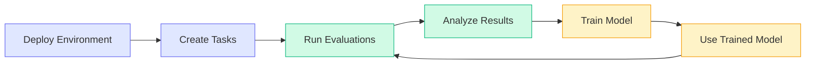

Run agents against your tasksets, analyze the results, and train models on successful traces.

<Warning>
Before running evaluations, you need a deployed environment and a taskset with tasks. See [Scaffolding](/building/scaffolding) and [Deploy & Go Remote](/building/running-at-scale).
</Warning>

## Running Evaluations

Open your taskset on [hud.ai/evalsets](https://hud.ai/evalsets), click **Run Taskset**, and configure your run:

<Frame>
  
</Frame>

- **Models** — Select one or more models to evaluate. Multi-select runs the same tasks across all selected models.
- **Group Size** — How many times to run each task per model (more runs = higher confidence)
- **Max Steps** — Limit agent actions per task

Jobs queue and run in parallel across HUD infrastructure. Each run generates a trace with the full conversation, tool calls, and reward. Results show up in real-time on the taskset's **Leaderboard** tab—rankings, success rates, and model comparisons.

<Frame>
  
</Frame>

## Training Models

Training turns your evaluation traces into better models:

1. Go to [hud.ai/models](https://hud.ai/models) and find a trainable base model in **Explore**
2. Click **Fork** to create your copy—this gives you your model ID
3. Click **Train Model** and select a taskset as training data
4. Training creates a new checkpoint in your model's tree

<Frame>
  
</Frame>

Set any checkpoint as HEAD to use it for inference. Your model ID works through the same gateway:

```python
result = await task.run("your-model-id")
```

See [Platform Models](/platform/models) for training details.

## CLI Alternative

Prefer the command line? Use `hud eval` for running evaluations locally or remotely:

```bash
# Run a platform taskset with a model
hud eval "My Tasks" claude --full

# Run with multiple repeats for variance
hud eval "My Tasks" claude --full --group-size 5

# Run remotely on HUD infrastructure
hud eval "My Tasks" claude --full --remote

# Run from a local file, linked to a platform taskset
hud eval tasks.json claude --full --taskset "My Tasks"
```

See [`hud eval` CLI reference](/reference/cli/eval) for all options.

## The Loop

Scenarios are the atomic skills your agent must get right. If your agent can't reliably pass a scenario, that's a gap to close — through prompting, fine-tuning, or tool design.

Deploy your environment, create tasks, run evaluations, train on successful traces, use the trained model. Repeat.



Every evaluation generates traces. Every training run creates a better model. Agents get better at *your* environment, *your* tasks, *your* success criteria.

## What's Next

<CardGroup cols={2}>
<Card title="Platform Models" icon="robot" href="/platform/models">
  Model training and checkpoints
</Card>

<Card title="Platform Tasksets" icon="list-check" href="/platform/tasksets">
  Full taskset management guide
</Card>

<Card title="Publishing Leaderboards" icon="trophy" href="/platform/publishing-leaderboards">
  Make your benchmarks public
</Card>

<Card title="Environments as Data" icon="chart-line" href="/building/environments-as-data">
  Design for useful training signal
</Card>
</CardGroup>
