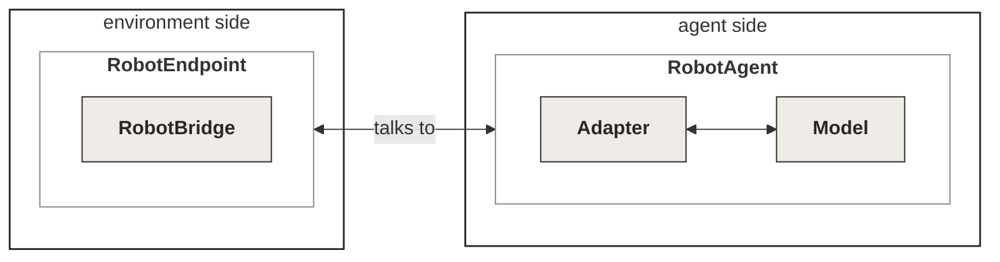

<Note>
The `robot` capability is in **beta**. The wire protocol is versioned `openpi/0`; the contract
schema is v0. Expect additive changes while the design settles.
</Note>

HUD runs robot environments the same way it runs everything else - an environment declares tasks
and capabilities, an agent drives a live `Run`, but a 50 Hz policy can't stream actions over tool calls.

So the `robot` capability is instead a continuous **observation/action loop over WebSocket**: the
environment streams observations (camera frames, robot state) and the agent streams back actions, as
fast as the policy can run. The wire format is **openpi**-inspired (msgpack with numpy serialization), 
so existing openpi policy servers only need a thin adapter. 

Everything below ships behind the `robot` extra (pulls in numpy + openpi-client):

<CodeGroup>
```bash uv
uv add 'hud[robot]'
```
```bash pip
pip install 'hud[robot]'
```
</CodeGroup>

## Overview
Like with other HUD workflows there's the environment side
(server - containerized, served on the runtime) and the agent side (client - swappable, model with harness).
For robotics the **environment side** 
translates incoming actions into changes in the digital or physical environment and serves observations. 
The **agent side** owns the policy: it reads those observations, runs
inference, and sends actions back. 

Both sides need building, and this is where robotics differs from
the rest of HUD. For LLM agents you can lean on a standard inference provider and a
stock harness, so often the environment is the only thing you write. For robot policies there is no
equivalent - no hosted inference provider, no standard harness.

HUD ships tooling for **both** sides: a handful of small, named abstractions you implement, 
with the framework owning everything in between (the serve loop, the wire protocol, telemetry to platform).



**Environment side** - owns the simulator and serves frames:

- **`RobotBridge`** - the one class you implement around your sim: `reset` / `step` /
  `get_observation`. The framework owns the WebSocket serve loop and the single-agent connection.
- **`RobotEndpoint`** - wraps the bridge - the environment server's handle for the 
sim (even if the sim is running in another process)

**Agent side** - runs the policy and streams actions:

- **`RobotAgent`** - the harness: connects to the env and bridge, owns adapter and model, 
drives model until env terminates.
- **`Model`** - the actual stateless checkpoint of the model (includes pre-/post-processing)
- **`Adapter`** - translates the env's observation space to the model's, and the model's action space to the env's

**The contract** (of the environment) - the one artifact both sides share: a self-describing JSON schema of the
embodiment's control rate, observation and action spaces, carried in the capability's manifest params. 
The agent wires observations to policy inputs purely from the manifest; there is no shared config.

## Environment side

For a gym-style sim you implement nothing: `env.gym(make_env)` takes any callable returning a
gym-style env, derives the [contract](#contract) from a sample observation, serves the sim over the
``robot`` WebSocket, and returns the handle templates drive episodes through:

```python env.py
from hud import Environment

env = Environment(name="my-sim")
sim = env.gym(make_env)   # make_env: any callable returning a gym-style env

@env.template()
async def pick_and_place(task: str = "default", seed: int = 0):
    ep = await sim.reset(task=task, seed=seed)  # {prompt, token}
    yield {"prompt": ep["prompt"], "robot": {"token": ep["token"]}}
    yield await sim.result(token=ep["token"])
```

Task args are partitioned by the factory's signature: args the factory accepts define the env (a
change rebuilds it), everything else is episodic and flows to `env.reset(seed=..., options=...)`.
For a sim that isn't gym-shaped, subclass the **bridge** instead:

```python
from hud.environment.robot import RobotBridge

class MySimBridge(RobotBridge):
    async def reset(self, task_id: str, seed: int = 0) -> str:
        ...                              # build the episode
        return self.task_description     # becomes the task prompt

    def step(self, action) -> None:
        ...  # advance one tick; set success / terminated

    def get_observation(self):
        # Always [N, ...] arrays + [N] terminated (N=1 is fine).
        return {"agentview_image": frames, "state": vecs}, done_mask
```


Those three methods are all you write. Under the hood the framework takes care of communication 
with the agent and  starting/stopping as well as stepping of the simulator at the *control rate*.

- **`reset`** starts a fresh episode for a task and returns its prompt (the text the agent is given).
- **`step`** applies one action and advances the sim a tick, setting `success` / `terminated` as the
  episode plays out.
- **`get_observation`** returns a structured dict of the current observation
plus whether the episode is done.

<Note>
The `get_observation` function has a strict output convention, see below to follow it.
</Note>

<Accordion title="The openpi observation convention">

**The `data` dict is the strict part.** It is what the agent indexes by name and feeds straight to
the policy, so a few things have to be exactly right:

- **Values are numpy arrays** - nothing else survives the trip into the adapter and the trace viewer.
- **Each key is an observation feature's name, verbatim from the contract.** The agent does
  `data[name]` directly off the contract
- **Images are `HWC` arrays** (`[H, W, 3]`, `uint8` RGB).
- **State is a single 1-D array**, passed to the policy as `float32`; everything rank-1 is treated
  as state.
- **`terminated` is a sibling, not part of `data`** - return it as the second item of your
  `(data, terminated)` tuple and the framework attaches it to the frame.

```python
def get_observation(self):
    data = {
        "observation/image":       rgb,          # [256, 256, 3] uint8, RGB, HWC
        "observation/wrist_image": wrist_rgb,    # [256, 256, 3] uint8, RGB, HWC
        "observation/state": np.concatenate([    # [8] float32, in contract order
            eef_pos,         # xyz                 (3,)
            eef_axis_angle,  # orientation         (3,)
            gripper_qpos,    # gripper             (2,)
        ]).astype(np.float32),
    }
    return data, self.terminated   # terminated is a sibling key the framework adds
```

Actions come back the same way: the agent sends them under openpi's `actions` key, and your
`step(action)` receives an already-decoded numpy array - you never touch the codec.

</Accordion>

`RobotEndpoint` is the env's control handle on the bridge - the one surface it drives an episode
through. `start` / `stop` bring the bridge's socket up and down; `capability` publishes the `robot`
binding once that URL exists (call it after `start`); `reset` begins an episode and returns its
prompt; `result` returns the episode's score. It's control-plane only - the agent's observe/act loop
tunnels straight to the bridge's WebSocket - and the same calls work whether the bridge is local
(shown here) or [in another process](#running-a-sim-in-another-process).

```python
from hud import Environment
from hud.environment.robot import RobotEndpoint

env = Environment(name="my-sim")
endpoint = RobotEndpoint(MySimBridge())  # the env drives the bridge only through the endpoint

@env.initialize
async def _up():
    await endpoint.start()
    env.add_capability(await endpoint.capability(contract=CONTRACT))

@env.shutdown
async def _down():
    await endpoint.stop()

@env.template()
async def pick_and_place(task_id: str, seed: int = 0):
    ep = await endpoint.reset(task_id=task_id, seed=seed)  # {prompt, token}
    yield {"prompt": ep["prompt"], "robot": {"token": ep["token"]}}
    yield await endpoint.result(token=ep["token"])  # this slot's {score, success, total_reward}
```

Each session grades one slot. A vectorized sim fans N concurrent sessions across its slots; see
[vectorized evals](#vectorized-envs-and-evals).

## Agent side

The harness lives in `hud.agents.robot`. 

We provide a base class called `RobotAgent`. It connects to the `robot`
binding, reads the contract, then runs the rollout loop including model inference
until the environment terminates. You supply two objects.

- **`Model`** - something with an `infer()` function that returns action chunks (pre-/post-processing included)
- **`Adapter`** - translates env ↔ model spaces.

Run it with the normal engine - `Taskset(...).run(agent, runtime=...)` - against any substrate
serving an env with the robot capability and an adaptable embodiment.

## LeRobot integration

HUD integrates with [LeRobot](https://github.com/huggingface/lerobot) natively, so a stock checkpoint
is a complete agent in a few lines. The two bundled seams *are* the LeRobot convention:

- **`LeRobotModel(policy, preprocess, postprocess)`** runs the policy through its own LeRobot
  pre/post-processors, so the checkpoint behaves exactly as it does upstream. Pass an `Ensembler` to
  reduce overlapping action chunks to one action per step.
- **`LeRobotAdapter(model_image_keys=...)`** maps the env's cameras and state onto the policy's
  inputs from the [contract](#contract) - HWC `uint8` → CHW float, state and prompt passed
  through.

```python
import torch
from lerobot.policies.factory import make_pre_post_processors
from lerobot.policies.pi05.modeling_pi05 import PI05Policy

from hud.agents.robot import RobotAgent, LeRobotModel, LeRobotAdapter

class PI05Agent(RobotAgent):
    def __init__(self):
        device = "cuda" if torch.cuda.is_available() else "cpu"
        policy = PI05Policy.from_pretrained("lerobot/pi05_libero_finetuned").to(device).eval()
        pre, post = make_pre_post_processors(policy.config, "lerobot/pi05_libero_finetuned",
                                             preprocessor_overrides={"device_processor": {"device": device}})
        self.model = LeRobotModel(policy, pre, post)
        self.adapter = LeRobotAdapter(model_image_keys=list(policy.config.image_features))
```

Anything past the stock image/state convention is just a subclass of `Model` or `Adapter`; the
LeRobot classes are the batteries-included default. See the
[robot benchmark cookbook](/v6/cookbooks/robot-benchmark) for a full LIBERO + pi0.5 run.

## The Model

`Model` owns *how to run* a policy. To wrap a non-LeRobot checkpoint, subclass it and implement one
method - `infer`; the episode loop, threading, and the wire are handled for you.

```python
import numpy as np
from hud.agents.robot import Model

class MyModel(Model):
    def __init__(self, policy):
        self.policy = policy

    def reset(self) -> None:
        ...                                    # clear per-episode state (optional)

    def infer(self, batch) -> np.ndarray:
        chunk = self.policy(batch)             # run your policy
        return np.asarray(chunk, np.float32)   # [T, A] chunk, in the env's action space
```

- **Input** (`batch`) - the policy-ready inputs your [`Adapter`](#agent-side) produced for this step
  (images, a state vector, the task prompt - whatever your policy consumes). `Model` and `Adapter`
  are a matched pair, so the batch is exactly what your adapter emits.
- **Output** - a `[T, A]` `float32` numpy array: an action chunk of `T` timesteps × `A` action dims,
  already in the env's action space. Single-action policies return `T = 1`.
- **`reset()`** - optional; clear per-episode state (an action queue, a chunk buffer) at the start of
  each episode.

The harness awaits `ainfer`, which runs your (blocking) `infer` in a worker thread by default -
override `ainfer` only if your policy is natively async. For chunked policies, reduce each `[T, A]`
chunk to one action per step with an `Ensembler`.

## Batching

Running many rollouts at once, each calling `infer` once per step, wastes the GPU on
single-observation forwards. `BatchedAgent` fixes that: it wraps a `RobotAgent`, gives each concurrent
rollout its own episode state, and shares one batched model that coalesces their per-step `infer` calls
into a single stacked forward.

```python
from hud.agents.robot.batching import BatchedAgent

agent = BatchedAgent(MyRobotAgent())   # sizes itself to the live concurrency

job = await taskset.run(agent, runtime=DockerRuntime("hud-libero-env"), max_concurrent=8)
```

Each tick, the concurrent observations queued within a short window (`max_wait_s`, default 50 ms)
are stacked into one `[N, ...]` batch, run through a single forward, and scattered back to each
rollout - so the batch is as wide as whatever is in flight, and the tail of a suite never stalls.
`max_concurrent` already bounds the width; pass `batch_size=` only to cap the forward below it
(e.g. VRAM headroom).

`BatchedAgent` needs an **in-process, stateless** model whose `infer` runs the whole `[N, ...]` batch
in one forward - `LeRobotModel` qualifies. A remote OpenPI policy server is not supported (its protocol
has no batched-request shape); run one agent per rollout against it instead. `BatchedAgent` also takes
ownership of the agent you pass (it swaps in the batched model in place), so give it a dedicated
instance rather than one you also use for unbatched runs.

## Vectorized envs and evals

A GPU sim like Isaac amortizes its cost by stepping many env copies together in one process
(`num_envs`). Getting N graded rollouts by booting N separate containers throws that away - each
one pays for its own physics from scratch. Instead, N rollouts share one vectorized instance, and
every layer keeps the plain single-env contract described above:

- **Vectorization is sim config, not an eval parameter.** A factory that accepts `num_envs` makes
  `env.gym(make_env, num_envs=8)` build an eight-way batched sim. Internally the bridge steps
  every claimed slot together each tick, but each rollout still gets its own ordinary WebSocket -
  one observation in, one action out, no batch dimension on the wire.
- **The agent is unchanged.** A stock `RobotAgent` drives one connection per rollout, same as a
  single-env run. It claims its slot with the token the environment handed back on `tasks.start`
  (`run.started["robot"]["token"]`); concurrent rollouts still coalesce GPU forwards through
  [`BatchedModel`](#batching).
- **`group` picks how many rollouts; `Shared` puts them on one substrate.** Left alone, `group`
  rollouts would each provision a fresh container. Wrapping the provider in
  [`Shared(provider, width=N)`](/v6/reference/runtime#shared) instead provisions one and lets
  all `N` reuse it:

```python
from hud.eval import Shared, DockerRuntime

job = await taskset.run(
    MyAgent(),
    runtime=Shared(DockerRuntime("hud-isaac-env"), width=8),
    group=8,
    max_concurrent=8,
)
```

Each rollout opens its own control-channel connection and claims a slot on it: the first
`tasks.start` resets the sim and claims slot 0, later starts claim whatever is free, and a start
once every slot is taken errors instead of queuing silently. Grading is the same call every
rollout already makes - the environment resolves it to that rollout's slot and returns one
`Grade`, exactly as a single-env run would.

`group` and `max_concurrent` are the ordinary [`Taskset.run` parameters](/v6/reference/tasks#running);
set `max_concurrent` to `width` so every slot fills and none sit idle waiting for a rollout that
never starts.

## Contract

Embodiments and policies disagree on cameras, state layout, action semantics, and control rate, so
pairing a model with an env always needs a wiring step. The **contract** makes it explicit: a JSON
document in the capability manifest that the agent reads back with `RobotClient.spaces()`, which
splits `features` into an observation and an action space by each feature's `role` - so a policy
wires itself with no shared config.

Here's a proper minimal contract - one camera, a state vector, and an action:

```json
{
  "control_rate": 10,
  "features": {
    "observation/image": {
      "role": "observation",
      "type": "rgb",
      "names": ["height", "width", "channel"]
    },
    "observation/state": {
      "role": "observation",
      "names": ["eef_x", "eef_y", "eef_z", "axis_x", "axis_y", "axis_z", "grip_l", "grip_r"]
    },
    "action": {
      "role": "action",
      "names": ["dx", "dy", "dz", "drx", "dry", "drz", "gripper"]
    }
  }
}
```

`role` and `type` wire the spaces; `control_rate` and `names` are what make the run legible on the
platform, so a real contract should always set them:

- **`role`** (`observation` / `action`) - `spaces()` splits the contract by it and the `Adapter` wires
  against that split. Required on every feature.
- **`type`** on image observations - `rgb`/`bgr`/`gray`/`depth` is how the bundled adapter spots a
  camera; the first observation *without* an image type becomes the state. Omit it and your image is
  mistaken for the state. (On the state and action, `type` is descriptive.)
- **`control_rate`** (top level, Hz) - the agent reads it as the playback fps for the recorded episode,
  so the trace viewer plays back at real speed and any saved dataset has the right frame rate. Set it
  to your real control rate.
- **`names`** (per feature) - per-element labels the trace viewer shows on each state/action slice;
  without them the dimensions display unlabeled.

Feature keys are openpi flat slash-paths and must match *verbatim* the keys your bridge returns from
`get_observation` (`action` is the single action feature). Everything else - `robot_type`, `dtype`,
`shape`, `stats` - is descriptive and never enforced. Full list in the reference below.

<Accordion title="Full field reference">

| Field | Where | Meaning |
|-------|-------|---------|
| `robot_type` | top level | Embodiment id, shown in the trace viewer. Descriptive. |
| `control_rate` | top level | Control-loop frequency in Hz; the agent reads it as the playback/record fps. Recommended. |
| `features` | top level | Map of feature name → feature spec (rows below). |
| `role` | feature | `observation` or `action` - **the only field that splits the spaces**. Load-bearing. |
| `type` | feature | Representation tag. Observations: `rgb`/`bgr`/`gray`/`depth` mark an image (load-bearing for the bundled adapter); others (`ee_abs`, `ee_del`, `joint_pos`, …) are descriptive control/state modes. |
| `dtype` | feature | `image` for frames, else a numpy dtype (`float32`). Descriptive - not checked against your arrays. |
| `shape` | feature | Declared dims (`[H, W, 3]`, `[8]`). Descriptive; every feature is rank ≥ 1 (scalars are `[1]`). |
| `names` | feature | Per-element labels; what the trace viewer uses to label state/action slices. |
| `stats` | feature | Per-element `mean` / `std` / `min` / `max` for a custom adapter. The stock LeRobot path uses the checkpoint's own normalization, so you can omit it. |
| `state_type` / `state_representation` / `frame` | feature | Closed-symbol embodiment metadata (EEF vs joint, quaternion vs axis-angle, world vs base frame). Descriptive. |

The v0 schema is deliberately narrow: **one embodiment, one observation space, one action space per
contract**. The framework never validates your arrays against `shape` / `dtype`; the full authoring
spec - the closed symbol sets and known traps - lives outside the SDK alongside the contract corpus.

</Accordion>

## How sims run

The loop is lockstep - the bridge steps the sim once per received action. A simulator is usually
**thread-affine** (every touch must run on the thread that created its GL/device context), and some
runtimes - Isaac/Omniverse - must own the process main thread outright. HUD therefore serves every
sim with one process shape: **the sim owns the main thread**, serving (the control channel and the
robot WebSocket) runs on a background loop thread, and the framework queues every sim touch back to
the main thread. A cheap CPU sim blocks on that queue; when Omniverse is loaded, the main thread
also pumps Kit between touches.

There is nothing to configure. `hud serve` and `python -m hud.environment.server` detect an
attached sim and pick the shape; any fix to the loop applies to every sim the same way.

## Recording datasets

Set `agent.save = True` (wire it to a `--save` flag on your runner) to also record every
`(observation, executed action)` tick into a **LeRobot v3 dataset** - the rollouts you just ran,
ready to finetune a policy on. Telemetry streams either way; saving is the opt-in extra.

Recording is **agent-side**: it consumes the observations the agent already receives and the actions
it already produces, so it runs in *your* process - not the environment container. That sidesteps
sims (e.g. Isaac/RoboLab) whose dependency stack conflicts with `lerobot`; only your machine needs
`pip install 'lerobot[dataset]'`.

All rollouts in a process record into one shared dataset: each buffers its episode and commits
it whole, so concurrent runs (e.g. `BatchedAgent`) interleave safely. Finalized at process exit.
Destination and Hub push come from the environment:

| Env var | Effect |
|---------|--------|
| `RECORD_DIR` | Dataset root (default `./data`, relative to where the rollout launched) |
| `HF_REPO` | Also push the finalized dataset to this HF namespace (needs `HF_TOKEN`) |
| `HF_PRIVATE` | Push the dataset private |

The [contract](#contract) drives the schema with no extra wiring: image features become
`observation.images.<camera>` (encoded to per-episode video), the lone state vector becomes
`observation.state`, the action becomes `action`, and the task prompt rides along as each frame's
`task`.


## Running a sim in another process

Serving in one process is the default (see [how sims run](#how-sims-run)), but the sim can also
live in its own process - on another machine, or built against a dependency stack the env
container can't carry. The env code stays essentially unchanged.

`RobotEndpoint` is built for exactly this: the same control surface (`start` / `reset` / `result` /
`stop`) works whether the bridge is local or remote.

- **Env process** - publish a *remote* handle with `RobotEndpoint.remote(host, port)`. It dials the
  sim process and forwards every control call over JSON-RPC.
- **Sim process** - wrap the real bridge and expose it with
  `RobotEndpoint(bridge).serve_blocking(host, port)`, the same sim-owns-main shape `hud serve` uses.

The two planes split cleanly, which is why the agent never knows the sim is remote:

- **Control plane** (`start` / `reset` / `result`) - JSON-RPC between the remote endpoint and the
  serving process.
- **Data plane** (the agent's `observe → act` loop) - tunnels straight to the bridge's `robot`
  WebSocket; the contract stays env-side.

**Env side** - identical to the local example, but the endpoint is remote and you `connect()` to it
first:

```python env.py
from hud import Environment
from hud.environment.robot import RobotEndpoint

env = Environment(name="isaac-sim")
endpoint = RobotEndpoint.remote("127.0.0.1", 9100)   # a handle on the bridge in the sim process

@env.initialize
async def _up():
    await endpoint.connect()    # retries until the sim process is serving
    await endpoint.start()
    env.add_capability(await endpoint.capability(contract=CONTRACT))

@env.shutdown
async def _down():
    await endpoint.close()      # drops the link; does not stop the sim

@env.template()
async def pick_and_place(task_id: str, seed: int = 0):
    ep = await endpoint.reset(task_id=task_id, seed=seed)
    yield {"prompt": ep["prompt"], "robot": {"token": ep["token"]}}
    yield await endpoint.result(token=ep["token"])
```

**Sim process** - your program builds the bridge and serves its control surface, blocking for the
process's lifetime with the sim owning the main thread:

```python sim_main.py
from hud.environment.robot import RobotEndpoint

bridge = MySimBridge()
RobotEndpoint(bridge).serve_blocking("127.0.0.1", 9100)
```

Bring the two up together - the env's `connect()` retries until the sim is listening. Everything
downstream (`hud eval`, tasksets, the agent) is unchanged; only *where the bridge runs* moved.


## API summary

| Symbol | Where | Role |
|--------|-------|------|
| `env.gym(make_env)` / `Gym` | `hud.environment.robot` | Declarative sim: contract, capability, and serving derived from a gym factory |
| `hud.wrap(env)` | `hud` | One-line trace streaming for any gym-style env you drive yourself |
| `RobotBridge` / `GymBridge` | `hud.environment.robot` | Env-side serve loop (slot barrier + scalar wire); subclass `RobotBridge` for a custom sim |
| `RobotEndpoint` | `hud.environment.robot` | Episode bookkeeping + results (`reset` → `{prompt, token}`, `result(token=...)`) |
| `RobotEndpoint.capability(...)` | `hud.environment.robot` | Build the `openpi/0` capability after `start()` |
| `Capability.robot(name, url, contract)` | `hud.capabilities` | Lower-level constructor (usually via `endpoint.capability`) |
| `RobotClient` | `hud.capabilities.robot` | Agent-side wire client (`connect(..., token=)`, `spaces`, `get_observation`, `send_action`) |
| `RobotAgent` | `hud.agents.robot` | The harness: one open-loop chunk queue per scalar connection |
| `Model` / `LeRobotModel`, `Adapter` / `LeRobotAdapter` | `hud.agents.robot` | Policy + space-translation seams |
| `BatchedAgent` / `BatchedModel` | `hud.agents.robot.batching` | Many concurrent rollouts against one shared, batched model |
| `Shared(provider, width=N)` | `hud.eval` | Refcounting provider: N concurrent rollouts share one substrate |

## See also

<CardGroup cols={2}>
<Card title="Robot benchmark cookbook" icon="flask" href="/v6/cookbooks/robot-benchmark">
  LIBERO in Docker, driven by pi0.5, end to end.
</Card>
<Card title="Capabilities" icon="plug" href="/v6/reference/capabilities" />
</CardGroup>
