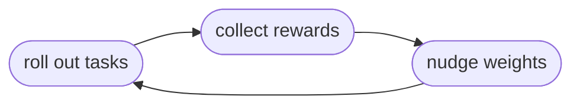

The key idea: **the rewards you collect are already training data.** Every rollout produced a
trajectory (what the agent did) and a [reward](/v6/core/tasks) (how well it did). Training nudges the
model's weights so the behavior that earned *high* reward becomes more likely next time. You feed that
signal into **HUD's managed trainer** (the simple path, no ML infra) or into **your own** RL loop.

## Training is a loop

All of training is one loop repeated:

1. **Roll out** a batch of tasks with the current model.
2. **Score** each rollout - that's the reward you already get for free.
3. **Nudge** the model's weights toward the rollouts that scored better.
4. **Repeat** - the next batch samples the now-slightly-better model.



Each pass makes the model a little better at the tasks you're training on. Everything below is how you
set that loop up.

## What you need first

- **A task with spread in its rewards.** This is the one prerequisite people miss. If every rollout of
  a task gets the *same* reward, training learns nothing from it (see [Why grouping
  matters](#why-grouping-matters)). Designing tasks that produce spread is its own craft - see
  [Designing tasks](/v6/core/advice).
- **A trainable model**, which you make by forking one (next).

## Get a trainable model

Only some gateway models can be trained. List what's available and fork one into your own private,
team-owned model whose weights you're allowed to advance:

```bash
hud models list                              # the Trainable column marks forkable bases
hud models fork Qwen/Qwen3.5-4B --name arith-rl
```

The new slug (`arith-rl`) is both what you **sample** (like any other model) and what you **train**.
The fork starts from the base's current weights, so you continue from where it left off.

## Run the loop

This is the whole thing. Each step: roll out a batch with the current model, hand those graded rollouts
to the trainer, and it nudges the weights. The next step then samples the improved model.

```python train.py
from hud import TrainingClient
from hud.agents import create_agent
from hud.eval import Job

# return_token_ids tells the gateway to send back the token ids + logprobs training needs
agent = create_agent("arith-rl", completion_kwargs={"extra_body": {"return_token_ids": True}})
trainer = TrainingClient("arith-rl")
taskset, runtime = ...   # your taskset + where rollouts run (see Tasks / Run & deploy)

session = await Job.start("arith-rl", group=8)   # 8 rollouts per task
for _ in range(10):
    start = len(session.runs)
    await taskset.run(agent, runtime=runtime, job=session)   # roll out a batch
    batch = session.runs[start:]
    await trainer.step(batch, learning_rate=1e-5, group_size=8)   # nudge the weights
```

The one line that learns is `trainer.step(...)`. It computes how each rollout should shift the weights,
applies that shift, then checkpoints and **promotes** the new weights so the gateway serves them
immediately. That's why the *next* `taskset.run` samples an improved model - the loop closes itself.

The trainer's input is the rewards you already have: a [`Job`](/v6/core/tasks#jobs) holds the graded
[`Run`](/v6/core/types#run)s from each batch, and you pass those runs (or a slice) straight to
`trainer.step`. Each `Run` carries its reward and either inline token samples or a `trace_id`, which is
all the trainer needs (see [Inputs](#inputs)).

## Why grouping matters

The one concept worth really understanding. HUD trains with **GRPO**, which scores each rollout
*relative to its group*: an advantage of `reward - group_mean`. So a rollout is "good" only by
comparison to its siblings on the same task.

The consequence: if every rollout in a group earns the **same** reward, every advantage is zero and
**no learning happens** - no matter how high the average looks. That's why you run each task as a group
(`group=8` above) and why your tasks must produce a **spread** of rewards. Trainability is a property of
your tasks, not just your loop - the whole point of [Designing tasks](/v6/core/advice).

## Watch it improve

Each step adds a node to the model's **checkpoint tree** and promotes it to the **head** - the weights
the gateway now serves. A node carries everything you need to watch a run: `mean_reward`, `loss_fn`,
token/datum counts, and a `metrics` blob (reward spread, sampling logprob, provider training stats like
PPO KL and clip fraction). Read it from the shell or from the loop:

```bash
hud models checkpoints arith-rl          # the checkpoint tree (active head marked)
hud models head arith-rl --set <id>      # roll back or branch from an earlier point
```

```python
for c in await trainer.checkpoints():    # same data, in the training loop
    print(c.name, c.mean_reward, c.metrics.get("reward_std"))
```

Setting the head points the gateway at a different checkpoint and the next `optim_step` extends the tree
from there - so a checkpoint is also a **rollback point**.

<Warning>
Roll back when the objective changes. If you edit the reward function or the environment partway through
a run, the current head encodes the *old* objective - continuing from it fine-tunes a contaminated
policy, and the early steps after the change mostly undo the old shaping. Roll the head back to a
checkpoint from before the change (`set_head` / `--set`), or fork a fresh model, so the run measures the
new objective from a clean start.
</Warning>

## TrainingClient

A `TrainingClient` drives managed training for one model: it accumulates gradients from rewarded
trajectories and advances the weights behind the model's gateway slug in place. Inputs are `Run`s (sent
inline) or `trace_id` strings (resolved server-side); the two can be mixed.

```python
TrainingClient(model, *, api_key=None, base_url=None, api_url=None)
```

| Argument | Default | Meaning |
|----------|---------|---------|
| `model` | - | Trainable model slug or id (the gateway string you also sample). |
| `api_key` | `settings.api_key` | HUD API key. |
| `base_url` | `settings.hud_rl_url` | Training (RL) service. |
| `api_url` | `settings.hud_api_url` | Catalog API (resolves the slug -> id once). |

### Methods

| Method | Returns | Purpose |
|--------|---------|---------|
| `forward_backward(trajectories, *, loss_fn, loss_fn_config=None, group_size=None, reward_scale=1.0, num_substeps=1)` | `ForwardBackwardResult` | Accumulate gradients with a built-in `loss_fn`. |
| `optim_step(*, learning_rate, beta1=0.9, beta2=0.95, eps=1e-8, weight_decay=0.0)` | `OptimStepResult` | Apply gradients, checkpoint, and promote the new weights. |
| `step(trajectories, *, learning_rate, ...)` | `OptimStepResult` | One `forward_backward` then one `optim_step`. |
| `forward_backward_custom(trajectories, loss_fn, *, group_size=None, reward_scale=1.0)` | `ForwardBackwardResult` | Accumulate gradients with a client-side loss (see [Custom losses](#custom-losses)). |
| `forward(trajectories, *, group_size=None, reward_scale=1.0)` | `ForwardResult` | Current-policy forward pass returning per-token tensors. |
| `backward(forward_id, weights, *, metrics=None)` | `ForwardBackwardResult` | Apply caller-computed per-token gradients to a forward pass. |
| `available_losses()` | `list[str]` | Built-in `loss_fn` names this model's provider supports. |
| `checkpoints()` | `list[CheckpointResponse]` | The checkpoint tree, each node with rewards, loss, counts, and a `metrics` blob. |
| `head()` | `CheckpointResponse \| None` | The active checkpoint (the weights the gateway serves), or `None` for base weights. |
| `set_head(checkpoint_id)` | `None` | Promote a checkpoint to head - roll back to, or branch from, it. |

Advantages are normalized within contiguous **groups** of `group_size` (GRPO); `None` treats the whole
batch as one group. The batch must divide evenly into groups - `forward_backward` rejects a partial
final group before spending a forward pass. `num_substeps` splits the batch for gradient accumulation.

## Inputs

A training input is a recorded trajectory by id, or an inline one:

```python
TrainInput = str | TrajectoryPayload          # trace_id, or inline tokens + reward
```

The methods accept `str | Run | TrajectoryPayload`, mixed freely. A `Run` is converted automatically -
inline `TrajectoryPayload` when it carries token-level samples (local rollout), else its `trace_id`
(remote rollout). Build a `TrajectoryPayload` yourself when the tokens didn't come from a `Run` at all -
e.g. an opponent move sampled inside the environment during self-play, trained with its own reward.

| Type | Fields |
|------|--------|
| `TrajectorySample` | `prompt_token_ids`, `output_token_ids`, `output_logprobs` |
| `TrajectoryPayload` | `samples: list[TrajectorySample]`, `reward`, `trace_id=None` |

To get the token data for a hand-built payload, ask the gateway for it on the completion call: pass
`extra_body={"return_token_ids": True}` with `logprobs=True`, then read the ids off the choice.

```python
resp = await client.chat.completions.create(
    model="arith-rl", messages=msgs, logprobs=True,
    extra_body={"return_token_ids": True},
)
choice = resp.choices[0]
sample = TrajectorySample(
    prompt_token_ids=choice.prompt_token_ids,   # gateway-added fields
    output_token_ids=choice.token_ids,
    output_logprobs=[t.logprob for t in choice.logprobs.content],
)
```

## Built-in losses

`loss_fn` is an open string validated against the model's provider; discover the set with
`await trainer.available_losses()`. `BuiltinLoss` lists the common Tinker names (each *is* a `str`):

| `BuiltinLoss` | Value | Use |
|---------------|-------|-----|
| `CROSS_ENTROPY` | `cross_entropy` | Supervised - imitate sampled tokens. |
| `IMPORTANCE_SAMPLING` | `importance_sampling` | On-policy PG, rollout-logprob ratio. |
| `PPO` | `ppo` | Clipped-surrogate PG. |
| `CISPO` | `cispo` | Clipped IS policy optimization. |
| `DRO` | `dro` | Direct reward optimization. |

`loss_fn_config` forwards provider-specific hyperparameters to the loss (e.g. `{"epsilon": 0.2}` for
the `ppo` clip). The supported keys are provider-defined and not every loss accepts config, so prefer
the defaults (`None`) unless a provider documents a key.

## Custom losses

`forward_backward_custom` runs the current-policy forward pass server-side, hands you per-token tensors,
runs your loss locally (torch autograd), and ships the per-token gradients back. Requires torch
(`pip install 'hud-python[train]'`).

```python
import torch
from hud.train import DatumTensors

def my_loss(data: list[DatumTensors], logprobs: list[torch.Tensor]):
    loss = logprobs[0].new_zeros(())
    for datum, policy_lp in zip(data, logprobs):
        ratio = torch.exp(policy_lp - torch.tensor(datum.sampling_logprobs))
        loss = loss - (ratio * datum.reward * torch.tensor(datum.mask)).sum()
    return loss, {"trained": float(len(data))}

await trainer.forward_backward_custom(batch, my_loss, group_size=8)
```

`logprobs[i]` are the current policy for datum `i` as differentiable leaves. Everything else is constant
on the matching `DatumTensors`:

| `DatumTensors` | Meaning |
|----------------|---------|
| `logprobs` | Current-policy, per token (the differentiable leaf). |
| `sampling_logprobs` | Rollout policy, per token. |
| `mask` | `1.0` on action tokens, `0.0` on observation tokens. |
| `reward`, `traj_idx`, `group_idx` | Trajectory reward, source trajectory, GRPO group (or `None`). |

Under the hood `forward` returns a `ForwardResult` (`forward_id` + `data: list[DatumTensors]`);
`backward(forward_id, weights)` applies `weights[d][t] = -dC/dlogprobs`.

## Results

| Type | Fields |
|------|--------|
| `ForwardBackwardResult` | `metrics: dict[str, float]`, `num_datums` |
| `OptimStepResult` | `step`, `checkpoint_id`, `sampler_path`, `state_path`, `model` |
| `CheckpointResponse` | `id`, `name`, `is_active`, `prev_model_checkpoint_id`, `mean_reward`, `loss_fn`, `num_datums`, `num_tokens`, `metrics`, `created_at` |

## `hud models` CLI

| Command | Purpose |
|---------|---------|
| `hud models list` | List gateway models. |
| `hud models fork <model> --name <slug>` | Fork a team-owned trainable model from an existing one. |
| `hud models checkpoints <model>` | List the checkpoint tree (active head marked). |
| `hud models head <model> [--set <checkpoint-id>]` | Show, or set (rollback/select), the active checkpoint. |

## See also

<CardGroup cols={2}>
<Card title="Designing tasks" icon="lightbulb" href="/v6/core/advice">
  Design tasks that produce reward spread - the prerequisite for training to work.
</Card>
<Card title="Tasks & Tasksets" icon="list-check" href="/v6/core/tasks">
  Where the rewards training learns from come from.
</Card>
<Card title="Run & deploy" icon="rocket" href="/v6/core/runtime">
  Scale the rollouts that feed the loop.
</Card>
<Card title="Types: Run & Trace" icon="code" href="/v6/core/types">
  The Run a rollout produces and the trace it carries.
</Card>
</CardGroup>
