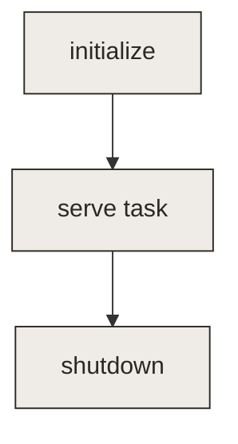

This page demonstrates a minimal two-column guide layout. The left column holds the explanation and stays
the center of attention; the right column is a quiet textbook margin for the supporting code, tables,
diagrams, and notes that belong beside it. On narrow screens the columns stack, so each visual drops under
the text it belongs to.

<div className="guide-row">
<div className="guide-main">

### Declare the environment

An environment is defined in a single `env.py`. Start with an `Environment` and at least one capability -
the connection the agent drives. The fields below are the minimum a runnable environment needs.

</div>
<div className="guide-aside">

<p className="aside-label">env.py</p>

```python
from hud.environment import Environment
from hud.capabilities import Capability

env = Environment(name="my-env", capabilities=[
    Capability.ssh(name="shell", url="<url>"),
])
```

| Field | Role |
| --- | --- |
| `name` | identifies the env |
| `capabilities` | what the agent drives |

</div>
</div>

<div className="guide-row">
<div className="guide-main">

### Lifecycle

Optional hooks run setup and teardown around each rollout. Use them only when a task needs fixtures,
services, or seed state - stateless tasks skip them entirely.

</div>
<div className="guide-aside">

<p className="aside-label">lifecycle</p>



</div>
</div>

<div className="guide-row">
<div className="guide-main">

### Grade a task

A task prompts the agent and returns a reward. The final `yield` is the score - that number, with the
trace, is what you read in an eval and feed into training.

</div>
<div className="guide-aside">

<p className="aside-label">graded task</p>

```python
@env.template()
async def task(target: str = "..."):
    answer = yield f"<prompt {target}>"
    yield 1.0 if answer == target else 0.0
```

<Note>The reward is a single number between 0 and 1.</Note>

</div>
</div>
