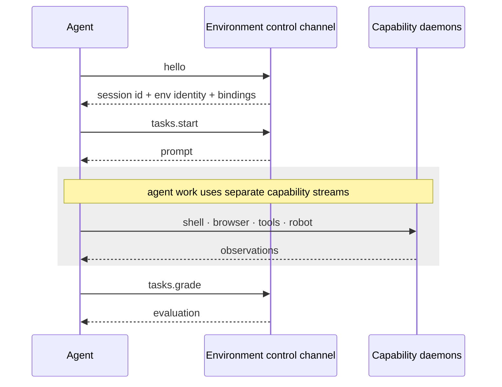
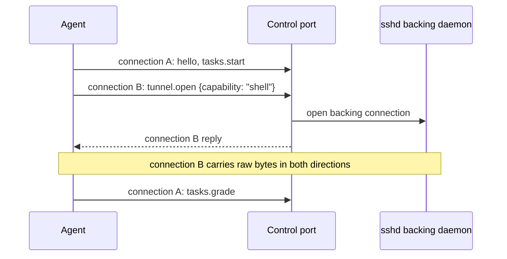

The control channel is the boundary between the process driving an agent and the
served environment it acts on. A served environment exposes one TCP address.
Task setup, grading, session state, and live capability tunnels all pass through
connections to that address.

Three roles meet at this boundary:

| Role | Wire responsibility |
| --- | --- |
| **Agent** | Drives a `Run`, reads the prompt, and opens capabilities through `HudClient`. |
| **Environment** | Serves task templates and the backing daemons named by its capability bindings. |
| **Capability** | Describes a live protocol endpoint such as `ssh`, `mcp`, `cdp`, `rfb`, or `robot`. |

The channel contains two related contracts:

| Concept | What it is |
| --- | --- |
| **Control session** | A framed JSON-RPC dialogue over one connection: `hello`, `tasks.start`, `tasks.grade`, and related methods. |
| **Capability stream** | A raw byte tunnel over a separate connection, splicing the client to a backing capability daemon. |
| **Preface frame** | The first frame on a connection; it selects a control session or a capability stream. |

## The run loop on the wire



`hello` creates or resumes a session and returns the environment identity plus
its capability bindings. `tasks.start` advances one task generator to its first
yield and returns the prompt. The agent drives the advertised capabilities while
that generator remains suspended. `tasks.grade` sends the agent's answer into
the generator and returns its second yield as an evaluation.

The environment defines what can be acted on and how the resulting state is
graded. The agent harness defines the action loop. Their only shared contract is
the channel and the capability protocols named by its bindings.

## Session methods

A control session speaks JSON-RPC 2.0 for the connection's lifetime:

| Method | Result |
| --- | --- |
| `hello` | Session id, environment name/version, and capability `bindings`. An optional `session_id` resumes a parked session. |
| `tasks.list` | Registered task metadata for introspection and validation. |
| `tasks.start` | The selected task's first yield, normalized to a prompt frame. |
| `tasks.grade` | The selected task's evaluation, including numeric `score`. |
| `tasks.cancel` | Cancels and removes the session's suspended task. |
| `bye` | Cancels the task and ends the session. |

Each request and response is one newline-delimited JSON frame. Calls on a
`HudClient` are serialized, and reply ids must match the corresponding request.
A malformed or unknown call receives a JSON-RPC error frame.

## One port, two connection types

The TCP listener accepts many connections but publishes only one address. The
first frame on each connection selects its interpretation. A `tunnel.open`
preface creates a capability stream; any other first frame begins a control
session.

```python hud/environment/server.py · bind
async def accept(reader, writer):
    first = await read_frame(reader)
    if first.get("method") == "tunnel.open":
        await _stream(env, first, reader, writer)
    else:
        await channel.session(first, reader, writer)
```

The fork is connection-local. Control-session connections continue parsing
JSON-RPC frames. Capability-stream connections send one JSON-RPC reply and then
become raw bidirectional byte pipes. Several control sessions and capability
streams can coexist on the same listening port.

The session methods are independent of this TCP multiplexing rule. A transport
with native streams could carry the same methods while expressing capability
tunnels through its own stream or upgrade mechanism.

## The suspended task

`bind` creates one `_ControlChannel` for the served environment. That channel
owns one suspended `TaskRunner` per session id. A session's `tasks.start`
replaces its runner, `tasks.grade` consumes it, and `tasks.cancel` removes it.

```python hud/environment/server.py · _ControlChannel
async def start(self, session_id, task_id, args):
    await self.cancel(session_id)
    runner = TaskRunner(self.env.tasks[task_id], args)
    self._runners[session_id] = runner
    try:
        return await runner.start()
    except BaseException:
        self._runners.pop(session_id, None)
        await runner.cancel()
        raise

async def grade(self, session_id, payload):
    runner = self._runners.pop(session_id, None)
    if runner is None:
        _, runner = self._adopt_parked()
    return await runner.grade(payload)
```

The runner lives on the channel rather than the socket. A dropped connection
removes its session id from the live set but leaves its runner parked. A later
connection reaches the same runner in either of two ways:

- `hello` with its `session_id` resumes that exact parked session.
- A plain `tasks.grade` adopts a parked runner only when exactly one exists.

Zero parked runners produces `no task in progress`; multiple parked runners
produce an ambiguity error that names their session ids. This is the channel
mechanism behind split `hud task start` and `hud task grade` invocations.

## Capability streams

A capability binding describes a backing daemon inside the environment's
substrate. The agent reaches that daemon through a second connection to the
control address. Its first frame names the capability:



The server resolves the named binding, opens its host and port, sends the one
reply frame, and splices both byte streams until either side closes:

```python hud/environment/server.py · _stream
name = (msg.get("params") or {}).get("capability")
cap = env.capability(name)
parts = urlsplit(cap.url)
backend = await asyncio.open_connection(parts.hostname, parts.port)
if msg_id is not None:
    await send_frame(writer, reply(msg_id, {"capability": name}))
await splice((reader, writer), backend)
```

One `tunnel.open` connection carries one capability stream. Opening a shell and
a browser at the same time therefore creates two independent stream
connections alongside the control-session connection.

## Client-side routes

`connect(Runtime(url))` gives `HudClient` the control endpoint. During `hello`,
the client creates one loopback forwarder for every returned binding. Each
forwarder accepts local connections, opens a `tunnel.open` connection to the
control endpoint, and splices the local client to that tunnel.

```python hud/clients/client.py · HudClient.hello
bindings = [Capability.from_manifest(binding) for binding in result["bindings"]]

for capability in bindings:
    forwarder = await asyncio.start_server(
        partial(forward, capability), "127.0.0.1", 0
    )
    self._forwarders.append(forwarder)
    local_port = forwarder.sockets[0].getsockname()[1]
    parts = urlsplit(capability.url)
    userinfo = f"{parts.username}@" if parts.username else ""
    self._routes[capability.name] = urlunsplit(
        (
            parts.scheme,
            f"{userinfo}127.0.0.1:{local_port}",
            parts.path,
            parts.query,
            parts.fragment,
        )
    )
```

`binding(ref)` returns the capability with its routed local URL.
`open(ref)` resolves that same binding, constructs the registered protocol
client, and caches it for the life of the `HudClient`. All external capability
traffic therefore follows the control address even when a manifest binding
contains a substrate-local or otherwise unreachable address.

The [walkthrough](/v6/internals/walkthrough#connecting) places the handshake and
forwarders on the execution path. [Placement](/v6/internals/placement) explains
how the runtime behind the control address is selected and provisioned.
