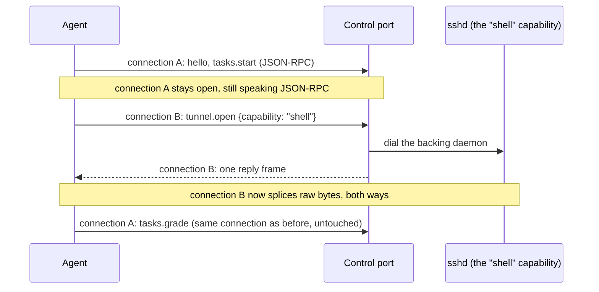
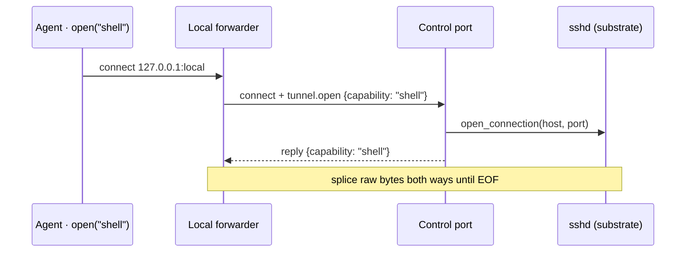

A served environment exposes exactly one address: a single TCP port. Everything a client does to
it - starting a task, grading it, and driving a real shell or browser inside it - travels through
that one port. The [walkthrough](/v6/internals/walkthrough#bringing-up-the-server) reaches this port when `bind`
puts an environment on the wire; this page is the port itself: the two kinds of traffic it carries,
and how one frame tells them apart. The [protocol](/v6/advanced/protocol) page covers the message
semantics riding on top; this page covers how the server carries them.

| Concept | What it is |
| --- | --- |
| **Control channel** | The single TCP server a served env exposes (`hud/environment/server.py`). Every connection to the substrate goes through it. |
| **Control session** | A JSON-RPC dialogue over one connection: `hello`, `tasks.start`, `tasks.grade`, and friends. |
| **Capability stream** | A raw byte tunnel over one connection, splicing the client to a **backing daemon** - the real `ssh` / `cdp` / `mcp` server a capability points at. |
| **Preface frame** | The first frame a connection sends; it decides which of the two that connection becomes. |

## One port, two kinds of connection

A raw TCP connection is one byte pipe with no notion of what it carries. The control port itself
is an ordinary listening socket, so it accepts as many connections as clients dial - a container
publishes one port, a hosted sandbox hands back one address, but neither limits how many
connections reach it. What is scarce is the *address*, not the connection count: an env could
publish a separate port for its control session and one more per backing daemon, but the
substrate often cannot expose them. So the env exposes a single control port and every connection
declares its purpose in its **preface frame** - the first line it sends. That frame is
transport-level routing, the JSON-RPC analog of an HTTP `CONNECT`, not a session method.

The accept handler reads that one frame and forks on it. A `tunnel.open` frame opens a capability
stream; anything else begins a control session.

```python hud/environment/server.py · bind
async def accept(reader, writer):
    first = await read_frame(reader)                  # the preface frame
    if first.get("method") == "tunnel.open":
        await _stream(env, first, reader, writer)     # raw capability tunnel
    else:
        await channel.session(first, reader, writer)  # JSON-RPC control session
```

Everything after the preface is decided by that fork: a control session parses each subsequent
frame as JSON-RPC, a capability stream stops parsing and moves raw bytes. Because only the preface
is transport-specific, the same session methods would ride any transport - a WebSocket build would
tunnel through its native upgrade instead of a `tunnel.open` frame, and the methods below would not
change.

## The control session

A control session is a JSON-RPC dialogue that lasts the connection's lifetime. Its methods are the
wire protocol an agent and env speak:

| Method | Does |
| --- | --- |
| `hello` | Returns the session id, the env identity, and the capability **bindings** (the manifest). Takes an optional `session_id` to resume a parked session instead of opening a fresh one. |
| `tasks.list` | Lists task metadata, for introspection and validation. |
| `tasks.start` | Runs the task to its first yield and returns the prompt. |
| `tasks.grade` | Resumes the task with the agent's answer and returns the score. |
| `tasks.cancel` | Drops the held task. |
| `bye` | Ends the session and tears the held task down. |

The [walkthrough](/v6/internals/walkthrough#starting-the-task) follows the `tasks.start` / `tasks.grade` flow
end to end. What matters here is where the task's state lives between those two calls.

## The suspended task

Between `tasks.start` and `tasks.grade` the task's generator is paused at its first yield, holding
the whole world it set up. That paused generator lives on the **control channel** itself, not in
any one connection: `bind` creates one `_ControlChannel` per served env and every control session
shares it. The channel holds one suspended task per session, keyed by session id, so concurrent
sessions each own their own - a session's `start` replaces its task, `grade` consumes it, `cancel`
clears it. It also tracks which session ids currently have a live connection.

```python hud/environment/server.py · _ControlChannel
async def start(self, session_id, task_id, args):
    await self.cancel(session_id)                  # replace this session's task
    self._runners[session_id] = TaskRunner(self.env.tasks[task_id], args)
    return await self._runners[session_id].start()

async def grade(self, session_id, payload):
    runner = self._runners.pop(session_id, None)   # this session's task ...
    if runner is None:
        runner = self._adopt_parked()              # ... or the lone parked one
    return await runner.grade(payload)

def _adopt_parked(self):                           # claim iff exactly one is parked
    parked = [s for s in self._runners if s not in self._live]
    if len(parked) != 1:                           # 0: none; >1: resume by id
        raise _NoTaskInProgress(...)
    return self._runners.pop(parked[0])
```

Because the task is held on the channel and not the connection, a dropped connection leaves it in
place: the session's id leaves the live set and its runner is **parked**, still in `_runners` but
with no live connection, awaiting a later one to grade it. A client can `tasks.start`, disconnect,
and reconnect to `tasks.grade` the same suspended task - the split start/grade flow behind
`hud task start` / `hud task grade` and a reconnecting verifier.

A later connection reaches a parked session by one of two grade paths. Sending `hello` with its
`session_id` resumes that exact session, so the connection's next `tasks.grade` lands on the right
task - the path to use whenever more than one session could be parked. A plain `tasks.grade` with no
prior resume auto-adopts a parked session only when exactly one is parked; with none it reports no
task in progress, and with several it refuses and names them, telling the caller to resume one by
`session_id`.

## Capability streams and `tunnel.open`

A capability is not data the env sends over the control session; it is a live daemon the agent
connects to and drives - a real `sshd`, a browser's `cdp` endpoint. That daemon listens somewhere
inside the substrate, and the substrate may expose only the control port, so the agent cannot dial
it directly.

The agent reaches it by opening a **second, separate connection** to the control port - not by
somehow converting its existing control-session connection. That new connection's preface is a
`tunnel.open` frame naming the capability, which is enough to send it down the raw-splice branch of
the fork [above](#one-port-two-kinds-of-connection) instead of starting a session. The control
session that ran `tasks.start` is a different connection entirely, and keeps speaking JSON-RPC the
whole time; `tasks.grade` later just uses that same connection normally, with nothing to "recover" -
it was never touched. Because the port accepts unlimited connections, any number of these can be
open at once: several capability streams alongside one control session, or streams and sessions
from several clients, all independent of each other and of which session (if any) opened which
stream.



On connection B's `tunnel.open` frame, the server resolves the named capability to its backing
daemon, dials it, replies once, and only then stops speaking JSON-RPC *on that connection*: it
splices raw bytes between the client and the daemon until either side hangs up.

```python hud/environment/server.py · _stream
async def _stream(env, msg, reader, writer):    # this connection's own reader/writer
    name = msg["params"]["capability"]
    cap = env.capability(name)                  # the declared capability
    parts = urlsplit(cap.url)                    # its backing daemon's host:port
    backend = await asyncio.open_connection(parts.hostname, parts.port)
    await send_frame(writer, reply(msg_id, {"capability": name}))  # the one reply frame
    await splice((reader, writer), backend)      # then raw bytes, both ways, until EOF
```

The splice is the whole point: after that one reply frame, connection B becomes a transparent
pipe to the daemon, so the substrate needs no second published port - just one more connection to
the port it already has. One `tunnel.open` connection carries exactly one capability stream, so an
agent needing a shell and a `cdp` tunnel at once simply opens two.

## Reaching a loopback capability

The manifest a client gets from `hello` carries each capability's url, but a loopback url in it
(`127.0.0.1`, `localhost`, `::1`) is the *substrate's* loopback, not the client's - the daemon
lives in the substrate's network namespace, which is not ours when the substrate is a container or
a hosted sandbox. A non-loopback url is globally reachable and passes through unchanged.

For the loopback case the client runs an `ssh -L` style **forwarder**: a local listener whose every
accepted connection opens one `tunnel.open` connection to the control port and splices to it. It
then rewrites the binding's url to point at the forwarder's local port, so the address handed to
the agent always works from here.

```python hud/clients/client.py · HudClient._reachable
parts = urlsplit(cap.url)
if self._endpoint is None or parts.hostname not in ("127.0.0.1", "localhost", "::1"):
    return cap                                  # globally reachable: pass through
host, port = self._endpoint                     # the control port

async def forward(reader, writer):              # one accepted local connection
    up_reader, up_writer = await asyncio.open_connection(host, port)
    await send_frame(up_writer, {"method": "tunnel.open",
                                 "params": {"capability": cap.name}, ...})
    await read_frame(up_reader)                  # the one-line reply
    await splice((reader, writer), (up_reader, up_writer))

forwarder = await asyncio.start_server(forward, "127.0.0.1", 0)
return replace(cap, url=...forwarder's local port...)   # rewritten binding
```

So `run.client.open("shell")` connects to a local port that tunnels, frame then raw bytes, all the
way to the `sshd` inside the substrate:



The [walkthrough](/v6/internals/walkthrough#connecting) shows where the client runs `hello` and builds these
forwarders on the pointer's path, and [placement](/v6/internals/placement) covers how the substrate behind this
port is chosen and brought up.
