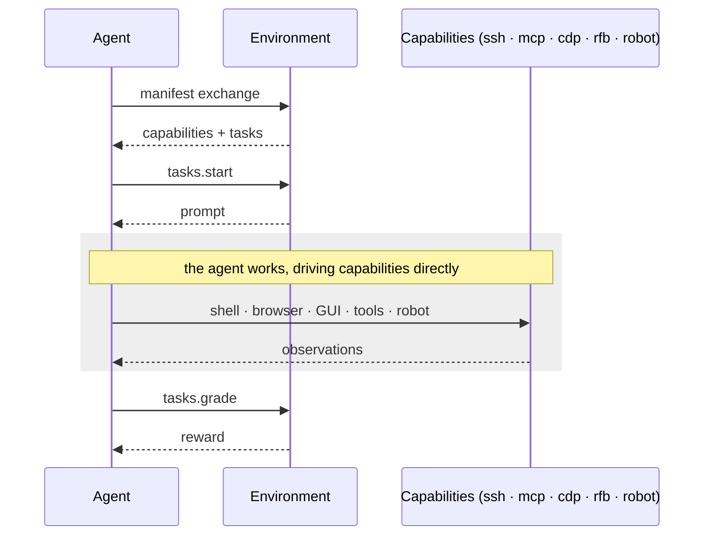

HUD is **protocol-first**. An agent and an environment never integrate directly — they exchange a few small, well-defined messages. HUD owns only that thin envelope; everything inside it (the model, the harness, the work the agent does) stays swappable.

The whole exchange is just three steps.

## Step 1 — Manifest exchange

The agent connects and asks the environment what it is. The environment answers with a **manifest**: the [capabilities](/v6/reference/capabilities) it exposes (`ssh`, `mcp`, `cdp`, `rfb`, `robot`, …) and the [tasks](/v6/reference/tasks) available to run.

Nothing model-specific is involved — the manifest describes the *environment*, not any particular agent. This is what lets a harness written years from now still drive an environment built today.

## Step 2 — Start a task

The agent calls `tasks.start`. The environment sets up the world for that task and returns a **prompt** — the instruction the agent should act on.

From here the agent is on its own: it drives the capabilities directly. A shell is a real `ssh` connection, a browser is a real `cdp` session — the agent reads observations and acts, in a loop, with HUD staying out of the way. The environment doesn't dictate *how* the agent works, only *what* it can touch.

## Step 3 — Grade

When the agent is done, it calls `tasks.grade`. The environment inspects the resulting state and returns a single **reward**.

That reward (plus the trace of everything that happened) is the entire output. The same number you read in an eval is the signal you feed into [training](/v6/run/training).

## The full loop

## Why it matters

Because the protocol only ever exposes **capabilities** — never a fixed agent — an environment outlives any single harness. New models and harnesses keep running against the same environments, benchmarks, and tasks, with no environment-side glue.

That's the payoff of keeping the envelope thin: you write the environment once, and the model, harness, trainer, and infra all stay swappable.

<CardGroup cols={2}>
<Card title="Capabilities" icon="cube" href="/v6/reference/capabilities">
  The connections an agent drives: shell, browser, GUI, tools, robot.
</Card>
<Card title="Tasks & tasksets" icon="list-check" href="/v6/reference/tasks">
  What `tasks.start` and `tasks.grade` operate on.
</Card>
</CardGroup>
