This page reviews HUD-specific core concepts and overviews a full workflow. We'll go through the
workflow and introduce all the core concepts as they arise. We'll include some code snippets, but for
specific guides on the main uses see Guides. The workflow can be split into 5 steps:

```mermaid
%%{init: {'flowchart': {'padding': 22}}}%%
flowchart LR
    A(["1#160;·#160;Declare#160;environment"]) --> B(["2#160;·#160;Choose#160;your#160;taskset"]) --> C(["3#160;·#160;Choose#160;your#160;runtime"]) --> D(["4#160;·#160;Run#160;your#160;agent"]) --> E(["5#160;·#160;Learn"])
    classDef s1 fill:#efece8,stroke:#2b2722,stroke-width:1px,color:#2b2722;
    classDef s2 fill:#efece8,stroke:#2b2722,stroke-width:1px,color:#2b2722;
    classDef s3 fill:#efece8,stroke:#2b2722,stroke-width:1px,color:#2b2722;
    classDef s4 fill:#efece8,stroke:#2b2722,stroke-width:1px,color:#2b2722;
    classDef s5 fill:#efece8,stroke:#2b2722,stroke-width:1px,color:#2b2722;
    class A s1;
    class B s2;
    class C s3;
    class D s4;
    class E s5;
    click A href "#1-·-declare-your-environment" _self
    click B href "#2-·-choose-your-taskset" _self
    click C href "#3-·-choose-your-runtime" _self
    click D href "#4-·-run-your-agent" _self
    click E href "#5-·-learn" _self
```



## 1 · Declare your environment

In HUD any workflow starts with creating an environment.

An environment is some closed container for your agent to act in. Fundamentally it's defined by:

<div className="tight-list">

- the **contents** of the container like files or environment state
- the **tasks** to be performed inside it
- the **grading mechanism** associated with each task
- the **capabilities** the agent can use to perform these tasks

</div>

HUD maps each of these abstractions to a core concept you can compose and reuse:

| Concept | What it is in HUD |
| --- | --- |
| [**Environment**](/v6/reference/environment) | The closed container the agent acts in - its contents, state, and lifecycle. |
| [**Tasks & Tasksets**](/v6/reference/tasks) | A single task bound to an environment, each with its own prompt; bundle many task instances into a taskset. |
| [**Graders**](/v6/reference/graders) | The mechanism associated with a specific task that scores an attempt and turns it into a reward. |
| [**Capabilities**](/v6/reference/capabilities) | The interfaces the agent drives to act - shell, browser, screen, robot. |

All of these abstractions appear in the `env.py` file - the central declarative file that describes
everything there is to a HUD environment. For a dedicated overview, see our guide on [creating environments](/v6/guides/creating-an-environment).

<Accordion title="Part 1: Declare your environment">

The first and **key** part of any HUD workflow is **declaring your [environment](/v6/reference/environment)**
in a declaration file `env.py` - here is a standard scaffold:

```python env.py
from hud.environment import Environment
from hud.capabilities import Capability
from hud.graders import LLMJudgeGrader

# VITAL: an env with at least one capability - this is what the agent connects to and drives
env = Environment(name="...", capabilities=[
    Capability.ssh(name="shell", url="<url>", host_pubkey="<key>"),  # a real shell over ssh
])

# OPTIONAL: lifecycle hooks - only if the task needs setup/teardown (fixtures, services, seed state)
@env.initialize               # runs once before serving
async def _up():
    ...                       # write fixtures, stand up services, etc.

@env.shutdown                 # runs on env.stop()
async def _down():
    ...

# VITAL: at least one task definition - prompts the agent and returns a reward
@env.template()               # one definition = a whole space of tasks
async def some_task_1(...):
    answer = yield "<prompt>"      # the prompt handed to the agent; the agent's answer comes back
    # ── everything the agent does happens here: it drives the capability until it's done ──
    result = await LLMJudgeGrader.grade(answer=answer, criteria=[...])   # score the result → reward
    yield result.value           # VITAL: the final yield is the reward
```

This scaffold is general on purpose - it describes _any_ environment. A one-line shell task, a full GUI
desktop, a robot simulator - they're all just environments with some bespoke **content**, **tasks**, and
associated **capabilities**. The complexity hidden under this file is hidden in the
[HUD protocol](/v6/advanced/protocol) Its thin envelope lets any model or harness plug into any environment.


</Accordion>


## 2 · Choose your taskset

Once an environment is defined or chosen, the next part is to simply select the set of tasks to use
on that environment for evaluation. The core abstraction for this in HUD is the [Taskset](/v6/reference/tasks). 

<Accordion title="Part 2: Choose your taskset">

To form a [taskset](/v6/reference/tasks) (one or more tasks with parameters) do this directly **in code** 
by importing from `env.py` or load them **from a file**. 
HUD provides various ways to load, select, and run tasks. For a dedicated overview see our guide on
[evaluating agents](/v6/guides/running-an-eval).

```python tasks.py
from hud.eval import Taskset
from env import some_task_1, some_task_2

# VITAL: a named taskset of concrete tasks to evaluate (parametrize one definition into many)
TASKS = Taskset("my-taskset", [some_task_1(<args1>), some_task_1(<args2>), some_task_2(<args3>)])
```

</Accordion>

## 3 · Choose your runtime

Any kind of environment needs to actually run somewhere. An environment shouldn't care where 
it runs - it should just work. HUD lets you run agent evaluations by deploying your environment to our platform on
[hud.ai](https://hud.ai). For more customizability and local development, however, we use the [Runtime](/v6/reference/runtime).

| Concept | What it is in HUD |
| --- | --- |
| [**Runtime**](/v6/reference/runtime) | Where an environment runs - locally, on a third-party provider, or the HUD platform - selected without changing the environment definition. |

HUD provides you freedom to flexibly switch between running your environment 
locally for fast environment development, on third-party runtime providers like
[Daytona](https://www.daytona.io/), [Modal](https://modal.com/), or [E2B](https://e2b.dev/) for scale,
or [deploy to the HUD platform](/v6/reference/runtime). The environment definition never changes - just the
[Runtime](/v6/reference/runtime) you pass.

<Accordion title="Part 3: Choose your runtime">

There are **three ways** to run your declared environments. The main distinction is simply **where your
environment file lives** - on your local drive, or packaged and deployed to the HUD platform.

**1. From the CLI with `hud eval` (preferred).** Point it at your on-disk `env.py` (or `tasks.py`) and choose
where each rollout runs with `--runtime`:

```bash
hud eval env.py claude                  # run locally against your on-disk env
hud eval env.py claude --runtime hud    # same env, executed on HUD's hosted infra
```

**2. From a script.** The same eval embedded in Python when you want programmatic control - pick a
[runtime](/v6/reference/runtime) and run a taskset against it:

```python
from hud.eval import LocalRuntime, SubprocessRuntime, DockerRuntime, ModalRuntime, HUDRuntime

LocalRuntime(env)          # this process - live env objects
SubprocessRuntime("env.py") # local child process serving a source file
DockerRuntime("my-env")    # a fresh container per rollout
ModalRuntime("my-env")     # a Modal cloud sandbox per rollout
HUDRuntime()               # HUD's hosted infra (after `hud deploy`)
```

**3. Deploy to the platform.** Build a portable image once and push it to HUD - now your environment lives
remotely, so you can run tasksets from the [platform](https://hud.ai), compare models, and browse every
trace with no local infra:

```bash
hud deploy                 # build + register your env image on HUD
hud sync tasks my-taskset  # publish a taskset to run from the platform
```

</Accordion>

## 4 · Run your agent

The next step is to choose
the **agent** you want to evaluate.
For standard models like Claude, GPT, or Gemini our **prebuilt harnesses** and our optional inference gateway
let you switch between models just by choosing their name. 

Running the agent evaluation produces a **run** (one rollout). Everry run is recorded into a **trace** - a full,
replayable timeline of everything the agent did and how it was graded. Running a whole taskset bundles all 
the runs into a single **job**. HUD enables executing runs in parallel with full isolation out of the box, and every
run is traced on the [platform](https://hud.ai), so you can see exactly what the agent did in realtime.

| Concept | What it is in HUD |
| --- | --- |
| [**Agent**](/v6/reference/agents) | A model paired with a harness that drives it - plugged into an environment's capabilities to attempt tasks and be graded. |
| [**Run**](/v6/reference/types#run) | A single rollout - one agent attempting one task - that produces a reward. |
| [**Trace**](/v6/reference/types#trace) | The full, replayable timeline of a run: every action, observation, and grade. |
| [**Job**](/v6/reference/types#job) | A collection of runs grouped together - e.g. a whole taskset evaluated by an agent. |

<Accordion title="Part 4: Run your agent">

You can run this programmatically:

```python
from hud.agents import create_agent
from hud.eval import SubprocessRuntime
from tasks import TASKS

agent = create_agent("claude-sonnet-4-5")               # routed through the HUD gateway

job = await TASKS.run(agent, runtime=SubprocessRuntime("env.py"))   # start the run
print(job.reward)
```
{/*
<Note>You need a `HUD_API_KEY` ([hud.ai](https://hud.ai/project/api-keys)) for the gateway and tracing, or a provider key (`ANTHROPIC_API_KEY`, …) to call a model directly. See [Run on any model](/v6/reference/agents).</Note> */}


or run it from the [CLI](/v6/reference/cli):
```bash
hud eval env.py claude --group 3
```


</Accordion>

## 5 · Learn

With runs in hand, you can **learn** from their signals - *evaluating* a model, *benchmarking* it against
others, or *training* it to improve. For training, the **training client** turns the rewards from your runs
into model updates you can plug straight into your RL stack.

| Concept | What it is in HUD |
| --- | --- |
| [**Training Client**](/v6/reference/training#trainingclient) | Drives managed training for a model - turning the rewards collected from runs into gradient updates you feed into your RL loop. |

<Accordion title="Part 5: Learn">

HUD can directly provide rewards for your runs based on the **grader**. 
These can then be used for your [training](/v6/reference/training): run a group per task and feed the
spread straight into your own GRPO/PPO loop - or a stack like
[Tinker](https://thinkingmachines.ai/tinker/), [slime](https://github.com/THUDM/slime), or
[Fireworks](https://fireworks.ai/).

</Accordion>

## Where to next

Go hands-on with the [Guides](/v6/guides/creating-an-environment), or dig into the full
[Reference](/v6/reference/environment).
